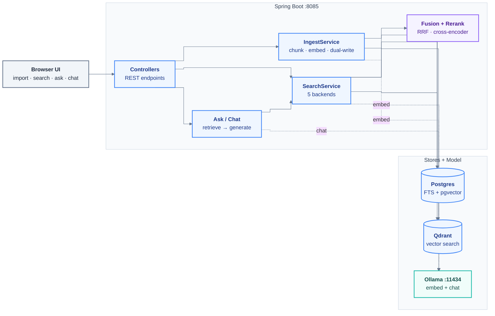
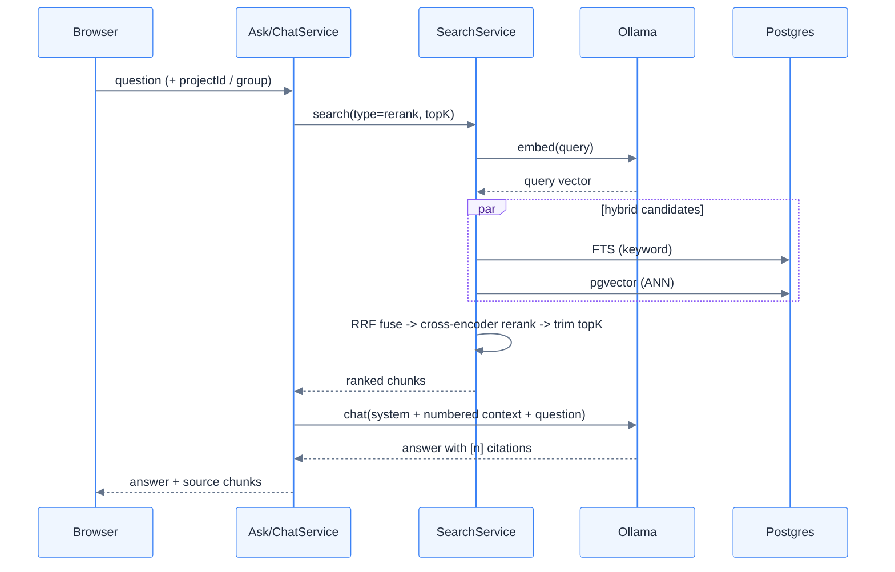

# springboot-rag

Self-study sandbox comparing **Postgres FTS**, **pgvector**, **Qdrant**, and **hybrid (RRF)**
search in Java. See `docs/2026-06-13-springboot-rag-design.md` for the design and
`docs/plans/2026-06-13-springboot-rag.md` for the build plan.

## Architecture

Spring Boot app fronts three retrieval backends and a local Ollama for embeddings + chat.
A document is chunked once, embedded once, and written to **both** Postgres (pgvector) and
Qdrant so the same corpus can be searched five ways and compared side by side.



### Query flow (`/ask`, `/chat` - hybrid + rerank RAG)



> Note: `/search?type=qdrant` and `/compare` route the vector search to **Qdrant**; `hybrid`
> and `rerank` fuse Postgres FTS + pgvector. Qdrant is written on every ingest so all five
> backends stay in sync over the same corpus.

## Prerequisites
- Java 21+ (JDK 25 works)
- Docker + Docker Compose
- Ollama: install using `winget install Ollama.Ollama --accept-package-agreements --accept-source-agreements `, then `ollama pull nomic-embed-text` and `ollama serve`
  (only needed to run the app / real smoke test; the integration test uses fake embeddings)

> Build tool: this project ships a Maven Wrapper. Use `./mvnw` (Linux/macOS/Git Bash) or
> `mvnw.cmd` (Windows) - no system Maven install required.

## Run
```bash
docker compose up -d            # postgres + qdrant
ollama serve                    # if not already running
./mvnw spring-boot:run
```
Swagger UI: http://localhost:8085/swagger-ui.html

## Endpoints
- `POST /ingest` - ingest a document `{ "docId": "...", "text": "..." }`
- `GET /search?q=...&type=fts|pgvector|qdrant|hybrid|rerank|graph&topK=10` - optional `projectId=<id>` or `group=true` to scope results
- `GET /compare?q=...&topK=10` - all backends side by side (scores + timing), including the `rerank` and `graph` columns; accepts optional `projectId` / `group=true`
- `DELETE /docs/{docId}`
- `GET /actuator/health`

## Reranking (`type=rerank`)
`rerank` over-fetches hybrid candidates (`app.rerank.candidates`, default 50), reorders them with a
cross-encoder, then trims to `topK`. By default the reranker is a no-op `IdentityReranker`, so the
app and tests stay light and offline (no model download).

To enable the real cross-encoder, set `app.rerank.provider=djl` (in `application.yml` or as
`--app.rerank.provider=djl`). The first run downloads the `BAAI/bge-reranker-base` model **and** the
native PyTorch libraries (hundreds of MB) via DJL, then runs locally/offline after that.

| property | default | meaning |
|---|---|---|
| `app.rerank.provider` | `""` | `djl` = real bge-reranker; anything else = `IdentityReranker` |
| `app.rerank.model` | `BAAI/bge-reranker-base` | HuggingFace cross-encoder id |
| `app.rerank.candidates` | `50` | hybrid candidates fed to the reranker before trimming to `topK` |
| `app.rerank.maxLength` | `512` | tokenizer max sequence length |

## Graph retrieval (`type=graph`, GraphRAG)

`graph` seeds with `hybrid`, then expands over a knowledge graph before reranking, so it can
surface pages that keyword/vector search miss - especially **orphan pages** (no inbound links)
reconnected through a shared entity. Two edge sources, selected by `app.graph.edges`:

- **structural** (default): parse the wiki's own markdown links + `.order` hierarchy into
  `doc_edge`. Free, instant, no LLM. Retrieval hops from seed pages to linked pages.
- **semantic** / **both**: additionally run entity extraction so pages that mention the same
  entity are connected even without an explicit link (this is what reconnects orphans).

> **Cost warning:** `semantic` and `both` run **one LLM call (`app.chat.model`) per chunk at
> ingest** and one extraction call per graph query. On a large corpus (e.g. a few hundred wiki
> pages) that is thousands of calls - expect much slower imports. The default is `structural`
> precisely to avoid this surprise; opt into the entity layer explicitly when you want it.

Enable the entity layer via `application.yml` or a flag: `--app.graph.edges=both`. Extraction is
best-effort - if the chat model is unavailable, ingest still succeeds (just without entities).
`graph` also carries a per-document **recency tiebreak**: among equally-relevant chunks the newer
document (by git commit date, populated by the bulk importer) ranks first.

| property | default | meaning |
|---|---|---|
| `app.graph.enabled` | `true` | master switch for graph expansion |
| `app.graph.edges` | `structural` | `structural` \| `semantic` \| `both` |
| `app.graph.neighbor-hops` | `1` | graph traversal depth |
| `app.graph.candidates` | `50` | seed candidates gathered before rerank |
| `app.graph.min-mentions` | `1` | drop entities mentioned fewer than N times at query match |
| `app.graph.extract-model` | `""` | RESERVED - not yet wired; extraction uses `app.chat.model` |

Bulk-import an Azure DevOps wiki clone (structural edges + git-date recency) with the
`WikiImporter` dev component; the gated `WikiImporterManualTest` shows the entry point.

## Knowledge base

UI at http://localhost:8085/ lets you import .md files, search with the backend dropdown, and ask questions. The backend runs RAG retrieval (hybrid, FTS, pgvector, or qdrant) and answers via a local chat model.

### Projects & groups

Every document belongs to a **project**. A project is a named container; projects may optionally share a `group_name` label - there is no separate groups table, just a string column on the project row. On startup a **Default** project is seeded and all existing chunks are backfilled to it.

**Project management endpoints:**
- `POST /projects` - create `{ "name": "...", "groupName": "..." }`
- `GET /projects` - list all projects
- `PATCH /projects/{id}` - rename or change group
- `DELETE /projects/{id}` - delete project and its documents
- `GET /groups` - list distinct group names

**Project-scoped document endpoints:**
- `POST /projects/{id}/documents` - upload a .md file into the project
- `GET /projects/{id}/documents` - list documents in the project
- `DELETE /projects/{id}/documents/{docId}` - remove a document from the project
- `GET /projects/{id}/documents/{docId}/chunks` - list chunks for a document

**Scoping search / ask / compare / chat:**
Add `projectId=<id>` to any of `/search`, `/ask`, or `/compare` to scope retrieval to one project. Pass `group=true` to widen retrieval to every project sharing the active project's `group_name`. The `/chat/stream` request body accepts the same `projectId` and `group` fields. The UI sidebar project switcher and "Search whole group" toggle drive these params automatically.

**Legacy flat API (all target the Default project):**
- `POST /documents` - multipart form upload (*.md file, max 2 MB, UTF-8). Chunks the file by heading, stores chunks in Postgres + embeddings.
- `GET /documents` - list all imported documents and their chunk counts.
- `DELETE /documents/{docId}` - delete all chunks for a document.
- `GET /ask?q=...` - full RAG query: retrieves via hybrid + rerank (`app.chat.context-chunks` chunks, default 5), answers with the local chat model, cites chunk numbers. Returns answer plus the source chunks.

**Chat model prerequisite:**
```bash
ollama pull qwen3:8b  # or set app.chat.model to another Ollama model
ollama serve          # runs on localhost:11434
```

**Evaluation commands** (with your docs corpus as gold, needs Docker + Ollama):
```bash
./mvnw test "-Dgroups=eval" "-DexcludedGroups="        # retrieval metrics (top-K recall, MRR, hit@1)
./mvnw test "-Dgroups=eval-judge" "-DexcludedGroups="  # faithfulness smoke report (LLM judge, yes/no per answer)
```

Wiki corpus eval (real 428-page corpus, live stack - NOT Testcontainers):
```bash
./mvnw test "-Dgroups=eval-wiki" "-DexcludedGroups="
```
Prereqs: Postgres + Qdrant up, Ollama with nomic-embed-text, and the wiki already imported into
a project named "docmaster" (override with `-Deval.wiki.project=<name>`). The test is read-only
and skips itself when the corpus is absent. Add `-Deval.rerank=djl` to run with the real
cross-encoder instead of the no-op reranker.

## Run in WSL2 (no Docker Desktop)

For machines where policy forbids Docker Desktop: run the WHOLE stack inside Ubuntu WSL2
with native `docker-ce`. Do not split (tests on Windows + Docker in WSL) - Testcontainers
needs the Docker socket on the same side as the JVM.

**One-time setup (inside Ubuntu WSL):**
```bash
# 1. Enable systemd so the Docker service can run
sudo tee -a /etc/wsl.conf > /dev/null <<'EOF'
[boot]
systemd=true
EOF
# then from Windows: wsl --shutdown, and reopen Ubuntu

# 2. Docker Engine (docker-ce), NOT Docker Desktop
sudo apt-get update
sudo apt-get install -y ca-certificates curl
sudo install -m 0755 -d /etc/apt/keyrings
sudo curl -fsSL https://download.docker.com/linux/ubuntu/gpg -o /etc/apt/keyrings/docker.asc
echo "deb [arch=$(dpkg --print-architecture) signed-by=/etc/apt/keyrings/docker.asc] \
  https://download.docker.com/linux/ubuntu $(. /etc/os-release && echo $VERSION_CODENAME) stable" \
  | sudo tee /etc/apt/sources.list.d/docker.list > /dev/null
sudo apt-get update
sudo apt-get install -y docker-ce docker-ce-cli containerd.io docker-compose-plugin
sudo usermod -aG docker $USER   # then close + reopen the shell

# 3. JDK 21
sudo apt-get install -y openjdk-21-jdk

# 4. Ollama (native Linux, no container)
curl -fsSL https://ollama.com/install.sh | sh
ollama pull nomic-embed-text
ollama pull qwen3:8b            # or qwen3:4b on 16 GB machines (set app.chat.model)

# 5. Clone INTO the WSL filesystem (not /mnt/c - Maven is 5-10x slower there)
git clone <repo-url> ~/springboot-rag && cd ~/springboot-rag
```

**Run and test (same commands as everywhere):**
```bash
docker compose up -d      # postgres + qdrant inside WSL
./mvnw spring-boot:run    # app on :8085
./mvnw test               # Testcontainers finds /var/run/docker.sock natively
```

Notes:
- Ports bound in WSL auto-forward: open http://localhost:8085/ in the WINDOWS browser as usual.
- The surefire `api.version=1.44` pin in `pom.xml` already handles new Docker Engine versions
  (WSL docker-ce is typically Engine 29.x) - keep it.
- NVIDIA GPU: WSL2 CUDA passthrough works with the standard Windows NVIDIA driver; Ollama
  detects it automatically (`ollama ps` shows GPU vs CPU).
- RAM: the chat model is the heavy part (qwen3:8b ~6-7 GB while loaded). On 16 GB total,
  prefer `qwen3:4b` and cap WSL memory in `%UserProfile%\.wslconfig` if Windows starves.

## Run on native Linux (Ubuntu/Debian)

Same stack, fewer steps than WSL - no systemd/`wsl.conf`/`.wslconfig` and no Windows
port-forwarding to think about. Clone anywhere on the native filesystem.

**Already have Docker + Compose?** Skip the Docker install. Verify with `docker ps`
(daemon reachable without sudo) and `docker compose version` (v2 plugin). If both work
you are set - any real Docker Engine is fine. Docker Desktop / rootless Docker move the
socket, so Testcontainers may need `DOCKER_HOST` exported; plain Docker Engine needs none.

**One-time setup:**
```bash
# 1. JDK 21 (project targets 21, builds fine on newer)
sudo apt-get install -y openjdk-21-jdk

# 2. Docker Engine + Compose plugin  (SKIP if `docker ps` already works)
sudo apt-get update
sudo apt-get install -y ca-certificates curl
sudo install -m 0755 -d /etc/apt/keyrings
sudo curl -fsSL https://download.docker.com/linux/ubuntu/gpg -o /etc/apt/keyrings/docker.asc
echo "deb [arch=$(dpkg --print-architecture) signed-by=/etc/apt/keyrings/docker.asc] \
  https://download.docker.com/linux/ubuntu $(. /etc/os-release && echo $VERSION_CODENAME) stable" \
  | sudo tee /etc/apt/sources.list.d/docker.list > /dev/null
sudo apt-get update
sudo apt-get install -y docker-ce docker-ce-cli containerd.io docker-compose-plugin
sudo usermod -aG docker $USER   # then log out + back in

# 3. Ollama (native, no container)
curl -fsSL https://ollama.com/install.sh | sh
ollama pull qwen3:8b            # or qwen3:4b on 16 GB machines (set app.chat.model)

# 4. Clone anywhere
git clone <repo-url> ~/springboot-rag && cd ~/springboot-rag
```

**Run and test (same commands as everywhere):**
```bash
docker compose up -d      # postgres + qdrant
./mvnw spring-boot:run    # app on :8085, open http://localhost:8085/ directly
./mvnw test               # Testcontainers finds /var/run/docker.sock natively
```

Notes:
- The surefire `api.version=1.44` pin in `pom.xml` still applies - native `docker-ce` is
  also Engine 29.x. Keep it.
- NVIDIA GPU: install the driver + CUDA; Ollama detects it automatically (`ollama ps`
  shows GPU vs CPU). No passthrough layer needed.

## Test
```bash
./mvnw test          # unit + Testcontainers integration (needs Docker, not Ollama)
```
The real cross-encoder tests are gated behind an env var (they download a model + native libs):
```bash
RUN_DJL_SPIKE=true ./mvnw -Dtest=DjlSpikeTest,DjlRerankerManualTest test
```
