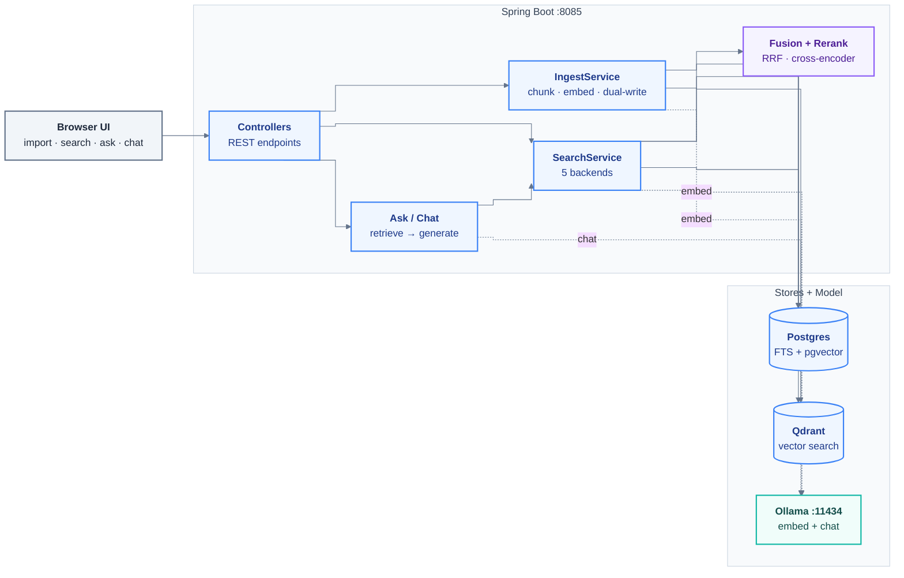
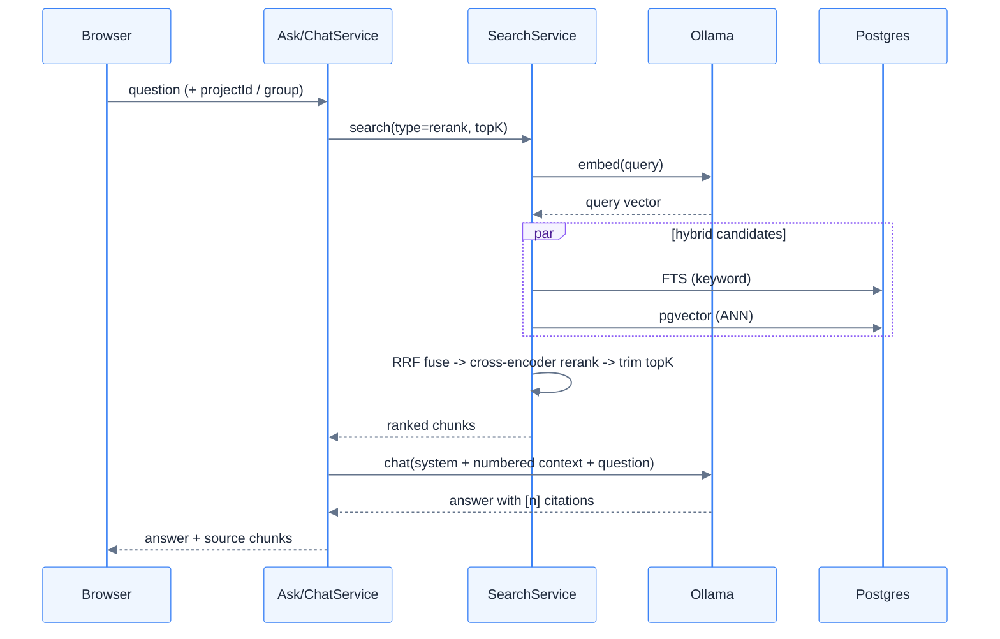

# springboot-rag

Self-study sandbox comparing **Postgres FTS**, **pgvector**, **Qdrant**, and **hybrid (RRF)**
search in Java. See `docs/2026-06-13-springboot-rag-design.md` for the design and
`docs/plans/2026-06-13-springboot-rag.md` for the build plan.

## Architecture

Spring Boot app fronts three retrieval backends and a local Ollama for embeddings + chat.
A document is chunked once, embedded once, and written to **both** Postgres (pgvector) and
Qdrant so the same corpus can be searched five ways and compared side by side.



### Query flow (`/ask`, `/chat` - hybrid + rerank RAG)



> Note: `/search?type=qdrant` and `/compare` route the vector search to **Qdrant**; `hybrid`
> and `rerank` fuse Postgres FTS + pgvector. Qdrant is written on every ingest so all five
> backends stay in sync over the same corpus.

## Prerequisites
- Java 21+ (JDK 25 works)
- Docker + Docker Compose
- Ollama: install using `winget install Ollama.Ollama --accept-package-agreements --accept-source-agreements `, then `ollama pull nomic-embed-text` and `ollama serve`
  (only needed to run the app / real smoke test; the integration test uses fake embeddings)

> Build tool: this project ships a Maven Wrapper. Use `./mvnw` (Linux/macOS/Git Bash) or
> `mvnw.cmd` (Windows) - no system Maven install required.

## Run
```bash
docker compose up -d            # postgres + qdrant
ollama serve                    # if not already running
./mvnw spring-boot:run
```
Open http://localhost:8085/ - the browser will ask for a username and password (see below).
Swagger UI: http://localhost:8085/swagger-ui.html

## Authentication (read this before your first curl)

**Everything except `/actuator/health` requires HTTP Basic auth.** An unauthenticated call gets
`401`, which is the most common "why is this broken" moment on a fresh clone.

Two sandbox users ship in `application.yml`:

| user | password | groups |
|---|---|---|
| `alice` | `alice` | `public`, `hr` |
| `haiks` | `123123` | `public`, `eng` |

```bash
curl -u alice:alice "http://localhost:8085/search?q=chunking&type=hybrid&projectId=1"
curl -u alice:alice http://localhost:8085/me      # {"principal":"alice","groups":["hr","public"]}
```

Retrieval is filtered by the caller's groups, not by a request parameter. Every chunk carries an
`allowed_groups` label stamped at ingest; a chunk you are not in the group for cannot appear in
search results, listings, answers, citations, or feedback labels. A caller with **no** groups sees
nothing - that is the intended fail-closed default.

Change or add users under `app.security.users`. Passwords are plain text with a `{noop}` encoder
because this is a single-developer laboratory - **do not copy this block anywhere real.**

| property | default | meaning |
|---|---|---|
| `app.security.users` | alice, haiks | username / password / groups list |
| `app.security.default-group` | `public` | label stamped on ingest when none is given |
| `app.security.backfill-qdrant-groups` | `true` | label pre-ACL Qdrant points at startup |

Existing corpora keep working after an upgrade: `schema.sql` backfills unlabelled chunks to
`public`, and `QdrantAclBackfill` does the same for Qdrant points.

## Endpoints

**Search and answers**
- `GET /search?q=...&type=fts|pgvector|qdrant|hybrid|rerank|graph&topK=10` - optional `projectId=<id>`, `group=true`, `docIds=a&docIds=b`, `docType=invoice`, `filters=<json>`
- `GET /compare?q=...&topK=10` - all six backends side by side (scores + timing); same `docType` / `filters` params
- `GET /ask?q=...` - one-shot RAG answer with citations; same `docType` / `filters` params
- `POST /chat/stream` - streaming multi-turn RAG, NDJSON frames: `filter`, `token`, `reasoning`, `sources`, `trace`, `guard`, `done`, `error`; `docType` / `filters` in the body

**Documents and projects**
- `POST /projects/{id}/documents` - multipart `.md` upload; optional `groups=hr&groups=public` sets the access label
- `GET /projects/{id}/documents`, `DELETE /projects/{id}/documents/{docId}`, `GET /projects/{id}/documents/{docId}/chunks`
- `POST /projects/{id}/import-wiki` - bulk import a local wiki clone, streaming progress
- `POST /projects`, `GET /projects`, `PATCH /projects/{id}`, `DELETE /projects/{id}`, `GET /groups`
- Legacy flat routes target the Default project: `POST /ingest`, `POST /documents`, `GET /documents`, `DELETE /documents/{docId}`, `DELETE /docs/{docId}`

**Extracted records** (see "Record search" below)
- `POST /projects/{id}/records` - index one extracted JSON record; returns `indexed`, `metadata-refreshed`, or `skipped`
- `DELETE /projects/{id}/records/{docId}` - removes it from Postgres, Qdrant, the edge graph, and the registry
- `PUT /projects/{id}/profiles/{docType}` - optional render profile for a document type
- `GET /projects/{id}/profiles`, `GET /projects/{id}/profiles/{docType}`
- `GET /projects/{id}/facets` - what can be filtered on, derived from what is actually indexed; optional `docType=`

**Feedback, traces, identity**
- `POST /feedback` - one relevance label per `(project, doc, chunk, query)`; `DELETE /feedback` clears it; `GET /feedback?projectId&query&limit` dumps them
- `GET /traces?limit=10` - the `rag_trace` rows behind your recent answers (your own only)
- `GET /me` - the principal and groups the server resolved for you
- `GET /actuator/health` - the only unauthenticated route

See `docs/ARCHITECTURE.md` for what each of these actually does step by step.

## Record search (extracted JSON, not markdown)

For the case where an upstream pipeline already did upload -> parse -> extraction and hands you a
**JSON record plus metadata**. Document types differ per tenant and the set is open, so nothing
here needs a schema up front.

```bash
curl -u alice:alice -X POST localhost:8085/projects/1/records \
  -H 'Content-Type: application/json' -d '{
    "docId": "INV-5575", "docType": "invoice", "groups": ["public"],
    "record": {
      "invoiceNumber": "5575",
      "customer": {"value": "ACME Corp", "confidence": 0.82,
                   "grounding": {"page": 2, "bbox": [12,44,90,60]}},
      "lineItems": [{"sku": "A-1", "description": "Widget assembly"}]
    }}'
```

- **Wrapped values are unwrapped.** `confidence`, `page`, and `bbox` become filterable metadata and
  a deep-linkable citation; they never enter the embedded text, where scores and coordinates would
  only dilute the vector.
- **Every field is indexed regardless of confidence.** A threshold is the caller's policy - filter
  on `conf.min` when you want only trustworthy hits.
- **Chunking**: top-level scalars form a header chunk, each nested object a section chunk, each
  array element its own chunk carrying its JSON path as breadcrumb plus the record's scalars.
- **Re-posting is cheap**: identical record -> `skipped`; only a confidence changed ->
  `metadata-refreshed` (no embedding call); a value changed -> `indexed`.

Filter with dotted paths over the stored `values` / `prov` / `conf` trees:

```bash
curl -u alice:alice -G localhost:8085/search --data-urlencode q='late payment' \
  --data-urlencode 'docType=invoice' \
  --data-urlencode 'filters={"filters":[
      {"path":"values.customer","op":"eq","value":"ACME Corp"},
      {"path":"conf.min","op":"range","gte":0.7,"type":"number"}]}'
```

Ops: `eq`, `in`, `range` (`gte`/`gt`/`lte`/`lt`), `exists`; add `"type":"number"` or `"type":"date"`
to cast. Filters AND together, apply inside every backend query, and compose with - never replace -
your access labels. Known limit: a `date` range is unsupported on the `qdrant` backend and fails
loudly rather than silently matching everything.

**Render profiles** are optional per `(project, docType)` configuration - which paths to embed,
what to call them, which are filter-only:

```bash
curl -u alice:alice -X PUT localhost:8085/projects/1/profiles/invoice \
  -H 'Content-Type: application/json' \
  -d '{"exclude":["rawOcrText"],"labels":{"issueDate":"Invoice date"},
       "filterOnly":["internal.batchId"]}'
```

No profile means generic rendering, so an unconfigured document type is searchable the moment it
lands. Editing a profile bumps its version and re-indexes only that document type.

## Query understanding (question -> filter)

You should not have to write a filter by hand. When `app.understand.enabled` is on (the default),
`/ask` and `/chat/stream` turn the question into one automatically:

1. **Facet catalogue.** The filterable paths are derived from the metadata actually indexed, never
   declared - so a document type nobody configured is still filterable. Read it yourself:

   ```bash
   curl -u alice:alice localhost:8085/projects/1/facets
   # {"docTypes":["invoice"],
   #  "facets":[{"docType":"invoice","path":"values.customer","type":"text",
   #             "samples":["ACME Corp","GLOBEX Ltd"],"distinctCount":2}, ...]}
   ```

   Facets are read under your access labels - you never see a field belonging to documents you
   cannot read.

2. **One LLM call** gets that catalogue (with real sample values) plus the question, and returns a
   filter as JSON.

3. **The output is validated against the catalogue, not trusted.** Invented paths, unknown document
   types, malformed conditions and oversized values are dropped. Everything surviving is rebuilt
   through the same parser an explicit `filters=` param goes through, so extraction can never
   express something the DSL cannot - and can never touch your access labels.

4. **Widen on empty.** If the extracted filter matches nothing, retrieval runs again without it and
   the response says so. A misheard customer name costs one extra query, not an answer.

Both responses report what happened:

```jsonc
// GET /ask
{"answer": "...", "sources": [...],
 "appliedFilter": {"docType":"invoice",
                   "filters":[{"path":"values.customer","op":"eq","value":"ACME Corp","type":"text"}]},
 "widened": false}
```

```jsonc
// POST /chat/stream - always BEFORE the first token frame
{"type":"filter","applied":{"docType":"invoice","filters":[...]},"widened":false}
```

`appliedFilter` comes back in the same shape the API accepts, so a client can echo it straight back
as an explicit filter. **An explicit `filters=` from you always wins** and skips extraction
entirely - it is never merged with an extracted one.

| Key | Default | Meaning |
|---|---|---|
| `app.understand.enabled` | `true` | off restores exactly the pre-feature behaviour |
| `app.understand.model` | `""` | empty = `app.chat.model`; set a smaller model to make extraction cheap |
| `app.understand.max-conditions` | `4` | conditions kept from one extraction |
| `app.understand.facet-samples` | `5` | sample values shown per facet (clamped to 20) |
| `app.understand.facet-ttl-seconds` | `300` | catalogue cache lifetime, per group set + project scope |
| `app.understand.max-value-length` | `200` | longer values are dropped from the filter |

Extraction never fails a request: model down, timeout, or garbage output all mean "no filter, answer
anyway". The filter that was attempted and the widen decision are recorded in `rag_trace`
(`applied_filter`, `filter_widened`), because "why did it not find my document?" is otherwise
unanswerable.

## Reranking (`type=rerank`)
`rerank` over-fetches hybrid candidates (`app.rerank.candidates`, default 50), reorders them with a
cross-encoder, then trims to `topK`. By default the reranker is a no-op `IdentityReranker`, so the
app and tests stay light and offline (no model download).

To enable the real cross-encoder, set `app.rerank.provider=djl` (in `application.yml` or as
`--app.rerank.provider=djl`). The first run downloads the model (about 470 MB) **and** the native
PyTorch libraries via DJL, then runs locally/offline after that. DJL falls back to the CPU engine
when there is no supported CUDA build, so each query costs `app.rerank.candidates` CPU forward
passes.

> `app.rerank.model` must name a model published in **DJL's own zoo** (<https://mlrepo.djl.ai>),
> not an arbitrary HuggingFace id - `djl://` needs a pre-traced TorchScript build. An id that is
> missing there fails with the misleading message `Invalid djl URL`. The only other cross-encoder
> in that catalog today is `BAAI/bge-reranker-v2-m3` (stronger, but roughly 2.2 GB).

| property | default | meaning |
|---|---|---|
| `app.rerank.provider` | `""` | `djl` = real cross-encoder; anything else = `IdentityReranker` |
| `app.rerank.model` | `cross-encoder/mmarco-mMiniLMv2-L12-H384-v1` | cross-encoder id, must exist in DJL's zoo |
| `app.rerank.candidates` | `50` | hybrid candidates fed to the reranker before trimming to `topK` |
| `app.rerank.maxLength` | `512` | tokenizer max sequence length (currently not applied - see `docs/implementation-notes.md`) |

## Graph retrieval (`type=graph`, GraphRAG)

`graph` seeds with `hybrid`, then expands over a knowledge graph before reranking, so it can
surface pages that keyword/vector search miss - especially **orphan pages** (no inbound links)
reconnected through a shared entity. Two edge sources, selected by `app.graph.edges`:

- **structural** (default): parse the wiki's own markdown links + `.order` hierarchy into
  `doc_edge`. Free, instant, no LLM. Retrieval hops from seed pages to linked pages.
- **semantic** / **both**: additionally run entity extraction so pages that mention the same
  entity are connected even without an explicit link (this is what reconnects orphans).

> **Cost warning:** `semantic` and `both` run **one LLM call (`app.chat.model`) per chunk at
> ingest** and one extraction call per graph query. On a large corpus (e.g. a few hundred wiki
> pages) that is thousands of calls - expect much slower imports. The default is `structural`
> precisely to avoid this surprise; opt into the entity layer explicitly when you want it.

Enable the entity layer via `application.yml` or a flag: `--app.graph.edges=both`. Extraction is
best-effort - if the chat model is unavailable, ingest still succeeds (just without entities).
`graph` also carries a per-document **recency tiebreak**: among equally-relevant chunks the newer
document (by git commit date, populated by the bulk importer) ranks first.

| property | default | meaning |
|---|---|---|
| `app.graph.enabled` | `true` | master switch for graph expansion |
| `app.graph.edges` | `structural` | `structural` \| `semantic` \| `both` |
| `app.graph.neighbor-hops` | `1` | graph traversal depth |
| `app.graph.candidates` | `50` | seed candidates gathered before rerank |
| `app.graph.min-mentions` | `1` | drop entities mentioned fewer than N times at query match |
| `app.graph.extract-model` | `""` | RESERVED - not yet wired; extraction uses `app.chat.model` |

Bulk-import an Azure DevOps wiki clone (structural edges + git-date recency) with the
`WikiImporter` dev component; the gated `WikiImporterManualTest` shows the entry point.

## Knowledge base

UI at http://localhost:8085/ lets you import .md files, search with the backend dropdown, and ask questions. The backend runs RAG retrieval (hybrid, FTS, pgvector, or qdrant) and answers via a local chat model.

### Projects & groups

Every document belongs to a **project**. A project is a named container; projects may optionally share a `group_name` label - there is no separate groups table, just a string column on the project row. On startup a **Default** project is seeded and all existing chunks are backfilled to it.

**Project management endpoints:**
- `POST /projects` - create `{ "name": "...", "groupName": "..." }`
- `GET /projects` - list all projects
- `PATCH /projects/{id}` - rename or change group
- `DELETE /projects/{id}` - delete project and its documents
- `GET /groups` - list distinct group names

**Project-scoped document endpoints:**
- `POST /projects/{id}/documents` - upload a .md file into the project
- `GET /projects/{id}/documents` - list documents in the project
- `DELETE /projects/{id}/documents/{docId}` - remove a document from the project
- `GET /projects/{id}/documents/{docId}/chunks` - list chunks for a document

**Scoping search / ask / compare / chat:**
Add `projectId=<id>` to any of `/search`, `/ask`, or `/compare` to scope retrieval to one project. Pass `group=true` to widen retrieval to every project sharing the active project's `group_name`. The `/chat/stream` request body accepts the same `projectId` and `group` fields. The UI sidebar project switcher and "Search whole group" toggle drive these params automatically.

**Legacy flat API (all target the Default project):**
- `POST /documents` - multipart form upload (*.md file, max 2 MB, UTF-8). Chunks the file by heading, stores chunks in Postgres + embeddings.
- `GET /documents` - list all imported documents and their chunk counts.
- `DELETE /documents/{docId}` - delete all chunks for a document.
- `GET /ask?q=...` - full RAG query: retrieves via hybrid + rerank (`app.chat.context-chunks` chunks, default 5), answers with the local chat model, cites chunk numbers. Returns answer plus the source chunks.

**Chat model prerequisite:**
```bash
ollama pull qwen3:4b  # the configured default (app.chat.model); qwen3:8b works on larger machines
ollama serve          # runs on localhost:11434
```

> Reasoning models: both the streaming and non-streaming paths send `think:true` on purpose.
> `think:false` does **not** stop qwen3 reasoning - it dumps tag-less chain-of-thought straight
> into the answer. With `think:true` the reasoning arrives in a separate field and the answer stays
> clean (`docs/LEARNINGS.md` section 12).

## Answer safety: fenced context and cite-or-refuse

Retrieved text is treated as untrusted data, because anyone who can write a document can write part
of your prompt. Three things happen on every answer:

- **`PromptFence`** wraps the context in BEGIN/END markers, numbers each chunk, neutralises fence
  markers found inside chunk text, and places the question *after* the fence.
- **The system prompt** states that fenced material is data written by document authors and must
  never be acted on.
- **`AnswerGuard`** enforces cite-or-refuse in code: an answer with no `[n]` citation, or one citing
  a chunk that was never supplied, becomes `Not found in knowledge base.` on `/ask`. `/chat/stream`
  cannot recall sent tokens, so it emits a `guard` frame and the UI marks the answer unverified.

Uploads are also scanned for known injection phrasings; matches come back as `warnings` on the
ingest response and become a toast in the UI. It warns, it never blocks. Measured before/after
numbers are in `docs/LEARNINGS.md` section 17.

## Tracing (`rag_trace`)

Every answer writes one row: raw and condensed query, backend, retrieved chunks with scores,
per-stage latency, prompt/completion tokens, the model's original answer, and the guard verdict.
The UI shows it under each answer via the **Trace** button; `GET /traces` returns your own rows only.

| property | default | meaning |
|---|---|---|
| `app.trace.enabled` | `true` | turn tracing off entirely |
| `app.trace.keep` | `500` | rows kept per principal, pruned after each insert |
| `app.trace.max-answer-chars` | `4000` | answer truncation inside the trace |

First measured trace on this hardware: `embed 6,852 ms · retrieve 82 ms · generate 210,779 ms`,
`prompt 1,253 / completion 2,087` tokens. Generation is 97% of the wall clock - the levers that
matter are on the answer model, not the vector store (`docs/LEARNINGS.md` section 18).

**Evaluation commands** (with your docs corpus as gold, needs Docker + Ollama):
```bash
./mvnw test "-Dgroups=eval" "-DexcludedGroups="           # retrieval metrics (top-K recall, MRR, hit@1)
./mvnw test "-Dgroups=eval-judge" "-DexcludedGroups="     # faithfulness smoke report (LLM judge, yes/no per answer)
./mvnw test "-Dgroups=eval-feedback" "-DexcludedGroups="  # precision@k over human thumbs (skips below 10 labels)
./mvnw test "-Dgroups=eval-records" "-DexcludedGroups="   # query understanding vs a committed 210-record corpus
```

> recall@5, MRR and hit@1 are **eval-time** metrics - nothing computes them on a live request. They
> need a golden set of known-correct answers, so they live in these tests. What a live request does
> record is latency per stage and token counts, in `rag_trace`.

The feedback eval replays every query someone labelled through all six backends and reports
P@5 / P@10 / MRR-of-the-first-👍 with **judged coverage** printed beside it, so a precision built on
two labels cannot pose as a verdict. Collect labels by clicking the 👍/👎 on search results and
answer citations. It is a report, not a gate - labels grow over time.

Wiki corpus eval (real 428-page corpus, live stack - NOT Testcontainers):
```bash
./mvnw test "-Dgroups=eval-wiki" "-DexcludedGroups="
```
Prereqs: Postgres + Qdrant up, Ollama with nomic-embed-text, and the wiki already imported into
a project named "docmaster" (override with `-Deval.wiki.project=<name>`). The test is read-only
and skips itself when the corpus is absent. Add `-Deval.rerank=djl` to run with the real
cross-encoder instead of the no-op reranker (first run downloads about 470 MB; see the
Reranking section above, and `docs/LEARNINGS.md` section 14 for what that comparison measured).

This eval is a **regression gate**, not only a report: it fails when a backend drops below
`src/test/resources/eval/baseline-wiki.yaml` by more than 0.02 on recall@5, MRR, or hit@1, or when
any question the baseline found is no longer found at all. That second rule matters more than it
sounds - the 2026-08-05 cross-encoder regression left recall@5 and hit@1 completely unmoved and
shifted MRR by only 0.010, because the question it lost had been at rank 9, outside both windows.
Each reranker variant has its own baseline section, since `-Deval.rerank=djl` legitimately changes
the expected numbers.

After re-importing the wiki the baseline is stale by construction, because chunk ids shift. The
gate detects that from the recorded doc and chunk counts and tells you to regenerate, instead of
reporting six fake backend regressions:

```bash
./mvnw test "-Dgroups=eval-wiki" "-DexcludedGroups=" "-Deval.baseline.update=true"
```

That rewrites the current variant's section, leaves the other variant untouched, and skips the
assertions for that run. Review the resulting diff before committing it: accepting a lower baseline
should always be a deliberate, visible act.

## Run in WSL2 (no Docker Desktop)

For machines where policy forbids Docker Desktop: run the WHOLE stack inside Ubuntu WSL2
with native `docker-ce`. Do not split (tests on Windows + Docker in WSL) - Testcontainers
needs the Docker socket on the same side as the JVM.

**One-time setup (inside Ubuntu WSL):**
```bash
# 1. Enable systemd so the Docker service can run
sudo tee -a /etc/wsl.conf > /dev/null <<'EOF'
[boot]
systemd=true
EOF
# then from Windows: wsl --shutdown, and reopen Ubuntu

# 2. Docker Engine (docker-ce), NOT Docker Desktop
sudo apt-get update
sudo apt-get install -y ca-certificates curl
sudo install -m 0755 -d /etc/apt/keyrings
sudo curl -fsSL https://download.docker.com/linux/ubuntu/gpg -o /etc/apt/keyrings/docker.asc
echo "deb [arch=$(dpkg --print-architecture) signed-by=/etc/apt/keyrings/docker.asc] \
  https://download.docker.com/linux/ubuntu $(. /etc/os-release && echo $VERSION_CODENAME) stable" \
  | sudo tee /etc/apt/sources.list.d/docker.list > /dev/null
sudo apt-get update
sudo apt-get install -y docker-ce docker-ce-cli containerd.io docker-compose-plugin
sudo usermod -aG docker $USER   # then close + reopen the shell

# 3. JDK 21
sudo apt-get install -y openjdk-21-jdk

# 4. Ollama (native Linux, no container)
curl -fsSL https://ollama.com/install.sh | sh
ollama pull nomic-embed-text
ollama pull qwen3:8b            # or qwen3:4b on 16 GB machines (set app.chat.model)

# 5. Clone INTO the WSL filesystem (not /mnt/c - Maven is 5-10x slower there)
git clone <repo-url> ~/springboot-rag && cd ~/springboot-rag
```

**Run and test (same commands as everywhere):**
```bash
docker compose up -d      # postgres + qdrant inside WSL
./mvnw spring-boot:run    # app on :8085
./mvnw test               # Testcontainers finds /var/run/docker.sock natively
```

Notes:
- Ports bound in WSL auto-forward: open http://localhost:8085/ in the WINDOWS browser as usual.
- The surefire `api.version=1.44` pin in `pom.xml` already handles new Docker Engine versions
  (WSL docker-ce is typically Engine 29.x) - keep it.
- NVIDIA GPU: WSL2 CUDA passthrough works with the standard Windows NVIDIA driver; Ollama
  detects it automatically (`ollama ps` shows GPU vs CPU).
- RAM: the chat model is the heavy part (qwen3:8b ~6-7 GB while loaded). On 16 GB total,
  prefer `qwen3:4b` and cap WSL memory in `%UserProfile%\.wslconfig` if Windows starves.

## Run on native Linux (Ubuntu/Debian)

Same stack, fewer steps than WSL - no systemd/`wsl.conf`/`.wslconfig` and no Windows
port-forwarding to think about. Clone anywhere on the native filesystem.

**Already have Docker + Compose?** Skip the Docker install. Verify with `docker ps`
(daemon reachable without sudo) and `docker compose version` (v2 plugin). If both work
you are set - any real Docker Engine is fine. Docker Desktop / rootless Docker move the
socket, so Testcontainers may need `DOCKER_HOST` exported; plain Docker Engine needs none.

**One-time setup:**
```bash
# 1. JDK 21 (project targets 21, builds fine on newer)
sudo apt-get install -y openjdk-21-jdk

# 2. Docker Engine + Compose plugin  (SKIP if `docker ps` already works)
sudo apt-get update
sudo apt-get install -y ca-certificates curl
sudo install -m 0755 -d /etc/apt/keyrings
sudo curl -fsSL https://download.docker.com/linux/ubuntu/gpg -o /etc/apt/keyrings/docker.asc
echo "deb [arch=$(dpkg --print-architecture) signed-by=/etc/apt/keyrings/docker.asc] \
  https://download.docker.com/linux/ubuntu $(. /etc/os-release && echo $VERSION_CODENAME) stable" \
  | sudo tee /etc/apt/sources.list.d/docker.list > /dev/null
sudo apt-get update
sudo apt-get install -y docker-ce docker-ce-cli containerd.io docker-compose-plugin
sudo usermod -aG docker $USER   # then log out + back in

# 3. Ollama (native, no container)
curl -fsSL https://ollama.com/install.sh | sh
ollama pull qwen3:8b            # or qwen3:4b on 16 GB machines (set app.chat.model)

# 4. Clone anywhere
git clone <repo-url> ~/springboot-rag && cd ~/springboot-rag
```

**Run and test (same commands as everywhere):**
```bash
docker compose up -d      # postgres + qdrant
./mvnw spring-boot:run    # app on :8085, open http://localhost:8085/ directly
./mvnw test               # Testcontainers finds /var/run/docker.sock natively
```

Notes:
- The surefire `api.version=1.44` pin in `pom.xml` still applies - native `docker-ce` is
  also Engine 29.x. Keep it.
- NVIDIA GPU: install the driver + CUDA; Ollama detects it automatically (`ollama ps`
  shows GPU vs CPU). No passthrough layer needed.

## Test
```bash
./mvnw test          # unit + Testcontainers integration (needs Docker, not Ollama)
```
The real cross-encoder tests are gated behind an env var (they download a model + native libs):
```bash
RUN_DJL_SPIKE=true ./mvnw -Dtest=DjlSpikeTest,DjlRerankerManualTest test
```
