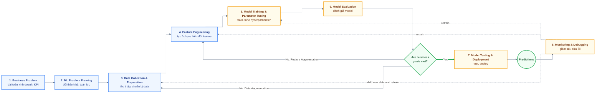

# AWS AIF-C01 - Ghi chú ôn thi (bản tổng hợp)

> Gộp từ: note gốc của bạn (`note_aif_01.txt`) + slide Stephane Maarek v19 + exam guide chính thức
> v1.1 + bảng tra `docs/RAG-MASTERY.md` §12. Kiểm tra lần cuối: 2026-09-26.
> Toàn bộ phần tiếng Việt trong note gốc được giữ lại. Chỗ nào sai đã sửa và đánh dấu ✏️.

**Ký hiệu nguồn** (mỗi dòng quan trọng đều có nguồn, để bạn tự kiểm tra lại)

| Ký hiệu | Nghĩa |
|---|---|
| `[G 1.1]` | Exam guide chính thức v1.1 (2026-04-30), Task Statement 1.1 |
| `[S p.105]` | Slide Maarek v19, trang 105 (số trang trong file PDF) |
| `[W]` | Trang web chính thức của AWS / Kiro, kiểm tra ngày 2026-09-26 |
| ✏️ **Sửa** | Note gốc bị sai hoặc thiếu, đã sửa |
| 💡 **Mẹo** | Mẹo nhớ do Claude tự đặt, KHÔNG phải tài liệu chính thức |
| 🔑 **Exam keywords** | Từ khóa hay gặp trong câu hỏi => đáp án |
| 🧭 **Cách chọn nhanh** | Cách phân biệt các từ / service dễ nhầm + câu tự luyện (Claude tự đặt, không phải câu thi thật) |
| *(Claude)* | Giải thích / định nghĩa chung của Claude, slide và guide không ghi |

## Mục lục

0. [Thông tin kỳ thi + mẹo làm bài](#0-thông-tin-kỳ-thi--mẹo-làm-bài)
1. [Những chỗ đã sửa trong note gốc](#1-những-chỗ-đã-sửa-trong-note-gốc)
2. [Amazon Q đã đổi thành Kiro / Quick?](#2-amazon-q-đã-đổi-thành-kiro--quick)
3. [Domain 1 - Fundamentals of AI and ML (20%)](#3-domain-1---fundamentals-of-ai-and-ml-20)
4. [Domain 2 - Fundamentals of GenAI (24%)](#4-domain-2---fundamentals-of-genai-24)
5. [Domain 3 - Applications of Foundation Models (28%)](#5-domain-3---applications-of-foundation-models-28)
6. [Domain 4 - Guidelines for Responsible AI (14%)](#6-domain-4---guidelines-for-responsible-ai-14)
7. [Domain 5 - Security, Compliance, Governance (14%)](#7-domain-5---security-compliance-governance-14)
8. [Chủ đề MỚI trong guide v1.1 mà slide v19 chưa có](#8-chủ-đề-mới-trong-guide-v11-mà-slide-v19-chưa-có)
9. [Service nào còn trong guide v1.1?](#9-service-nào-còn-trong-guide-v11)
10. [Quiz đã gặp + giải thích](#10-quiz-đã-gặp--giải-thích)

---

## 0. Thông tin kỳ thi + mẹo làm bài

**Format** `[G]` `[W]`
- 65 câu = **50 câu tính điểm + 15 câu không tính điểm** (không biết câu nào là câu không tính). 90 phút.
- Điểm 100-1000, **đậu >= 700**. Sai **không bị trừ điểm** => **không bao giờ bỏ trống câu nào**.
- Compensatory scoring: không cần đậu từng domain, chỉ cần tổng điểm đậu.
- 4 loại câu hỏi:
  - **Multiple choice**: 1 đáp án đúng, 3 đáp án sai (distractors = đáp án gây nhiễu).
  - **Multiple response**: >= 2 đáp án đúng trong >= 5 lựa chọn. Phải chọn **đủ** mới có điểm.
  - **Ordering** (sắp xếp thứ tự): 3-5 bước => phải nhớ **thứ tự** (xem 3.9 và 4.4).
  - **Matching** (nối cặp): 3-7 cặp => phải nhớ bảng "service <-> chức năng".

**Trọng số** `[G]`

| Domain | % | Ghi chú |
|---|---|---|
| 1. Fundamentals of AI and ML | 20% | Phần ML mới với bạn => học kỹ mục 3 |
| 2. Fundamentals of GenAI | 24% | |
| 3. Applications of Foundation Models | **28%** | Nặng nhất. RAG, prompt, fine-tune, evaluation |
| 4. Guidelines for Responsible AI | 14% | |
| 5. Security, Compliance, Governance | 14% | |

**Những việc KHÔNG thi** `[G]`: code model, làm feature engineering thật, tune hyperparameter thật, build pipeline,
tính toán thống kê, triển khai security/governance. => Chỉ cần **hiểu khái niệm + chọn đúng service**.

🔑 **Exam keywords chung** (từ `RAG-MASTERY.md` §12)

| Keyword trong câu hỏi | Nghĩa | Thường dẫn tới |
|---|---|---|
| MOST cost-effective / LEAST cost | rẻ nhất | batch, prompt engineering, RAG, model nhỏ |
| LEAST operational overhead / without managing infrastructure | ít phải vận hành nhất / không quản lý hạ tầng | fully managed service (Bedrock, serverless) |
| real-time / low latency | thời gian thực / độ trễ thấp | real-time inference |
| near real-time + large payload | gần thời gian thực + dữ liệu lớn | asynchronous inference |
| not needed immediately / large volume | không cần ngay / số lượng lớn | batch |
| human feedback / human review | phản hồi / kiểm duyệt của con người | RLHF, A2I, human evaluation |
| explain / explainability / why | giải thích vì sao | SageMaker Clarify, interpretable model |
| private connection / without internet | kết nối riêng, không qua internet | AWS PrivateLink |
| grounded / citations / company data | dựa trên dữ liệu thật / trích nguồn | RAG, Knowledge Bases |

**📖 Từ điển "chữ trong đề => task => đáp án"** *(Claude, gom từ các câu mock đã làm)*. Nhiều câu sai vì **không hiểu 1 từ**, không phải vì thiếu kiến thức:

| Chữ trong đề | Nghĩa | => Task | => Thường là |
|---|---|---|---|
| **summarize**, **summary**, **concise overview**, brief, **gist**, key points, condense | tóm tắt, ngắn gọn, tổng quan, ý chính | Summarization | GenAI (**Bedrock LLM**). Đánh giá bằng **ROUGE** (G = **G**isting) |
| **categorize**, **classify**, label, assign to a class, **which type** | phân loại, gán nhãn | Classification | supervised. Đánh giá bằng **confusion matrix** |
| **forecast**, **predict future** values, **trend** over time | dự báo tương lai, xu hướng | Time-series / regression | RNN, SageMaker |
| **segment**, **find groups**, **cluster** | chia nhóm, tìm nhóm | Clustering | **K-means** |
| **recommend**, suggest products, "customers also bought", **personalized** | gợi ý, cá nhân hóa | Recommendation | **Amazon Personalize** |
| **sentiment**, **opinion**, positive / negative, **entities**, **key phrases** | cảm xúc, ý kiến, thực thể | NLP understanding | **Amazon Comprehend** |
| **extract** text / **forms** / **tables** from **scanned** documents | trích xuất từ tài liệu scan | Document extraction | **Amazon Textract** |
| **transcribe**, **speech to text**, subtitles, call recordings | chép lời, giọng nói => chữ | Speech recognition | **Amazon Transcribe** |
| **read aloud**, **text to speech**, **lifelike voice** | đọc to, chữ => giọng | Speech synthesis | **Amazon Polly** |
| **images**, **video**, **faces**, **objects**, moderate **pictures** | ảnh, video, khuôn mặt | Computer vision | **Amazon Rekognition** |
| **resemble**, **similar to**, **compare with reference / provided examples** | giống, so với bài mẫu | Reference-based evaluation | ROUGE / BLEU / BERTScore |
| **inner mechanism**, **transparent**, **interpretable**, **explain each decision** | cơ chế bên trong, minh bạch, diễn giải được | Interpretability | Decision tree, linear / logistic regression (**không phải** neural network) |
| **unusual**, **outlier**, **anomaly** | bất thường, ngoại lệ | Anomaly detection | Isolation Forest (unsupervised) |
| **concise**, **coherent**, **fluent** | ngắn gọn, mạch lạc, trôi chảy | chất lượng text | (tính từ mô tả output, đọc kỹ requirement cuối câu) |
| **at runtime**, **in production**, operates **efficiently** | lúc đang chạy, trên production, hiệu quả | đo lúc **inference** | **inference latency** (không phải training time) |
| **reduce hallucinations** | giảm bịa | chỉnh output | **giảm temperature**, RAG grounding, Guardrails contextual grounding |
| **variables** shared across teams | biến = **features** | lưu / chia sẻ feature | **SageMaker Feature Store** |
| **extract key points** | rút ra **ý chính** | Summarization | LLM summarization (Bedrock). ⚠️ Khác "extract **entities**" (tên người, nơi chốn) => NER (Comprehend) |
| **no coding experience**, no ML knowledge, business analyst | không biết code / ML | no-code ML | **SageMaker Canvas** |
| **style / tone** that **employees prefer** | phong cách nhân viên thích (cảm tính) | Human evaluation | **human workforce + custom prompt dataset** |
| **natural language => SQL** / code | chữ thường => câu lệnh SQL | Text generation | **GPT / LLM** |
| model **analyzes a new** image / input | phân tích dữ liệu **mới** | Inference | **Inference** (không phải training, không phải deployment) |
| **monitor performance** (metrics, logs, alarms) | giám sát hiệu năng | Observability | **CloudWatch** (không phải CloudTrail / Config / Trusted Advisor) |
| **show its work**, **step by step**, explain reasoning | trình bày từng bước | Prompting | **Chain-of-thought** |
| **fill in missing words**, masked text | điền từ bị thiếu | Masked language model | **BERT** |
| **protect against prompt injection** (prompting technique) | chống chèn lệnh vào prompt | Prompt security | **Adversarial prompting** (+ Guardrails prompt attack filter) |
| **fully automated model tuning** | tự động tune model hoàn toàn | Hyperparameter tuning / AutoML | **SageMaker** (Automatic Model Tuning, Autopilot) |
| **view and adjust the weights** of variables | xem và chỉnh trọng số từng biến | model tuyến tính, dễ giải thích | **Logistic / linear regression** |
| **confidential data** was in the **training** set | data bí mật đã nằm trong data train | model đã "học" rồi | **Delete model => remove data => retrain** |
| generated images are **random**, need more **specific** / closer to prompt | ảnh sinh ra ngẫu nhiên, muốn bám prompt hơn | image generation | **increase CFG scale** |
| improve a **Bedrock Agent** with **specific examples** | thêm ví dụ cho agent | few-shot trong agent | **modify the advanced prompts** |
| **governance framework** characteristic | đặc điểm khung quản trị | quy tắc | **policies and guidelines** (data, transparency, responsible AI, compliance). ❌ không phải mục tiêu doanh thu / tăng trưởng |
| **offline batch** in RAG, content **published daily** | chạy trước, theo lô | chuẩn bị dữ liệu | **content embeddings + search index** |
| **assess compliance**, company **policies** and industry **regulations**, continuously | đánh giá tuân thủ liên tục | compliance | **AWS Audit Manager + AWS Config** |
| **steady / predictable** rate of requests + **custom (fine-tuned)** model | lưu lượng đều + model tự tùy chỉnh | Bedrock pricing | **Provisioned Throughput** |
| endpoint **not used for 15 days**, **underutilized**, idle resources | không dùng 15 ngày, dùng ít | cost optimization check | **AWS Trusted Advisor** (có check riêng cho Comprehend endpoints) |
| **transpose / rotate / resize** images, numerical transformations | xoay, lật ảnh (phép toán đơn giản) | **không cần ML** | **AWS Lambda** (code thường) |
| **output types** (text, image...) of a model | loại đầu ra / đầu vào | FM selection | **Modality** |
| **abnormal patterns**, **no labeled data** | mẫu bất thường, không có nhãn | anomaly detection | **Autoencoders** / Random Cut Forest / Isolation Forest (unsupervised) |
| chatbot must **check live data** (inventory, API) then answer | tra dữ liệu thật rồi trả lời | reason + act | **ReAct prompting** / Agents |
| "X is a **subset of** which **broader field**" | X là **nhánh con** của lĩnh vực **lớn hơn** nào | phân loại khái niệm | sentiment => **NLP**, object detection => **computer vision** |
| data **throughout the day**, over time, **trend** | theo thời gian trong ngày | data type | **Time series data** |
| **enterprise search** over documents | tìm kiếm tài liệu nội bộ | search | **Amazon Kendra** |
| output **unrelated to the input or task**, **not factually correct**, made-up | không liên quan, sai sự thật, bịa | GenAI weakness | **Hallucinations** |
| respond **within N seconds**, **pre-trained, no training** | phải trả lời trong N giây, không train thêm | model selection | **Model size** (nhỏ = nhanh) |
| **select / compare foundation models** for GenAI | chọn / so sánh FM | GenAI platform | **Amazon Bedrock** |
| **only approved data** for model training + **ethical guidelines** | chỉ dùng data đã duyệt | data & AI governance | **Amazon SageMaker Catalog** |
| minimize **environmental impact** | giảm tác động môi trường | sustainability | **tối ưu hiệu quả tính toán** (model nhỏ / hiệu quả hơn, Trainium / Inferentia) |
| **MLOps best practice** with a model in production | việc phải làm theo MLOps | vận hành | **continuously monitor outputs in production** |
| prompt must work **across all Bedrock LLMs**, what can **differ**? | khác nhau giữa các model | model limits | **Maximum token count** (context window) |
| **politically slanted**, avoid a **subject** (politics, investment advice...) | tránh 1 **chủ đề** | Guardrails | **Denied topics** (không phải content filters) |
| **charts / dashboards / visualizations** from natural language | tự tạo biểu đồ từ câu hỏi | BI | **Amazon Q in QuickSight** |
| resolves issues **without escalation** (không cần chuyển người thật) | tự giải quyết xong | business metric | **Task completion rate** |
| **proportion** of items **classified correctly** | tỉ lệ phân loại đúng | classification metric | **Accuracy** (không phải RMSE / MAE) |
| handles **specialized terminology** poorly | hiểu kém thuật ngữ chuyên ngành | customization | **Domain adaptation fine-tuning** |
| check bias with **least administrative effort** | kiểm tra bias ít công nhất | evaluation | **Benchmark datasets** |
| **vector search** backbone on OpenSearch | tìm kiếm vector | vector DB | **k-NN** nearest neighbor search |
| explain **individual predictions** to stakeholders | giải thích từng dự đoán | explainability | **Shapley values** (SHAP) |
| task split into **subtasks sent in sequence**, each building on the last | chia nhỏ, gửi lần lượt | prompting | **Prompt chaining** |
| what drives the **cost of each inference** | chi phí mỗi lần gọi | pricing | **Number of tokens** consumed |
| estimate a **price / number** | dự đoán số | regression | **Linear** regression (❌ logistic = classification) |

💡 **Mẹo đọc đề**: **requirement nằm ở CUỐI câu** ("... and provide a concise overview", "... to document how the inner mechanism..."). Đọc cuối câu trước, rồi mới đọc phần đầu.
💡 **Mẹo "từ độc"** (cho đáp án dài): mỗi đáp án sai thường chỉ có **1 từ làm nó sai** (vd "from **scratch**", "by **pre-training**", "**slower**"). Đọc từng đáp án, tìm từ đó rồi gạch bỏ. Đáp án đúng thường khớp gần **nguyên văn** định nghĩa.
💡 **Mẹo loại nhanh**: xem **INPUT** là gì (text / ảnh / audio / data số). Service nào không nhận loại input đó => loại ngay (vd input là **text** => loại Rekognition).

**Bảng tra nhanh requirement -> service** (từ `RAG-MASTERY.md` §12, đã cập nhật theo v1.1)

| Yêu cầu trong câu hỏi | Đáp án | Điểm khác biệt |
|---|---|---|
| Dữ liệu riêng / hay thay đổi, cần trích nguồn, không retrain | RAG | Grounding, không đổi weights |
| Đổi giọng văn, style, format, hành vi theo domain | Fine-tuning | Đổi weights |
| Cải thiện model từ đánh giá của con người | RLHF | Feedback của người định hình model |
| Dùng / tùy chỉnh FM, fully managed | Amazon Bedrock | Không lo hạ tầng |
| Toàn bộ vòng đời ML: chuẩn bị, train, deploy, monitor | Amazon SageMaker AI | End to end |
| Trích text / bảng / form từ ảnh scan, PDF | Amazon Textract | Đọc tài liệu |
| Sentiment, entity, PII trong text | Amazon Comprehend | NLP |
| Tìm dữ liệu nhạy cảm trong S3 | Amazon Macie | Phân loại dữ liệu |
| Vector search / nearest neighbour | OpenSearch Service | Vector engine |
| Chặn chủ đề, lọc nội dung, kiểm tra grounding | Bedrock Guardrails | Lớp policy |
| Phát hiện bias, giải thích dự đoán | SageMaker Clarify | Explainability |
| Ghi tài liệu mục đích, dữ liệu, rủi ro của model | SageMaker Model Cards | Governance |
| Phát hiện chất lượng giảm / drift trên production | SageMaker Model Monitor | Monitoring |
| Gọi Bedrock không đi qua internet | AWS PrivateLink | Kết nối riêng |
| Ai gọi API nào, khi nào | AWS CloudTrail | Audit |
| Metrics, logs, alarms | Amazon CloudWatch | Vận hành |
| Báo cáo compliance, chứng chỉ | AWS Artifact | Attestation |
| Nhiều dữ liệu, không cần kết quả ngay | Batch transform | Throughput |
| Chatbot / API, độ trễ thấp | Real-time inference | Latency |
| Traffic thất thường, ít vận hành | Serverless inference | Co giãn |
| Prompt prefix lặp lại tốn token và thời gian | Prompt caching | Chi phí và độ trễ |
| Gợi ý theo lịch sử người dùng | Amazon Personalize | Cá nhân hóa |
| Enterprise search theo quyền truy cập tài liệu | Amazon Kendra | ⚠️ Không còn trong list v1.1 (mục 9) |

---

## 1. Những chỗ đã sửa trong note gốc

Số dòng = số dòng trong `note_aif_01.txt`. Mức độ: 🔴 sai kiến thức (dễ mất điểm) · 🟡 thiếu / chưa chính xác · ⚪ lỗi chính tả.

| # | Dòng | Note gốc | Đã sửa thành | Nguồn |
|---|---|---|---|---|
| 1 | 521-530 | 🔴 Định nghĩa Precision / Recall / F1 / Accuracy bị **lệch 1 dòng** (định nghĩa của Recall nằm ở Precision, của F1 nằm ở Recall...) | Precision = đã đoán Positive thì đúng bao nhiêu. Recall = trong Positive thật tìm được bao nhiêu. F1 = cân bằng P + R. Accuracy = đúng bao nhiêu % tổng thể. Các dòng "=> Khi sợ..." vốn đã đúng, giữ nguyên. Xem 3.7 | `[S p.178-179]` |
| 2 | 573 | 🔴 Learning rate: "thấp thì hội tụ nhanh, cao thì chính xác hơn" (**ngược**) | **Cao** => hội tụ **nhanh** nhưng dễ vượt quá (overshoot) điểm tối ưu. **Thấp** => chính xác hơn nhưng hội tụ **chậm** | `[S p.191]` |
| 3 | 216 | 🔴 Top K "(0 to 1)" | Top K là **số lượng từ** (số nguyên, vd 10, 500), không phải 0-1. Chỉ Temperature và Top P là 0-1 | `[S p.105]` |
| 4 | 448 | 🟡 Self-supervised "(học ko giám sát...)" | "học **tự** giám sát". "Học không giám sát" = unsupervised, là khái niệm khác | `[S p.162]` |
| 5 | 190 | 🟡 Nova Act nằm trong nhóm "Creative" | Nova Act là service để build **agent tự động thao tác UI trên trình duyệt**, không phải model sáng tạo nội dung. Nghĩa tiếng Việt của bạn "trợ lý hành động / tự động hóa quy trình" là đúng | `[W]` |
| 6 | 793 | 🟡 Inspector "only for EC2, ECS and lambda?" | EC2, **ECR** (container image), Lambda. Không phải ECS | `[S p.336]` |
| 7 | 797 | 🟡 Trusted Advisor để trống | Đã điền: đề xuất theo 6 nhóm (cost, performance, security, fault tolerance, service limits, operational excellence) | `[S p.343]` |
| 8 | 735 | 🟡 Responsible AI "6 keywords" | AWS có **8 dimensions**: thêm Safety, Controllability, Veracity. Xem 6.1 | `[S p.265]` |
| 9 | 273 | 🟡 "Amazon Q Developer (Kiro)" | Gần đúng nhưng không phải đổi tên 1-1. Xem mục 2 | `[W]` |
| 10 | 294 | 🟡 "AWS Chatbot" | Từ 2025-02-19 AWS Chatbot **đã đổi tên** thành Amazon Q Developer (trong Slack / Teams) | `[W]` |
| 11 | 176 | 🟡 Provisioned Throughput: "ko có" | Provisioned Throughput (thường) **không phải** cách tiết kiệm chi phí, dùng để **giữ chỗ capacity** | `[S p.95]` |
| 12 | 34 | 🟡 "AWS managed work team: up to 2 models" | Giới hạn "so sánh tối đa 2 model" áp dụng cho **human evaluation job** nói chung | `[W]` |
| 13 | 566 | 🟡 "Phase of ML project" để trống | Đã điền. Xem 3.9 | `[S p.185-189]` |
| 14 | 639, 679 | 🟡 Transcribe Toxicity Detection, Personalize Recipes để trống | Đã điền. Xem 3.13 | `[S p.203, 212]` |
| 15 | 498 | 🟡 High bias = "rìa vòng bắn cung" | Rõ hơn: high bias = các điểm **tụm lại nhưng lệch khỏi tâm**. High variance = các điểm **rải rác**. *(Claude)* | |
| 16 | 822 | 🟡 HCD "environmental" | Slide không có nguyên tắc HCD nào tên "environmental". 4 nguyên tắc HCD xem 6.5 | `[S p.271]` |
| 17 | 236, 574, 590, 365, 440 | ⚪ Rezo-shot, Natch/match size, Textextract, "LM algorithm", Anormaly | Zero-shot, batch size, Textract, ML algorithm, Anomaly | |

Những chỗ đã kiểm tra và **đúng** (không cần sửa): Nova Micro chỉ nhận text `[S p.97]` · không tạo được Knowledge Base
bằng root user `[W]` · metric `ContentFilteredCount` `[S p.92]` · Distillation "up to 75% less expensive" `[S p.69]` ·
Top P / Top K / Temperature không ảnh hưởng giá và latency `[S p.95, 106]`.

---

## 2. Amazon Q đã đổi thành Kiro / Quick?

**Trả lời ngắn:** gần đúng, nhưng **không phải đổi tên 1-1**. Amazon Q có 2 sản phẩm chính và mỗi cái đi một hướng:

| Cái cũ (trong video / slide) | Bây giờ | Nguồn |
|---|---|---|
| **Amazon Q Business** | **Amazon Quick** = "the next evolution of Amazon Q Business". Q Business **không nhận khách hàng mới** nữa | `[W]` aws.amazon.com/q/business |
| **Amazon Q Developer** (plugin IDE) | AWS **ngừng hỗ trợ plugin IDE ngày 2027-04-30**, khuyên chuyển sang **Kiro** | `[W]` aws.amazon.com/q/developer |
| Amazon Q Developer CLI | Chạy `q update` => chuyển sang **Kiro CLI** | `[W]` Q Developer FAQ |
| **Kiro** | Sản phẩm **độc lập** (standalone), dùng lại một phần công nghệ của Q Developer (agent mode, MCP, steering, CLI) + thêm **spec-driven development** | `[W]` Q Developer FAQ |
| **AWS Chatbot** | Từ 2025-02-19 **đã đổi tên** thành Amazon Q Developer (trong Slack / Microsoft Teams) | `[W]` Q Developer FAQ |
| **Amazon CodeWhisperer** | Từ **2024-04-30** đã thành **1 phần của Amazon Q Developer** (code suggestions, security scans, code references) | `[W]` CodeWhisperer docs |

=> Tóm lại: **Q Developer (coding) ≈ Kiro**, **Q Business ≈ Quick**. Q Developer vẫn còn tồn tại (chưa hết hạn).

💡 Chuỗi đổi tên của trợ lý code: **CodeWhisperer** (cũ) => **Amazon Q Developer** (2024) => **Kiro** (mới). Đề cũ ghi CodeWhisperer thì hiểu là "AI code suggestions trong IDE".

**Exam guide v1.1 nói gì?** Phần objectives và danh sách in-scope chỉ có **Amazon Quick** và **Kiro**, không có
"Amazon Q". Nhưng bảng Revisions (trang 24 và 27 của PDF) vẫn ghi "Amazon Q" => **guide tự mâu thuẫn**.

=> **Học cả hai tên.** Video và mock test cũ hỏi Amazon Q. Đề mới có thể hỏi Quick / Kiro.

🔑 **Exam keywords**

| Keyword | Nghĩa | => Đáp án |
|---|---|---|
| employees ask questions about **company documents / internal data**, fully managed, **can't choose the FM** | nhân viên hỏi đáp trên dữ liệu công ty | Amazon Q Business (cũ) / Amazon Quick (mới) |
| **AI coding assistant**, code suggestions, **security scan** in IDE, answer about **your AWS account** | trợ lý viết code | Amazon Q Developer (cũ) / Kiro (mới) |
| **spec-driven development**, agentic IDE | phát triển dựa trên spec | Kiro |
| **no coding, no AWS account**, GenAI app playground | sân chơi tạo app GenAI không cần code | PartyRock |
| AWS notifications / troubleshoot **in Slack or Teams** | chatbot AWS trong Slack/Teams | AWS Chatbot = Amazon Q Developer in chat applications |

---

## 3. Domain 1 - Fundamentals of AI and ML (20%)

Guide yêu cầu `[G 1.1-1.3]`: định nghĩa thuật ngữ, phân biệt AI / ML / DL / GenAI / **agentic AI**, các loại inference,
các loại data, các kiểu learning, chọn kỹ thuật (regression / classification / clustering), khi nào **không** dùng AI,
các service AI managed, vòng đời ML, MLOps, metrics.

### 3.1 AI, ML, DL, GenAI (AI khác ML) `[S p.132-145]`

- Ví dụ AI: Computer vision, Facial recognition (nhận diện khuôn mặt), Fraud detection (ăn cắp thẻ tín dụng), IDP (intelligent document processing)

**AI components** (các tầng)
- Data layer
- ML framework and algorithm layer: data scientists and engineers work together to understand use cases, requirements, and frameworks that can solve them
- Model layer: implement model and train it. We have structures, parameters, and functions, optimizer functions
- App layer: expose model to user

**ML**: là 1 loại AI để build method cho máy tự học
- Data is leveraged to improve computer performance on a set of tasks
- Make predictions based on data used to train the model
- No explicit programming of rules (không lập trình luật cứng)
- 2 loại chính: Regression, Classification (xem 3.4)

**DL (Deep learning)**
- Subset of ML
- Uses neurons and synapses (khớp thần kinh) (like our brain) to train a model
- Process more complex patterns in the data than traditional ML
- "Deep" vì có nhiều hơn 1 layer: Input layer => Hidden layers (có thể nhiều tầng) => Output layer
- Ex: computer vision, NLP (text classification, machine translation, language generation)
- Large amount of input data
- Require GPU (Graphical Processing Unit)

**Neural networks**
- Nodes (tiny units) are connected together, organized in layers
- When the neural network sees a lot of data, it identifies patterns and changes the connections between the nodes
- Nodes are "talking" to each other, by passing on (or not) data to the next layer
- The math and parameter tuning behind: ko cần quan tâm
- Neural networks can have billions of nodes
- Ex: Recognizing hand-written digits: 1 layer detect nét thẳng: 1, 4, 7. 1 layer detect đường cong: 6, 8, 0 => this is "learned" by the neural network `[S p.139]`

**Gen AI**
- Subset of DL
- Foundation model backed by neural network
- Can be fine-tuned if necessary to better fit use case
- **Transformer model (LLM)**
  - Able to process a sentence **as a whole** instead of word by word
  - Faster and more efficient text processing (less training time)
  - Give relative importance to specific words in a sentence (more coherent sentences)
  - Trained on vast amounts of text data from internet, books, other sources, learn patterns and relationships between words and phrases
  - Ex: ChatGPT (Chat Generative Pre-trained Transformer), Google BERT
- **Diffusion models** (ex: Stable Diffusion) `[S p.142]`: ✏️ Training = **forward diffusion** (thêm nhiễu vào ảnh cho tới khi thành nhiễu hoàn toàn). Generating = **reverse diffusion** (khử nhiễu dần để tạo ảnh mới từ prompt). Note gốc "làm nhiễu ảnh rồi làm nét lại?" => **đúng**.
- **Multi-modal models** (gpt-4o): có thể nhận cả text, ảnh, video để trả ra kết quả kết hợp

**Agentic AI** ✏️ (mới trong v1.1 `[G 1.1]`, slide không có) *(Claude)*: AI (thường là GenAI) có thể **tự lập kế hoạch** nhiều bước,
**dùng tool / gọi API** và **tự hành động** để đạt mục tiêu, không chỉ trả lời 1 câu.

**Con người = hỗn hợp các loại AI** (ví dụ của bạn)
- AI: nếu cháy nhà thì dập lửa
- ML: thấy nhiều chó thì sau nhận ra con chó khác
- DL: thấy nhiều động vật thì lần đầu thấy hổ sẽ nghĩ nó là động vật
- Gen AI: đủ kiến thức thì tự sáng tạo thêm cái mới
- *(thêm)* Agentic AI: tự lên kế hoạch và tự đi làm việc đó (vd tự đặt vé máy bay)

💡 **Mẹo**: búp bê Nga lồng nhau: **AI ⊃ ML ⊃ DL ⊃ GenAI**. Agentic AI = GenAI + **tay chân** (tools, actions).

🔑 **Exam keywords**

| Keyword trong câu hỏi | Nghĩa | => Đáp án |
|---|---|---|
| mimic human intelligence, broad field | bắt chước trí tuệ con người, lĩnh vực rộng | AI |
| learn from data, **without explicit programming** | học từ dữ liệu, không lập trình luật | ML |
| neural network with **many hidden layers**, needs **GPU**, **complex patterns** | mạng nơ-ron nhiều tầng | Deep learning |
| **generate new** content (text, image, audio, code) | tạo nội dung mới | GenAI |
| **autonomous**, **plan** multi-step tasks, **use tools**, **take actions** | tự chủ, tự lên kế hoạch, tự hành động | Agentic AI / AI agent |
| process **whole sentence at once**, attention, relative importance of words | xử lý cả câu cùng lúc | Transformer |
| **add noise then remove noise** to generate images | thêm nhiễu rồi khử nhiễu | Diffusion model |
| accepts **text + image + audio/video** | đa phương thức | Multi-modal model |

### 3.2 ML terms có thể gặp trong đề `[S p.145]`

| Tên | Giải thích | Nhớ nhanh |
|---|---|---|
| GPT (Generative Pre-trained Transformer) | generate human text or computer code | AI tạo text |
| BERT (Bidirectional Encoder Representations from Transformers) | giống GPT nhưng **đọc text 2 chiều**, hiểu / ngữ cảnh hóa text, phù hợp cho dịch thuật, phân loại văn bản | AI **hiểu** text |
| RNN (Recurrent Neural Network) | for **sequential data** such as **time-series** or text, useful in speech recognition, time-series prediction, dự đoán giá | Nhớ dữ liệu trước đó trong chuỗi |
| ResNet (Residual Network - mạng dư thừa, cho thông tin đi tắt qua một số layer) | Deep Convolutional Neural Network (CNN) for **image recognition**, object detection, facial recognition | AI nhìn ảnh |
| SVM (Support Vector Machine) | ✏️ **ML** algorithm for classification and regression (phân loại và hồi quy). Email => SVM => Spam / Not Spam. Ảnh => SVM => Cat / Dog | Tìm ranh giới giữa các nhóm |
| WaveNet | generate **raw audio waveform**, used in **Speech Synthesis** | AI tạo giọng nói |
| GAN (Generative Adversarial Network) | generate **synthetic data** (images, videos, sound) that resemble training data. Helpful for **data augmentation** | Tạo data tương tự dựa trên 1 tệp data có sẵn |
| XGBoost (Extreme Gradient Boosting) | an implementation of gradient boosting | Nhiều decision tree sửa lỗi cho nhau |

**3 kiến trúc mạng hay bị trộn trong đáp án** (Q50):

| Kiến trúc | Cách xử lý | Câu mô tả hay gặp trong đề | Dùng cho |
|---|---|---|---|
| **Transformer** | xử lý **cả câu cùng lúc**, dùng **self-attention** để biết từ nào quan trọng với từ nào `[S p.141]` | "**self-attention**", "**contextual relationships**", "process the whole sentence at once" | LLM (GPT, BERT), cả multimodal |
| **CNN** (Convolutional) | trượt **bộ lọc (filter)** qua input để bắt **pattern cục bộ** *(Claude)* | "**convolutional layers**", "**filters**", "**local patterns**" | **ảnh** (ResNet là CNN `[S p.145]`) |
| **RNN** (Recurrent) | xử lý **từng phần tử một**, lặp vòng, nhớ phần trước `[S p.145]` | "**one element at a time**", "**cyclic / recurrent**", "sequential" | chuỗi thời gian, giọng nói |

💡 Mẹo: **T**ransformer = **T**ất cả cùng lúc + attention. **C**NN = **C**ửa sổ lọc (ảnh). **R**NN = **R**epeat từng bước (vòng lặp).

🔑 **Exam keywords**: "sequential / time-series" => **RNN** · "image recognition / CNN" => **ResNet** ·
"speech synthesis / raw audio" => **WaveNet** · "synthetic data / data augmentation" => **GAN** ·
"reads text in **both directions**" => **BERT**.
⚠️ "**fill in missing words**" (điền từ bị thiếu) => **BERT** (Q42): BERT được train bằng cách **che từ rồi đoán** (masked, self-supervised `[S p.163]`), và đọc **cả 2 phía** của chỗ trống

### 3.3 Training data `[S p.146-149]` `[G 1.1]`

- Must have good input data. **Garbage in => garbage out**
- Bước quan trọng nhất để build được good model
- Cách mô hình hóa data sẽ ảnh hưởng tới loại thuật toán dùng để train

| Loại | Giải thích | Ví dụ |
|---|---|---|
| **Labeled** (có nhãn) | Hình con chó có nhãn "đây là chó" | => Supervised learning: model học map input => known output |
| **Unlabeled** (không nhãn) | Ngược lại | => Unsupervised learning: model tự tìm pattern / structure |
| **Structured** (có cấu trúc) | Data có cấu trúc, thường theo hàng và cột (Excel) | **Tabular** (bảng: hàng và cột), **Time-series** (chuỗi thời gian: giá cổ phiếu) |
| **Unstructured** (phi cấu trúc) | Thường là text hoặc multimedia | **Text** (review của user, bài post), **Image** (ảnh cho object recognition) |

🔑 **Exam keywords**: labeled / annotated (đã gắn nhãn) · unlabeled (chưa gắn nhãn) · tabular (dạng bảng) ·
time-series (chuỗi thời gian, có thứ tự theo thời gian) · structured vs unstructured (có / không có cấu trúc).

#### 🧭 Cách chọn nhanh (Claude) - mục 3.1 đến 3.3

- Đề hỏi "cái nào **rộng nhất**?" => AI. "cái nào **hẹp nhất**?" => GenAI (trong nhóm AI / ML / DL / GenAI)
- Đề nói "**nhiều hidden layers**, GPU, ảnh / giọng nói phức tạp" => Deep learning
- Đề nói "**tự làm nhiều bước**, gọi tool" => Agentic AI (không phải chỉ GenAI)
- Đề nói "data **theo thời gian**" (giá cổ phiếu mỗi ngày, nhiệt độ mỗi giờ) => **time-series** => model gợi ý: **RNN**

**Tự kiểm tra nhanh** (câu Claude tự đặt, **không phải** câu thi thật)

| Câu hỏi | Đáp án |
|---|---|
| Which is the broadest field: ML, DL, AI, GenAI? | AI |
| A model writes new marketing images from a text prompt. | GenAI (diffusion model) |
| An assistant plans a trip, searches flights, then books the ticket by itself. | Agentic AI |
| Daily stock prices over 5 years. What data type? | Time-series (structured) |
| Customer reviews written in free text. Structured or unstructured? | Unstructured (text) |

### 3.4 Các kiểu learning `[S p.147-171]` `[G 1.1, 1.2]`

**e. Supervised Learning** (AI có đáp án để học)
- Learn a mapping function that can predict the output for new unseen input data
- Need **labeled** data
- **Regression** (hồi quy):
  - Predict a **numeric value** based on input data. Output là số liên tục
  - Use cases: predict a quantity or real value
  - Ex: cân nặng trung bình của người cao 1m6 => theo linear regression line => 60kg
  - Ex: dự đoán giá nhà, cổ phiếu, dự báo thời tiết (nhiệt độ)
- **Classification** (phân loại):
  - Predict the **category label** of input data
  - Output is **discrete** (rời rạc), falls into a specific category or class
  - Binary classification: email spam or not
  - Multiclass classification: động vật => có vú, chim, bò sát
  - Multi-label classification: gán nhiều nhãn cho 1 phim (horror, action)
  - Key algorithm: **K-nearest neighbors (k-NN)** `[S p.152]`

**f. Unsupervised Learning** (cho AI dữ liệu nhưng không nói đáp án)
- Goal: discover inherent patterns, structures, or relationships within the input data
- The machine must uncover and create the groups itself, but humans still put labels on the output groups

| Technique | Ví dụ | Thuật toán |
|---|---|---|
| **Clustering** (phân cụm) | phân loại user theo lịch sử mua hàng thành các nhóm: sinh viên / bố mẹ / người ăn chay | **K-means** |
| **Association rule learning** (luật kết hợp) | siêu thị muốn biết sản phẩm nào hay được mua chung để đặt gần nhau | **Apriori** |
| **Anomaly detection** (phát hiện bất thường) | fraud detection (chống gian lận) | **Isolation Forest** |

**g. Semi-supervised Learning** (có một ít đáp án + nhiều dữ liệu chưa có đáp án) `[S p.161]`
- Train với ít labeled data, rồi model tự gắn nhãn cho unlabeled data (**pseudo-labeling**)
- Train tiếp với data mới đó

**h. Self-supervised Learning** ✏️ (học **tự** giám sát, model tự label data) `[S p.162-163]`
- Model tự tạo bài toán / đáp án từ dữ liệu. Dữ liệu tự cung cấp đáp án cho chính nó (che 1 từ => model đoán từ đó)
- Widely used in NLP (to create GPT, BERT)
- **Pre-text tasks**: các task đơn giản ban đầu. Sau đó model đã train có thể giải "**downstream tasks**"

**i. Reinforcement Learning (RL)** `[S p.164-168]`
- An **agent** learns to make decisions by performing **actions** in an **environment** to maximize **cumulative rewards** (tổng phần thưởng)
- Key concepts:
  - Agent: the learner / decision maker
  - Environment: external system the agent interacts with
  - Action: the choice made by agent
  - Reward: the feedback from the environment based on agent actions
  - State: current situation of environment
  - Policy: strategy agent uses to determine actions based on state
- Learning process: Agent observes **State** => chọn **Action** theo **Policy** => environment chuyển sang State mới + trả **Reward** => Agent cập nhật Policy
- Ex: Gaming, Robotics, Finance (trading strategies), Healthcare (optimizing treatment plans), xe tự lái

**j. RLHF (Reinforcement Learning from Human Feedback)** `[S p.169-171]`
- Human feedback giúp ML model tự học hiệu quả hơn (human feedback nằm trong **reward function**)
- Các bước:
  1. Chuẩn bị prompts và responses do human tạo
  2. => fine-tuning model with internal knowledge
  3. => model tạo response dựa trên prompt
  4. => so sánh response của model vs human
  5. => Reward: đưa 2 response, xem người thích cái nào
  6. => dùng feedback đó tiếp tục optimize model (phần này có thể tự động hoàn toàn)
- Service: **SageMaker Ground Truth** (RLHF, human labeling) `[S p.247]`

💡 **Mẹo chọn kỹ thuật**
- "**How much? / bao nhiêu?**" (ra 1 con số) => **Regression**
- "**Which one? / cái nào?**" (ra 1 nhóm / nhãn) => **Classification**
- "**Who is alike? / ai giống ai?**" (chưa có nhãn) => **Clustering**
- Note gốc của bạn: "đi thi chỉ cần thấy **class / category / label** → Classification; **price / amount / value / number** → Regression là xử lý được rất nhiều câu."

🔑 **Exam keywords**

| Keyword trong câu hỏi | Nghĩa | => Đáp án |
|---|---|---|
| predict **price / amount / quantity / temperature** | dự đoán giá trị số | Regression (supervised) |
| **spam or not**, category, **class**, label, **yes/no** | phân loại | Classification (supervised) |
| **group / segment** customers, **no labels** | chia nhóm, không có nhãn | Clustering, K-means (unsupervised) |
| products **bought together** | mua cùng nhau | Association rules, Apriori |
| **outliers**, unusual transactions, fraud | điểm bất thường | Anomaly detection, Isolation Forest |
| **small** labeled + **large** unlabeled, **pseudo-labeling** | ít nhãn, nhiều không nhãn | Semi-supervised |
| **mask a word** and predict it, **pre-text task** | che từ rồi đoán | Self-supervised |
| **agent, environment, reward, trial and error**, maximize reward | học thử sai, nhận thưởng | Reinforcement learning |
| **human preferences**, rank responses, align with humans | người chấm / xếp hạng câu trả lời | RLHF (SageMaker Ground Truth) |

#### 🧭 Cách chọn nhanh (Claude) - hỏi 1 câu: "**Data có nhãn (label) không?**"

```
Data có nhãn không?
├─ CÓ HẾT  => Supervised
│            ├─ output là SỐ (giá, cân nặng, nhiệt độ)   => Regression
│            └─ output là NHÓM (spam / not spam, loài)    => Classification
├─ KHÔNG   => Unsupervised
│            ├─ chia thành NHÓM giống nhau               => Clustering (K-means)
│            ├─ cái gì hay ĐI CÙNG nhau                   => Association (Apriori)
│            └─ cái gì BẤT THƯỜNG                         => Anomaly detection (Isolation Forest)
├─ ÍT nhãn + NHIỀU không nhãn                             => Semi-supervised (pseudo-labeling)
└─ Model TỰ tạo nhãn từ data (che từ rồi đoán)            => Self-supervised

Không có dataset, học bằng THỬ - SAI + PHẦN THƯỞNG         => Reinforcement learning
Người thật chấm / xếp hạng câu trả lời                     => RLHF
```

🔁 **ĐIỂM YẾU SỐ 1 - đã sai 5 lần** (Q5, Q55, Q60, Q72): mọi câu có "**group / segment / cluster / similar**" + **không nói có nhãn** => **Unsupervised** (clustering, K-means).

| Câu "Which is an example of **unsupervised** learning?" | Loại |
|---|---|
| **groups** customers / data points by **similarity** or purchase history | ✅ **Unsupervised** (clustering) |
| classifies images as dogs or cats | ❌ Supervised (classification, cần nhãn) |
| predicts a house price from features | ❌ Supervised (regression, cần giá thật) |
| learns chess by **trial and error** | ❌ **Reinforcement** learning |
| generates text from a prompt | ❌ không phải ví dụ unsupervised (LLM train kiểu **self-supervised**) |

**Anomaly detection không có nhãn** (Q73): Isolation Forest `[S p.160]`, **Autoencoders** *(Claude)*: mạng nơ-ron học **nén rồi dựng lại** dữ liệu bình thường. Dữ liệu **bất thường** dựng lại **sai nhiều** => bị phát hiện. **Random Cut Forest** *(Claude)*: thuật toán anomaly detection có sẵn trong SageMaker.

⚠️ **Bẫy "Logistic regression"** (Q105): tên có chữ "regression" nhưng là thuật toán **CLASSIFICATION** (dự đoán **xác suất** có / không). Dự đoán **giá / số** liên tục => **Linear** regression.

⚠️ **Bẫy "K-means vs k-NN"** (cả 2 đều có chữ K, đã gặp trong mock test):

| | **K-means** | **k-NN** (K-nearest neighbors) |
|---|---|---|
| K là | **số nhóm** muốn tạo (K = 3 => 3 nhóm) | **số hàng xóm** được hỏi ý kiến |
| Loại | **Unsupervised** (không cần nhãn) | **Supervised** (cần nhãn) `[S p.152]` |
| Việc | **Clustering**: **TẠO** nhóm mới | **Classification**: xếp vào nhóm **ĐÃ CÓ** |
| Nhớ | "**mean**" = trung bình = **tâm** của mỗi nhóm | "**NN** = Nearest **Neighbors**" = hỏi **hàng xóm** đã có nhãn rồi bỏ phiếu |

=> Đề nói "**find / discover / segment groups**" (tìm nhóm khách hàng...) => **K-means** `[S p.158]`. Decision tree, SVM, k-NN đều **supervised** => loại.

⚠️ **Bẫy "fraud detection"**: có nhãn "fraud / not fraud" => **Classification** `[S p.152]`. Không có nhãn, chỉ tìm giao dịch **lạ** => **Anomaly detection** `[S p.160]`. => Đọc kỹ đề có nói "labeled" hay không.

**Tự kiểm tra nhanh** (câu Claude tự đặt, **không phải** câu thi thật)

| Câu hỏi | Đáp án |
|---|---|
| Predict a house price from its size and location. | Regression |
| Past transactions are labeled "fraud" or "not fraud". Predict new ones. | Classification |
| No labels. Find transactions that look unusual. | Anomaly detection (unsupervised) |
| Group customers by buying behavior. No labels. | Clustering |
| A shop wants to know which products are often bought together. | Association rule learning |
| Only 100 of 10,000 images are labeled. The model labels the rest, then retrains. | Semi-supervised |
| A language model learns by predicting hidden (masked) words in text. | Self-supervised |
| A robot learns to walk by trial and error, getting points for each step. | Reinforcement learning |

### 3.5 Training / Validation / Test set + Feature engineering `[S p.153-157]`

| Set | Dùng để | Ví dụ |
|---|---|---|
| **Training set** | train model | 1000 ảnh, 60-80% ảnh đã gắn nhãn => training set |
| **Validation set** | **tune hyperparameters** và kiểm tra performance | 100 ảnh có nhãn để hyperparameter tuning (chỉnh setting của thuật toán cho hiệu quả hơn) |
| **Test set** | đánh giá **final performance** | |

**Feature engineering** (structured data)
- Dùng **domain knowledge** (kiến thức chuyên ngành) để chọn và biến đổi raw data thành **meaningful features**
- Giúp tăng performance của ML model
- Techniques:
  - **Feature extraction**: lấy thông tin hữu ích từ raw data. Ex: đang để năm sinh => convert thành số tuổi
  - **Feature selection**: chọn subset các feature liên quan. Ex: input có 10 thông tin, nhưng dự đoán giá nhà chỉ cần 6
  - **Feature transformation**: biến đổi data cho model chạy tốt hơn, vd **normalizing**. Ex: 300000000 được normalize nhỏ lại để model dễ xử lý

**Feature engineering** (unstructured data)
- Text: vd review của user => convert thành positive / negative => dùng feature selection lấy ra keyword hữu ích
- Image: lấy thông tin từ pixel: đường nét, hình dạng, texture, pattern

🔑 **Exam keywords**: "use **domain knowledge** to create features" => feature engineering ·
"convert birth date to **age**" => feature extraction · "choose **most relevant** features" => feature selection ·
"**normalize / scale**" => feature transformation · "**tune hyperparameters**" => validation set ·
"**final evaluation**" => test set.

### 3.6 Model Fit, Bias, Variance `[S p.172-176, 192]` `[G 4.1]`

**Model fit**: model performance kém => xem fit

- **Overfitting** (quá khớp):
  - Perform well on **training** data, **poorly** on evaluation / new data
  - Nguyên nhân:
    - Training data size too small, không đại diện cho mọi input
    - Model trains too long on a single sample set of data
    - Model complexity is high and learns from the "**noise**" (nhiễu) in training data
  - Cách phòng:
    - Increase training data size
    - **Early stopping** the training
    - **Data augmentation** (tăng đa dạng dataset: lật, crop, đổi dpi...): tạo thêm training data từ data có sẵn
    - Adjust hyperparameters (but you can't "add" them)
    - **Ensembling** (kết hợp nhiều model để ra kết quả chính xác)
- **Underfitting** (chưa khớp):
  - Model performs poorly **even on training** data
  - Do model quá đơn giản hoặc features kém
- **Balanced**: không overfit, không underfit

**Bias** (độ lệch): sai số giữa giá trị dự đoán và giá trị thật, do chọn sai trong quá trình ML
- **High bias** = **underfitting**. Model không khớp với training data. Ex: dùng linear regression cho data phi tuyến
- ✏️ Hình dung bắn cung: các điểm **tụm lại nhưng lệch khỏi tâm** *(Claude)*
- Reduce bias: dùng model **phức tạp hơn**, **tăng số features** (dữ liệu chưa được chuẩn bị đầy đủ)

**Variance** (phương sai): performance của model thay đổi bao nhiêu nếu train trên dataset khác có phân phối tương tự
- **High variance** = **overfitting**. Model rất nhạy với thay đổi của training data. Tốt trên training data, kém trên data mới
- Hình dung bắn cung: các điểm **rải rác** khắp nơi *(Claude)*
- Reduce variance: **feature selection** (ít feature hơn, feature quan trọng hơn), **chia train / test nhiều lần**

⚠️ **Cùng 1 cách, 2 kết quả ngược nhau** (Q23 vs Q43):
- **Tăng epochs / thêm features / model phức tạp hơn** => sửa **underfitting**, nhưng làm **overfitting nặng hơn**
- **Tăng regularization / bớt features / early stopping** => sửa **overfitting**
=> Đọc kỹ đề: model **kém trên training** (underfit) hay **tốt trên training, kém trên data mới** (overfit)?

💡 **Mẹo**: **Overfit = học vẹt** (thuộc lòng sách, đi thi đề mới thì trượt). **Underfit = chưa học bài** (đề cũ cũng sai).
High **V**ariance = o**V**erfit. High **B**ias = underfit ("**B**asic" model quá đơn giản).

🔑 **Exam keywords**

| Keyword trong câu hỏi | => Đáp án |
|---|---|
| good on **training** data, poor on **new / test / evaluation** data | Overfitting / high variance |
| poor even on **training** data, model **too simple** | Underfitting / high bias |
| how to fix overfitting? | more data, early stopping, data augmentation, ensembling, regularization, feature selection |
| ⚠️ overfitting + options "regularization" (Q43) | **INCREASE** regularization (giảm độ phức tạp) `[S p.191]`. ❌ Decrease regularization, ❌ add more features, ❌ more epochs => đều làm overfitting **nặng hơn** |
| how to fix underfitting? | more complex model, more features, train longer (more epochs) |

### 3.7 Model evaluation metrics ✏️ (đã sửa) `[S p.178-182]` `[G 1.3]`

**Confusion Matrix** (ma trận nhầm lẫn)

| | Đoán Positive | Đoán Negative |
|---|---|---|
| **Thật Positive** | TP (đoán đúng) | FN (đoán Negative nhưng sai = **bỏ sót**) |
| **Thật Negative** | FP (đoán Positive nhưng sai = **báo nhầm**) | TN (đoán đúng) |

| Metric | ✏️ Định nghĩa đúng | Công thức | Dùng khi |
|---|---|---|---|
| **Precision** | **Đã đoán Positive thì đúng bao nhiêu?** (đoán Positive có chuẩn không) | TP / (TP + FP) | Sợ **False Positive** → không muốn **báo nhầm** |
| **Recall** | **Trong số Positive thật, tìm được bao nhiêu?** (có bỏ sót Positive không) | TP / (TP + FN) | Sợ **False Negative** → không muốn **bỏ sót** |
| **F1 score** | **Cân bằng Precision và Recall** (trung bình điều hòa của P và R) | 2PR / (P + R) | Cần cân bằng P + R, đặc biệt **dữ liệu không cân bằng** (imbalanced) |
| **Accuracy** | **Đúng bao nhiêu % tổng thể?** | (TP + TN) / tổng | Positive và Negative **khá cân bằng** (balanced) |

💡 **Mẹo**
- **P**recision = "trong những cái tôi **P**hán là Positive, bao nhiêu cái đúng?"
- **R**ecall = "trong tất cả Positive thật, tôi **R**ecall (gọi tên / tìm lại) được bao nhiêu?"
- Lọc spam (sợ xóa nhầm mail thật) => **Precision**. Ung thư, gian lận (sợ bỏ sót) => **Recall**.

**AUC-ROC** (Area Under the Curve - Receiver Operating Characteristic, diện tích dưới đường cong) `[S p.180]`
- How well the model separates classes. Giá trị 0 tới 1, **1 = model hoàn hảo**
- Dùng sensitivity (true positive rate) và 1 - specificity (false positive rate) ở nhiều ngưỡng (threshold)
- Lưu ý: guide v1.0 có AUC, v1.1 đổi ví dụ thành precision, recall `[G revisions]`. Vẫn nên biết

**Metrics cho regression** (đánh giá chất lượng hồi quy) `[S p.181]`
- MAE (Mean Absolute Error), MAPE (Mean Absolute Percentage Error), RMSE (Root Mean Squared Error)
- R² (R squared): giải thích variance của model. **R² gần 1 = dự đoán tốt**
- Ex: dự đoán điểm thi của học sinh dựa trên số giờ học

**🔤 Dịch câu trong đề => metric** (đã gặp trong mock test, xem Q14 mục 10). Đề hay mô tả **bằng lời** thay vì gọi tên:

| Câu trong đề | Dịch | => Metric |
|---|---|---|
| "correctly classified items / **total** (correctly **and** incorrectly) classified items", "**overall** correct" | đúng / **tất cả** | **Accuracy** |
| "of items **predicted positive**, how many are actually positive", TP / (TP + **FP**) | trong số **đoán Positive**, bao nhiêu đúng | **Precision** |
| "of **actual positives**, how many were found", TP / (TP + **FN**), "**sensitivity**", "**true positive rate**" | trong số **Positive thật**, tìm được bao nhiêu | **Recall** `[S p.180]` |
| "**harmonic mean** of precision and recall", "**balance** precision and recall" | trung bình điều hòa, cân bằng | **F1** |

💡 Precision và Recall **luôn** nói tới chữ "**positive**". Đề không có chữ positive, chỉ nói "**all / total / overall**" => **Accuracy**.
⚠️ Note gốc dòng 521 từng ghi "Precision: Đúng bao nhiêu % tổng thể?". Câu đó là định nghĩa của **Accuracy** (đã sửa ở mục 1, lỗi #1).

⚠️ **Bẫy "Confusion matrix vs Correlation matrix"** (đã gặp trong mock test, xem Q8 mục 10):

| | **Confusion matrix** | **Correlation matrix** |
|---|---|---|
| Nhìn vào | kết quả của **MODEL** (đoán đúng / sai từng class) | các **BIẾN trong DATA** liên quan nhau thế nào |
| Lúc nào | **SAU** khi train (đánh giá model classification) `[S p.179]` | **TRƯỚC** khi train (EDA, chọn feature) `[S p.188]` |
| Nhớ | **Con**fusion = model bị **con**fused (nhầm lẫn) | **Cor**relation = các cột data **liên quan** nhau |

**Nhớ nhanh** (note gốc)
- Thấy **classification** => Precision, Recall, F1, Accuracy, AUC
- Thấy **regression** => MAE, MAPE, RMSE, R²

**Business metrics** `[G 1.3]`: cost per user (chi phí mỗi user), development costs (chi phí phát triển), customer feedback, ROI (return on investment, lợi nhuận trên vốn đầu tư).

🔑 **Exam keywords**: "**false positives** are costly" => Precision · "**false negatives** are costly / must **not miss**" => Recall ·
"**imbalanced** dataset" => F1 · "**balanced** dataset" => Accuracy · "model **separates classes**, thresholds" => AUC-ROC ·
"predict **numeric** value, evaluate" => RMSE / MAE / R².

#### 🧭 Tự kiểm tra nhanh - mục 3.6 và 3.7 (câu Claude tự đặt, **không phải** câu thi thật)

| Câu hỏi | Đáp án |
|---|---|
| Training accuracy 99%, test accuracy 60%. | Overfitting (high variance) |
| Training accuracy 55%, test accuracy 54%. | Underfitting (high bias) |
| Cancer screening. Missing a sick patient is very dangerous. | Recall (sợ bỏ sót = sợ False Negative) |
| Spam filter. Moving a real email to spam is very bad. | Precision (sợ báo nhầm = sợ False Positive) |
| 99% of transactions are "not fraud". Which metric? | F1 score |
| Predict tomorrow's temperature. Which metrics? | MAE / RMSE / R² (regression) |

💡 Vì sao câu "99% not fraud" không dùng Accuracy? *(Claude)* Model ngốc chỉ luôn đoán "not fraud" cũng đạt **99% accuracy**, nhưng **không bắt được gian lận nào** (recall = 0). => Data **mất cân bằng** thì dùng **F1**.

### 3.8 ML Inferencing (dự đoán trên data mới) `[S p.183-184, 231-232]` `[G 1.1]`

- **Real-time**: máy phải quyết định **nhanh** khi data tới. **Speed > perfect accuracy**. Ex: chatbot
- **Batch**: phân tích **nhiều data cùng lúc**. Thường dùng cho data analysis. **Accuracy > speed**
- **Inferencing at the edge**:
  - Edge device: thiết bị ít sức mạnh tính toán, **gần nơi tạo ra data**, nơi **internet có thể bị hạn chế**
  - **SLM (small language model) trên edge device**: very low latency, low compute footprint, **offline** capability, local inference
  - **LLM trên remote server** (Bedrock): model mạnh hơn, latency cao hơn, **phải online**

**SageMaker: 4 kiểu inference** ✏️ (guide v1.1 thêm asynchronous, serverless `[G 1.1]`) `[S p.232]`

| Kiểu | Latency | Payload | Thời gian xử lý tối đa | Dùng khi |
|---|---|---|---|---|
| **Real-time** | thấp (ms tới giây) | tới 25 MB | 60 giây | web / mobile app cần kết quả ngay |
| **Serverless** | thấp (ms tới giây) | tới 4 MB | 60 giây | traffic **thất thường** (sporadic), **chấp nhận cold start**, không quản lý hạ tầng |
| **Asynchronous** | trung bình tới cao ("near real-time") | **tới 1 GB** | **1 giờ** | payload **lớn**, xử lý **lâu**, request / response qua S3, có **hàng đợi** (queue) |
| **Batch transform** | cao (phút tới giờ) | 100 MB mỗi mini batch | 1 giờ | xử lý **cả dataset** một lúc |

🔑 **Exam keywords**

| Keyword | Nghĩa | => Đáp án |
|---|---|---|
| immediate, **low latency**, milliseconds, interactive | tức thì, độ trễ thấp | Real-time |
| **intermittent / sporadic / unpredictable** traffic, **cold start** acceptable, no infrastructure | lúc có lúc không | Serverless |
| **large payload (up to 1 GB)**, **long processing (up to 1 hour)**, near real-time, **queue** | dữ liệu lớn, xử lý lâu | Asynchronous |
| **entire dataset**, results **not needed immediately**, offline, scheduled | cả bộ dữ liệu, không gấp | Batch transform |
| **no / limited internet**, **on device**, offline | không có mạng, chạy trên thiết bị | Edge + SLM |

#### 🧭 Cách chọn nhanh (Claude) - hỏi 3 câu theo thứ tự

```
1. Không có internet / chạy trên thiết bị?                => Edge (SLM)
2. Cần kết quả NGAY (mili giây)?
   ├─ traffic đều, liên tục                               => Real-time
   └─ traffic lúc có lúc không, chịu được cold start       => Serverless
3. KHÔNG cần ngay?
   ├─ từng request LỚN (tới 1 GB) / xử lý LÂU (tới 1 giờ)  => Asynchronous
   └─ chấm CẢ dataset một lần (ví dụ mỗi đêm)              => Batch transform
```

💡 **Mẹo**: **Async = gửi thư** (gửi đi, lát sau có kết quả, xếp hàng). **Batch = giặt cả máy đồ** một lần. **Serverless = đèn cảm ứng** (chỉ bật khi có người, lúc bật hơi chậm = cold start).

**Tự kiểm tra nhanh** (câu Claude tự đặt, **không phải** câu thi thật)

| Câu hỏi | Đáp án |
|---|---|
| Users upload 500 MB videos. Results within a few minutes are fine. | Asynchronous |
| Score 10 million customer records every night. | Batch transform |
| An internal tool used only a few times a day. Minimize cost, no servers to manage. | Serverless |
| Check a card payment for fraud in milliseconds. | Real-time |
| A factory camera with no internet connection must detect defects. | Edge (SLM / model on device) |

### 3.9 Phases of ML project ✏️ (note gốc để trống, đã điền) `[S p.185-189]`

Sơ đồ vẽ lại từ slide p.185 (đủ tất cả mũi tên). Xanh dương = business / data · Cam = model · Xanh lá = quyết định.
Nét liền = luồng chính · Nét đứt = vòng lặp retrain sau khi đã chạy production.



**Giải thích từng ô** (thứ tự quan trọng cho câu hỏi **ordering**) `[S p.186-189]`

| # | Ô trong sơ đồ | Làm gì |
|---|---|---|
| 1 | **Business Problem** | Stakeholders xác định value, budget, success criteria. Định nghĩa **KPI** (Key Performance Indicators) là then chốt |
| 2 | **ML Problem Framing** | Chuyển business problem thành ML problem. **Xác định ML có phù hợp không**. Data scientists, data engineers, ML architects, SME (subject matter experts, chuyên gia nghiệp vụ) cùng làm |
| 3 | **Data Collection & Preparation** | Đưa data về dạng dùng được: collection and integration (tập trung data về 1 chỗ), preprocessing, visualization. **EDA** (Exploratory Data Analysis, phân tích khám phá): vẽ biểu đồ, **correlation matrix** (ma trận tương quan: các biến "liên quan" nhau bao nhiêu) => giúp chọn feature quan trọng `[S p.188]` |
| 4 | **Feature Engineering** | Create, transform, extract variables (xem 3.5) |
| 5 | **Model Training & Parameter Tuning** | Train model, tune hyperparameters (xem 3.10) |
| 6 | **Model Evaluation** | Đánh giá model (metrics xem 3.7) |
| ◆ | **Are business goals met?** | **No** => quay lại: thêm data (**Data Augmentation**, về ô 3) hoặc thêm feature (**Feature Augmentation**, về ô 4). **Yes** => deploy |
| 7 | **Model Testing & Deployment** | Kết quả tốt thì deploy. Chọn kiểu deploy (real-time, serverless, asynchronous, batch, on-premises) => model bắt đầu ra **Predictions** |
| 8 | **Monitoring & Debugging** | Kiểm tra performance, phát hiện sớm và xử lý, debug. Có data mới => **Add new data and retrain** (quay về ô 3, 4 hoặc 5) |

**Iterations** (lặp lại): model liên tục được cải thiện khi có data mới hoặc yêu cầu thay đổi => đó là các mũi tên quay về trong sơ đồ.

Pipeline theo guide cũ v1.0 (vẫn đúng, dễ ra câu ordering) `[G v1.0 1.3.1]`:
data collection => EDA => data pre-processing => feature engineering => model training => hyperparameter tuning => evaluation => deployment => monitoring

- **EDA = Exploratory Data Analysis** (phân tích khám phá dữ liệu): **nhìn và hiểu data trước khi train**. Vẽ biểu đồ, **correlation matrix** (ma trận tương quan) để xem biến nào liên quan nhau => chọn feature quan trọng `[S p.188]`. *(Claude)* Phát hiện sớm data thiếu, giá trị bất thường, class mất cân bằng
- 💡 Mẹo: EDA = "nhìn kỹ nguyên liệu trước khi nấu"
- 🔑 Keyword: "**visualize** data", "**correlation matrix**", "understand data **before training**" => EDA

💡 **Mẹo nhớ thứ tự**: "**Goal => Frame => Data => Model => Deploy => Monitor**" (Mục tiêu => Đóng khung bài toán => Dữ liệu => Model => Triển khai => Giám sát).

🔑 **Exam keywords**: "**KPI**, success criteria, stakeholders" => business goals · "convert business problem to ML problem, **is ML appropriate?**" => ML problem framing ·
"**visualize**, **correlation matrix**" => EDA · "**drift**, quality drops in production" => monitoring (SageMaker Model Monitor).

### 3.10 Hyperparameter tuning ✏️ (đã sửa learning rate) `[S p.190-191]`

**Hyperparameter** (siêu tham số):
- Setting định nghĩa **cấu trúc model** và **thuật toán / quá trình học**
- **Được đặt TRƯỚC khi training bắt đầu** (khác với parameters / weights là thứ model tự học)
- Ví dụ:
  - **Learning rate** ✏️: bước cập nhật weights lớn hay nhỏ. **Cao** => hội tụ (convergence) **nhanh** nhưng dễ **vượt quá điểm tối ưu** (overshoot). **Thấp** => **chính xác hơn** nhưng hội tụ **chậm**
  - **Batch size**: số training examples dùng để cập nhật weights trong 1 iteration. Batch **nhỏ** => học ổn định hơn nhưng tính lâu hơn. Batch **lớn** => nhanh hơn nhưng cập nhật kém ổn định
  - **Number of epochs**: số lần model đi qua **toàn bộ** training dataset. **Quá ít => underfitting**, **quá nhiều => overfitting**
  - **Regularization**: cân bằng giữa model đơn giản và phức tạp. **Tăng regularization để giảm overfitting**

⚠️ **Bẫy "tăng accuracy khi TRAIN"** (Q23): **tăng số epochs** (model học thêm vòng) tới khi đạt ngưỡng. Quá nhiều epochs => overfitting `[S p.191]`. ❌ **Temperature** là tham số lúc **inference**, không ảnh hưởng training

**Hyperparameter tuning**:
- Tìm giá trị hyperparameter tốt nhất để tối ưu performance
- Tăng accuracy, **giảm overfitting**, tăng khả năng tổng quát hóa (generalization)
- Cách làm: **Grid search**, **random search**, hoặc **SageMaker Automatic Model Tuning (AMT)**

🔑 **Exam keywords**: "set **before training**" => hyperparameter · "learned **during training**" => parameters / weights ·
"find best hyperparameters automatically" => **SageMaker Automatic Model Tuning (AMT)** ·
"too many **epochs**" => overfitting · "**increase regularization**" => reduce overfitting.

### 3.11 Khi nào KHÔNG nên dùng ML `[S p.193]` `[G 1.2]`

- Bài toán **deterministic** (tất định: lời giải **tính ra được chính xác**) => viết code bình thường là chạy
  - Ex: bộ bài có 5 đỏ, 3 xanh, 2 vàng. Xác suất rút lá xanh? => 3/10, tính được, không cần ML
- Nếu dùng supervised / unsupervised / RL thì chỉ ra **xấp xỉ** (approximation)
- Dù LLM bây giờ có khả năng reasoning, chúng không hoàn hảo => là giải pháp "tệ hơn"
- Guide `[G 1.2]` thêm: khi **cost-benefit** không đáng (chi phí > lợi ích), khi cần **1 kết quả cụ thể** thay vì 1 dự đoán

**Traditional ML hay Foundation Model?** `[G 1.2]`: xét theo **regulatory concerns** (quy định pháp lý), **explainability requirements** (yêu cầu giải thích được), **operational constraints** (ràng buộc vận hành).
Model đơn giản (linear regression, decision tree) **dễ giải thích** hơn neural network / FM `[S p.268]` => khi đề bắt buộc giải thích được, nghiêng về traditional ML.

🔑 **Exam keywords**: "**deterministic**", "**exact** answer", "can be **computed**", "**rule-based**" => **không dùng ML**, viết code ·
"**regulated** industry, **must explain** each decision" => model đơn giản / traditional ML, dễ interpret.

### 3.12 MLOps + nguồn model + dùng model trên production `[G 1.3]`

**MLOps** (vận hành ML) - các khái niệm guide liệt kê: MLOps = **Machine Learning Operations** = DevOps mở rộng cho ML `[S p.300]` (Q101).

| Khái niệm | Nghĩa |
|---|---|
| experimentation | thử nghiệm |
| repeatable processes | quy trình lặp lại được |
| scalable systems | hệ thống mở rộng được |
| managing technical debt | quản lý nợ kỹ thuật |
| achieving production readiness | sẵn sàng chạy production |
| model monitoring | giám sát model |
| model re-training | huấn luyện lại model |

- **SageMaker Pipelines** = CI/CD cho Machine Learning `[S p.260]`
- **Nguồn model** `[G 1.3]`: open source **pre-trained** models, hoặc **train custom** model
- **Dùng model trên production** `[G 1.3]`: **managed API service** (AWS lo hạ tầng, vd Bedrock) hoặc **self-hosted API** (tự host, tự quản lý)
- **Service theo từng giai đoạn** `[G 1.3]`: Amazon Bedrock, Amazon Quick, Kiro, SageMaker AI

🔑 **Exam keywords**: "**automate / repeatable** ML workflow, **CI/CD** for ML" => SageMaker Pipelines · "**drift**" => Model Monitor · "**version** models" => Model Registry.

### 3.13 AWS AI Managed Services `[S p.194-224]` `[G 1.2]`

Nhóm service `[S p.195]`:
- GenAI: SageMaker JumpStart, Bedrock, Amazon Q Business (=> Quick), Amazon Q Developer (=> Kiro)
- Text and documents: Comprehend, Translate, Textract
- Vision: Rekognition
- Search: Kendra
- Chatbots: Lex
- Speech: Polly, Transcribe
- Recommendations: Personalize
- SageMaker

**Why AWS AI Managed Services** `[S p.195]` `[G 2.3]`:
- Pre-trained ML services cho nhiều use case
- **Responsiveness and Availability**
- **Redundancy and Regional Coverage**: deploy across multi AZ and regions
- **Performance**: specialized CPU and GPUs cho use case cụ thể => tiết kiệm chi phí
- **Token-based pricing**: dùng bao nhiêu trả bấy nhiêu
- **Provisioned throughput**: cho workload **dự đoán trước được**, tiết kiệm chi phí, performance ổn định

**1. Comprehend**: AWS service dùng ML để **hiểu nội dung của text**
- For **NLP** (Natural Language Processing). Fully managed and serverless
- Uses ML to find insights and relationships in text:
  - Language of the text
  - Extracts key phrases, places, people, brands, events
  - Understand how positive / negative the text is (**sentiment**)
  - Analyzes text using tokenization and parts of speech
  - Auto organizes a collection of text files by **topic**
- Ex: phân tích email khách hàng để tìm nguyên nhân trải nghiệm tốt / xấu
- **Custom classification**: tự định nghĩa category (class) để phân loại document. Hỗ trợ text, PDF, Word, images. Real-time (1 document, synchronous) hoặc Async (nhiều document, batch) `[S p.197]`
- **NER** (Named Entity Recognition): trích các entity định sẵn (Who / What / Where?)
- ✏️ **Toxicity detection** (slide không có) `[W]`: phát hiện nội dung độc hại trong **text** real-time (HATE_SPEECH, INSULT, PROFANITY...). Dùng để kiểm duyệt comment, chat, và input / output của GenAI. Dùng ngay, **không cần train**
- **Custom entity recognition**: tìm entity riêng của business (policy numbers, câu thể hiện khách hàng muốn escalate...). Train bằng list entity + document chứa chúng. Real-time hoặc Async

**2. Translate**: dịch ngôn ngữ

**3. Transcribe**: **speech => text**
- Dùng deep learning process gọi là **ASR** (automatic speech recognition)
- Tự động xóa **PII** bằng **Redaction**
- **Automatic Language Identification** cho audio nhiều ngôn ngữ
- Cải thiện độ chính xác cho từ chuyên ngành, viết tắt, jargon:
  - **Custom vocabularies** (cho **từ**)
  - **Custom language models** (cho **ngữ cảnh**): train Transcribe bằng text của domain riêng
- ✏️ **Toxicity Detection** (note gốc để trống) `[S p.203]`: phát hiện độc hại dựa trên **giọng nói** (tone, pitch) + **text**. Categories: sexual harassment, hate speech, threat, abuse, profanity, insult, graphic

**4. Polly** (ngược với Transcribe: **text => speech**)
- **Lexicons**: định nghĩa cách đọc, vd "AWS" => "Amazon Web Services"
- **SSML** (Speech Synthesis Markup Language): `Hello <break> how are you?` (pause, speech, pitch, emphasis)
- **Voice engine**: long-form, neural, standard... (cách Polly tạo giọng)
- **Speech marks**: metadata về audio, cho biết text đang được đọc tới đâu => đồng bộ text với giọng nói

**5. Rekognition**: hiểu **ảnh / video**
- Face detection / recognition → phát hiện / nhận diện khuôn mặt
- Object & scene detection → nhận diện vật thể, cảnh
- Labels → xác định nội dung trong ảnh
- Face analysis → phân tích khuôn mặt
- Text detection → đọc text trong ảnh → đây mới là phần giống OCR
- Custom labels
- **Content moderation**: phát hiện nội dung không phù hợp, tích hợp **Amazon Augmented AI (A2I)** để human review (giảm human review xuống 1-5%) `[S p.208]`

**6. Lex**: build **chatbots** / conversational interfaces
- **Intent** → Người dùng muốn làm gì? (BookFlight, CancelBooking)
- **Slot** → Thông tin cần thu thập (Destination = Tokyo, Date = tomorrow)
- **Utterance** → Câu người dùng nói / nhập: "I want to fly to Tokyo."

👉 Nhớ: Lex = Chatbot · Intent = What do you want? · Slot = What information do I need? · Utterance = What did the user say?

**7. Personalize**: recommend những gì từng user có thể thích
- Netflix → phim · Shopee / Amazon → sản phẩm · Spotify → bài hát · News app → bài báo
- ✏️ **Recipes** (note gốc để "?") `[S p.212]`: **thuật toán dựng sẵn** cho từng use case. Ví dụ: USER_PERSONALIZATION (gợi ý item cho user), PERSONALIZED_RANKING (xếp hạng item), POPULAR_ITEMS (trending), RELATED_ITEMS (item tương tự), PERSONALIZED_ACTIONS (next best action), USER_SEGMENTATION (phân nhóm user). Recipes chỉ dùng cho **recommendations**

**8. Textract**: trích **text và data** (form, bảng) từ tài liệu scan
- Nhớ: **Textract reads it. Comprehend understands it.**

**9. Kendra**: search và tìm thông tin trong document (enterprise search). ⚠️ Không còn trong list v1.1

**10. Mechanical Turk**: humans làm các việc máy làm chưa tốt. **Crowdsourcing marketplace** (chợ thuê người làm việc nhỏ). Ex: thuê người gắn nhãn 10 triệu ảnh, trả $0.10 / ảnh. Tích hợp A2I, SageMaker Ground Truth `[S p.215]`

**11. Augmented AI (A2I)**: cho phép **human review** kết quả của AI/ML khi cần kiểm tra hoặc khi model **không chắc chắn** (low confidence)

**12. Transcribe Medical**: Medical speech → text

**13. Comprehend Medical**: hiểu text y khoa

**14. HealthScribe**: nghĩ "biến cuộc nói chuyện bác sĩ - bệnh nhân thành hồ sơ / ghi chú y khoa". HIPAA-eligible `[S p.221]`

**15. Hardware cho AI** `[S p.224]`
- GPU EC2 instances: họ **P** (P3, P4, P5...) và **G** (G3...G6)
- **AWS Trainium**: chip tối ưu cho **training** (deep learning 100B+ parameters). Giảm 50% chi phí training
- **AWS Inferentia**: chip tối ưu cho **inference**. Tới 4x throughput, giảm 70% chi phí
- **Trn và Inf có environmental footprint thấp nhất** => liên quan **sustainability** trong Responsible AI `[G 4.1]`

🔑 **Exam keywords**

| Keyword trong câu hỏi | Nghĩa | => Đáp án |
|---|---|---|
| **sentiment**, key phrases, entities, **topics**, language of text | cảm xúc, cụm từ khóa, thực thể | Comprehend |
| categorize documents into **your own categories** | phân loại tài liệu theo nhóm riêng | Comprehend custom classification |
| business-specific terms (**policy numbers**) | thuật ngữ riêng của công ty | Comprehend custom entity recognition |
| **speech to text**, subtitles, call recordings, **ASR** | giọng nói => chữ | Transcribe |
| **jargon / acronyms** not recognized | từ chuyên ngành không nhận ra | Transcribe custom vocabulary |
| **text to speech**, lifelike voice, **SSML**, **lexicon** | chữ => giọng nói | Polly |
| **faces, objects, celebrities**, image / video analysis, **content moderation** | nhận diện ảnh / video | Rekognition |
| **chatbot**, **intent**, **slot**, **utterance**, voice/text conversation | chatbot | Lex |
| **recommendations**, "customers also bought", personalized | gợi ý cá nhân hóa | Personalize |
| extract text / **forms / tables** from **scanned** documents, invoices | đọc tài liệu scan | Textract |
| **human review** of low-confidence predictions | người kiểm tra lại kết quả AI | Augmented AI (A2I) |
| **crowdsourcing**, many humans do **simple tasks** | thuê nhiều người làm việc nhỏ | Mechanical Turk |
| **clinical notes** from doctor-patient conversation | ghi chú y khoa từ hội thoại | HealthScribe |
| accelerator for **training**, lower cost | chip training | Trainium |
| accelerator for **inference**, low cost high throughput | chip inference | Inferentia |
| lowest **environmental footprint**, sustainability | bền vững, ít tác động môi trường | Trainium / Inferentia |

#### 🧭 Cách chọn nhanh (Claude) - nhìn **INPUT => OUTPUT**

| Input (đầu vào) | Output (đầu ra) | => Service |
|---|---|---|
| 🎤 giọng nói (audio) | 📝 chữ | **Transcribe** |
| 📝 chữ | 🔊 giọng nói | **Polly** |
| 📝 chữ tiếng A | 📝 chữ tiếng B | **Translate** |
| 📝 chữ | 💡 ý nghĩa: sentiment, entities, PII, topics | **Comprehend** |
| 📄 tài liệu scan / PDF | 📝 chữ + **form + bảng** | **Textract** |
| 🖼️ ảnh / video | 🏷️ khuôn mặt, vật thể, nhãn, nội dung xấu | **Rekognition** |
| 💬 câu người dùng nói / gõ | 🤖 hội thoại, hiểu **intent** | **Lex** |
| 🛒 lịch sử hành vi user | ⭐ gợi ý | **Personalize** |
| ❓ câu hỏi | 📄 tài liệu phù hợp (enterprise search) | **Kendra** |

**Các cặp dễ nhầm**
- **Transcribe vs Polly**: Tran**scribe** = "scribe" (người chép) => **viết ra** chữ. **Polly** = con vẹt => **nói** ra tiếng
- **Textract vs Comprehend**: Textract **đọc** chữ ra. Comprehend **hiểu** chữ đó (note gốc: "Textract reads it. Comprehend understands it.")
- **Textract vs Rekognition text detection** *(Claude)*: **tài liệu** (hóa đơn, form, bảng) => Textract. Chữ **trong ảnh đời thường** (biển số, biển báo) => Rekognition
- **Lex vs Polly**: cần chatbot **hiểu ý** người dùng => Lex. Chỉ cần **đọc to** text => Polly
  - ⚠️ "**voice-enabled virtual agent** that **understands requests** and **routes calls**" (tổng đài ảo bằng giọng nói, hiểu yêu cầu, chuyển cuộc gọi) => **Lex** (Q18). Polly chỉ **nói**, không **hiểu**. Chữ "**voice**" không có nghĩa là Polly
- **A2I vs Ground Truth vs Mechanical Turk** `[S p.215, 247]`: A2I = người **kiểm tra lại kết quả** model (sau khi dự đoán). Ground Truth = người **gắn nhãn data** (trước khi train) + RLHF. Mechanical Turk = **chợ thuê người** làm việc nhỏ (cung cấp nhân lực cho 2 cái kia)
- ⚠️ **"Nội dung độc hại" => chọn theo INPUT** (đã gặp trong mock test, xem Q11 mục 10):

  | Input | => Tool |
  |---|---|
  | 📝 **Text** (comment, chat, review) | **Comprehend toxicity detection** `[W]` |
  | 🖼️ **Ảnh / video** | **Rekognition content moderation** `[S p.208]` |
  | 🎤 **Giọng nói / audio** | **Transcribe toxicity detection** `[S p.203]` |
  | 🤖 **Prompt / response của GenAI** (Bedrock) | **Bedrock Guardrails content filters** `[W]` |

  💡 **Rekognition = mắt** (chỉ nhìn ảnh), không đọc được comment
- **Trainium vs Inferentia**: **Train**ium = **train**. **Infer**entia = **infer**ence
- Có chữ "**Medical**" => bản y tế: Transcribe Medical, Comprehend Medical. Hội thoại bác sĩ => ghi chú y khoa => **HealthScribe**

**Tự kiểm tra nhanh** (câu Claude tự đặt, **không phải** câu thi thật)

| Câu hỏi | Đáp án |
|---|---|
| Create an audio version of every blog post. | Polly |
| Add subtitles to training videos. | Transcribe |
| Pull the total amount and line items from scanned invoices. | Textract |
| Find which customer reviews are negative. | Comprehend |
| Block inappropriate images that users upload. | Rekognition (content moderation) |
| A hotel booking chatbot that asks for dates and city. | Lex (intent + slots) |
| Humans check predictions when the model has low confidence. | Amazon A2I |
| Label 1 million images using many online workers. | Mechanical Turk (hoặc SageMaker Ground Truth) |

⚠️ **Không phải việc gì cũng cần AI** (Q74): **xoay, lật, resize** ảnh là phép toán **cố định** => viết code bình thường, chạy trên **AWS Lambda** (serverless, ít vận hành nhất). Giống mục 3.11: bài toán **tất định** => không dùng ML

### 3.14 SageMaker: Build, Train & Deploy ML models `[S p.225-260]`

| SageMaker | Keyword |
|---|---|
| **Build** | Develop ML models |
| **Train** | Train models |
| **Tune** | Optimize models |
| **Deploy** | Deploy models |
| **Inference** | Make predictions |
| **Monitor** | Monitor models |

Nhớ đơn giản: **SageMaker = Build → Train → Deploy → Monitor ML models**
Ví dụ: Data → SageMaker → Train model → Deploy endpoint → Prediction

**Các feature của SageMaker** `[S p.259-260]`

| Feature | Làm gì | 🔑 Keyword trong đề |
|---|---|---|
| **JumpStart** | ML model hub + pre-built ML solutions | "pre-trained models", "model hub", "deploy FM quickly" |
| **Canvas** | build ML model bằng giao diện, **no code** | "**no coding**", "business analyst", "visual interface" |
| **Data Wrangler** | explore và **prepare** data, tạo features | "prepare / clean / transform data", "fix bias by balancing dataset" |
| **Feature Store** | lưu features ở 1 chỗ trung tâm | "store and **share features**" |
| **Clarify** | so sánh model, **explain** output, **detect bias** | "**bias**", "**explainability**", "why did the model predict" |
| **Ground Truth** | RLHF, humans chấm model và **gắn nhãn data** | "**labeling**", "human annotators" |
| **Model Cards** | tài liệu về model | "**document** model: intended use, risk rating, training details" |
| **Model Dashboard** | xem tất cả model 1 chỗ | "view all models" |
| **Model Monitor** | giám sát, cảnh báo | "**drift**", "quality degrades in production" |
| **Model Registry** | kho quản lý **version** model | "versioning", "catalog models" |
| **Pipelines** | CI/CD cho ML | "automate workflow", "MLOps" |
| **Role Manager** | access control | "permissions for ML personas" |
| **Automatic Model Tuning (AMT)** | tune hyperparameters | "find best hyperparameters" |
| ✏️ **SageMaker Catalog** (mới, slide không có) | quản trị **data & AI**: tìm và dùng **data / model đã được duyệt**, kiểm soát quyền `[W]` | "**only approved data** used in model training", "**ethical guidelines**", data governance |

🔑 **Exam keyword** (note gốc): Nếu đề nói "**fully managed service/platform to build, train, and deploy machine learning models**" → **SageMaker**.

---

#### 🧭 Cách chọn nhanh (Claude) - xếp SageMaker feature theo **thời điểm dùng**

```
TRƯỚC khi train (data)   : Ground Truth (gắn nhãn) => Data Wrangler (chuẩn bị) => Feature Store (lưu feature)
KHI build / train        : JumpStart (lấy model có sẵn) · Canvas (no-code) · AMT (tune hyperparameter)
KIỂM TRA model           : Clarify (có bias không? vì sao ra kết quả này?)
SAU khi deploy           : Model Monitor (có drift không?) · Model Dashboard (xem hết model)
QUẢN TRỊ (governance)    : Model Cards (tài liệu) · Model Registry (version) · Role Manager (quyền) · Pipelines (CI/CD)
```

**Các cặp dễ nhầm**
- **Clarify vs Model Monitor**: Clarify = "model **có thiên vị không, vì sao** ra kết quả này?". Model Monitor = "model trên production **có đang xấu đi không** (drift)?"
- **Model Cards vs Model Registry**: Cards = **tài liệu** mô tả model (mục đích, rủi ro). Registry = **kho version** model
- **Data Wrangler vs Feature Store**: Wrangler = **chuẩn bị** data. Feature Store = **lưu và chia sẻ** feature đã làm xong
- **JumpStart vs Canvas**: JumpStart = **kho model** có sẵn để deploy (cho developer). Canvas = **không cần code** (cho business analyst)

**Tự kiểm tra nhanh** (câu Claude tự đặt, **không phải** câu thi thật)

| Câu hỏi | Đáp án |
|---|---|
| A business analyst with no coding skills wants to build a forecast model. | SageMaker Canvas |
| A loan model starts approving people with bad credit scores after 6 months. | SageMaker Model Monitor (drift) |
| Check if the training data is skewed toward one age group. | SageMaker Clarify |
| Keep a record of a model's intended use and risk rating for auditors. | SageMaker Model Cards |
| Automatically find the best learning rate and batch size. | SageMaker Automatic Model Tuning (AMT) |
| Deploy a pre-trained open-source model quickly. | SageMaker JumpStart |

## 4. Domain 2 - Fundamentals of GenAI (24%)

Guide yêu cầu `[G 2.1-2.3]`: tokens, chunking, embeddings, vectors, prompt engineering, transformer LLM, FM, multi-modal, diffusion,
use cases GenAI, **FM lifecycle**, **token-based pricing**, **context engineering**, **agentic AI (MCP, multi-agent...)**,
ưu / nhược điểm GenAI, chọn model, business metrics, service AWS cho GenAI, cost tradeoffs.

### 4.1 Amazon Titan và Amazon Nova `[S p.62, 97]`

**Amazon Titan**: high-performing foundation models **from AWS**
- Image, text, multimodal, qua fully-managed API
- Can be customized with your own data
- Smaller models are more cost-effective

**Amazon Nova**: build bởi AWS. Designed to be **fast, cost-effective, enterprise-ready**. Truy cập qua **Bedrock**
- **Understanding**: Premier => Pro => Lite => Micro (Micro chỉ nhận **text**, không support image)
  - Nova Premier: mạnh nhất, cho complex reasoning, và là **teacher tốt nhất để distill** custom model
- **Creative**:
  - Nova Canvas: gen ảnh
  - Nova Reel: gen video
- **Speech**:
  - Nova Sonic: hiểu và tạo giọng nói hội thoại, nhiều ngôn ngữ
- ✏️ **Nova Act** (note gốc để trong "Creative", đã chuyển ra): service build **agent tự động hóa thao tác UI trên trình duyệt** (browser-based UI workflows). Trợ lý hành động / tự động hóa quy trình `[W]`

**Amazon Nova 2** `[S p.97-98]`
- Nova 2 Omni: all-in-one model cho **multimodal reasoning** và **image generation**
- Nova 2 Lite: nhanh, rẻ, reasoning cho workload hằng ngày (text, images, videos, documents)
- Nova 2 Sonic: **speech-to-speech**, giọng nói real-time tự nhiên
- Nova 2 Multimodal Embeddings: embed input data thành vector. Tìm video bằng mô tả trong list video, tìm sản phẩm bằng hình ảnh

⚠️ **Nova rẻ nhất mà vẫn multimodal** (Q76): **Nova Lite** = "very low-cost **multimodal** model ... image, video, and text inputs" `[S p.97]`. **Micro** rẻ hơn nhưng **chỉ text** (không multimodal). **Canvas** = sinh **ảnh**, **Reel** = sinh **video** (là model sáng tạo, không phải model hiểu đa phương thức). Pro = mạnh hơn, đắt hơn

🔑 **Exam keywords**: "AWS's own FM" => Titan / Nova · "**lowest latency, text-only**, very low cost" => Nova Micro ·
"**image** generation" => Nova Canvas (hoặc Titan Image) · "**video** generation" => Nova Reel ·
"**speech / voice** conversation" => Nova Sonic · "agent that **automates browser / UI** tasks" => Nova Act.

### 4.2 Tokenization, Context window, Embeddings `[S p.84-87]` `[G 2.1]`

**1. Tokenization**
- Word-based tokenization: text được tách thành từng từ
- Subword tokenization: có từ bị tách nhỏ hơn nữa (hữu ích cho từ dài)

**2. Context window** (cửa sổ ngữ cảnh)
- Số **tokens** tối đa LLM có thể xét khi tạo text
- Context window càng lớn => càng nhiều thông tin và mạch lạc (coherence)
- Context window lớn cần nhiều memory và processing power hơn (=> đắt hơn)

**3. Embeddings**
- Tạo **vectors** (mảng các giá trị số) từ text, images, audio
- Vector có **nhiều chiều** (high dimensionality) để giữ nhiều đặc điểm cho 1 token: semantic meaning (ý nghĩa), syntactic role (vai trò cú pháp), sentiment (cảm xúc)
- Words => tokenization => embedding model => vector => vector DB
- Các từ **có quan hệ ngữ nghĩa** (semantic relationship) thì embedding **gần nhau**
- 2 cách trực quan hóa:
  - Dimensionality reduction của word embeddings về 2D (trục xy)
  - Color visualization: mỗi word có dải màu khác nhau

**4. Chunking** *(Claude, guide có nhắc `[G 2.1]`)*: chia tài liệu dài thành đoạn nhỏ trước khi embed và lưu vào vector DB (bước trong RAG)

**5. Context engineering** ✏️ (mới v1.1 `[G 2.1]`, slide không có) *(Claude)*: thiết kế **toàn bộ thông tin đưa vào context window** của model
(system prompt, tài liệu RAG, lịch sử hội thoại, kết quả tool, memory), không chỉ viết 1 câu prompt.

🔑 **Exam keywords**: "**numerical representation** of text / meaning", "semantic similarity" => **embeddings** ·
"**maximum number of tokens** the model can consider" => **context window** · "split text into smaller units" => **tokenization** ·
"split documents into smaller pieces **before embedding**" => **chunking**.

### 4.3 Capabilities vs Challenges của GenAI `[S p.272]` `[G 2.2]`

| ✅ Capabilities (điểm mạnh) | Nghĩa | ❌ Challenges (điểm yếu) | Nghĩa |
|---|---|---|---|
| **Adaptability** | khả năng thích ứng | **Regulatory violations** | vi phạm quy định |
| **Responsiveness** | phản hồi nhanh | **Social risks** | rủi ro xã hội |
| **Simplicity** | đơn giản, dễ dùng | **Data security and privacy concerns** | lo ngại bảo mật / riêng tư |
| **Creativity and exploration** | sáng tạo và khám phá | **Toxicity** | nội dung độc hại |
| **Data efficiency** | hiệu quả dữ liệu | **Hallucinations** | bịa thông tin |
| **Personalization** | cá nhân hóa | **Interpretability** | khó diễn giải (khó hiểu vì sao ra kết quả) |
| **Scalability** | khả năng mở rộng | **Nondeterminism** | **không tất định**: cùng prompt có thể ra câu trả lời khác nhau |
| *(guide v1.1)* **Conversational capabilities** | khả năng hội thoại | **Plagiarism and cheating** | đạo văn, gian lận |
| *(guide v1.1)* **Ability to generate content** | tạo nội dung | *(guide v1.1)* **Inaccuracy** | không chính xác |

#### 💡 Cách nhớ dễ hơn (Claude) - không học thuộc từng từ, mà nhóm theo nghĩa

**Bước 1 - Luật chung:** Capability = "GenAI **cho bạn** cái gì tốt". Challenge = "cái gì có thể **hỏng / sai / gây rắc rối**".
Hầu hết từ Challenge **nghe đã thấy xấu** (violations, risks, concerns, toxicity, hallucinations, plagiarism, cheating, inaccuracy) => dễ đoán.

**Bước 2 - Capabilities: 4 nhóm "GenAI giỏi gì?"**

| Nhóm | Từ tiếng Anh | Tách từ để hiểu | Nghĩa |
|---|---|---|---|
| ⚡ **Nhanh + lớn** | Responsiveness | respond (trả lời) + -ness | trả lời nhanh |
| | Scalability | scale (mở rộng) + -ability (khả năng) | phục vụ được rất nhiều người cùng lúc |
| 🧩 **Dễ** | Simplicity | simple (đơn giản) + -city | dễ dùng, chỉ cần gõ câu hỏi |
| | Data efficiency | data + efficient (tiết kiệm) | không cần nhiều data của bạn vẫn dùng được |
| 🔄 **Linh hoạt** | Adaptability | adapt (thích nghi) + -ability | làm được nhiều loại task khác nhau |
| | Personalization | personal (cá nhân) + -ization | trả lời hợp với từng người |
| 🎨 **Sáng tạo** | Creativity and exploration | create (tạo) + explore (khám phá) | nghĩ ra ý tưởng mới |
| | Conversational capabilities *(guide)* | conversation (hội thoại) | nói chuyện như người |
| | Ability to generate content *(guide)* | generate (tạo ra) | viết text, vẽ ảnh, code |

=> Câu nhớ: **"Nhanh - Dễ - Linh hoạt - Sáng tạo"**

**Bước 3 - Challenges: 5 nhóm "GenAI gây rắc rối gì?"**

| Nhóm | Từ tiếng Anh | Tách từ để hiểu | Nghĩa |
|---|---|---|---|
| ⚖️ **Luật** | Regulatory violations | regulation (quy định) + violate (vi phạm) | vi phạm luật |
| | Plagiarism and cheating | plagiarism (đạo văn), cheat (gian lận) | chép bài người khác, gian lận thi cử |
| 👥 **Xã hội** | Social risks | social (xã hội) + risk (rủi ro) | ảnh hưởng xấu tới xã hội |
| | Toxicity | toxic (độc hại) | nói lời xúc phạm, có hại |
| 🔒 **Dữ liệu** | Data security and privacy concerns | security (bảo mật), privacy (riêng tư), concern (lo ngại) | lộ dữ liệu |
| ❌ **Sai sự thật** | Hallucinations | hallucinate (ảo giác) | bịa thông tin |
| | Inaccuracy *(guide)* | in- (không) + accurate (chính xác) | không chính xác |
| 📦 **Hộp đen** ⚠️ | **Interpretability** | interpret (diễn giải) + -ability | ⚠️ khó hiểu **vì sao** model ra kết quả đó |
| | **Nondeterminism** | non- (không) + determine (xác định) | ⚠️ cùng câu hỏi, **mỗi lần ra 1 câu trả lời khác** |

=> Câu nhớ: **"Luật - Xã hội - Dữ liệu - Sai sự thật - Hộp đen"**

**Bước 4 - Chỉ cần học thuộc 2 từ bẫy** (nhóm 📦 Hộp đen):
- **Interpretability** nghe giống điểm tốt ("khả năng diễn giải"), nhưng nằm ở cột **Challenge**. Lý do: GenAI **thiếu** khả năng này.
- **Nondeterminism** có "non-" (không) => GenAI **không** ổn định => Challenge. Ngược lại, **Determinism** **không bao giờ** là Capability của GenAI.

**Bước 5 - Mẹo đọc tiền tố / hậu tố** (dùng được cho cả đề thi)

| Phần từ | Nghĩa | Ví dụ |
|---|---|---|
| -ability / -ibility | khả năng làm được | scal**ability**, adapt**ability**, interpret**ability**, explain**ability** |
| -ness / -ity | tính chất | responsive**ness**, simplic**ity**, toxic**ity** |
| -ization | làm cho thành | personal**ization** |
| non- / in- / un- | không | **non**determinism, **in**accuracy, **un**biased |
| over- / under- | quá / chưa đủ | **over**fitting, **under**fitting |

**Tự kiểm tra nhanh** (câu Claude tự đặt để luyện, **không phải** câu thi thật). Che cột phải lại:

| Câu hỏi | Đáp án |
|---|---|
| "The same prompt returns different answers each time." Capability hay Challenge? | Challenge: Nondeterminism |
| "The app serves 1 million users without redesign." | Capability: Scalability |
| "The model cites a court case that does not exist." | Challenge: Hallucination |
| "The chatbot adjusts answers to each customer's history." | Capability: Personalization |
| "The bank cannot explain why the model rejected a loan." | Challenge: Interpretability |
| "One model can summarize, translate, and write code." | Capability: Adaptability |

💡 **Mẹo**: GenAI **không tất định** (nondeterministic). Vì vậy **Determinism** (tính tất định: cùng input luôn ra cùng output) **KHÔNG** phải capability của GenAI.
=> Câu quiz "What isn't a capability of Gen AI?" => đáp án **Determinism**. Xem mục 10.

🔑 **Exam keywords**: "same prompt, **different answers**" => nondeterminism · "**made-up / false** facts" => hallucination ·
"can't explain **why**" => interpretability · "**harmful / offensive** output" => toxicity · "copies others' work" => plagiarism.

### 4.4 FM lifecycle (vòng đời FM) - thứ tự cho câu ordering `[G 2.1]`

**data selection** (chọn dữ liệu) => **model selection** (chọn model) => **pre-training** => **fine-tuning** => **evaluation** => **deployment** => **feedback**

💡 **Mẹo**: "**Data => Model => Pre-train => Fine-tune => Evaluate => Deploy => Feedback**". Chọn nguyên liệu, chọn nồi, nấu, nêm lại, nếm, dọn ra, khách góp ý.

### 4.5 Chọn model (model selection) `[S p.62]` `[G 2.2, 3.1]`

- Model types, performance requirements, capabilities, constraints, compliance
- Level of customization, model size, inference options, licensing agreements, context windows, latency
- Multimodal (nhiều loại input / output)
- `[G 3.1]` thêm: cost, modality, latency, multi-lingual (đa ngôn ngữ), model size, model complexity, customization, input/output length, **prompt caching**
- ⚠️ **Cần trả lời nhanh** (vd trong 30 giây) mà **không train thêm** => ưu tiên **model size**: model **nhỏ** chạy **nhanh** hơn. Latency bị ảnh hưởng bởi **model size**, model type, số token; **không** bởi temperature `[S p.106]` (Q82)

### 4.6 Pricing `[S p.93-95]` `[G 2.1, 2.3]`

**1. On-demand**
- Pay as you go (không cam kết)
- Text models: tính tiền mỗi input / output token
- Embedding models: tính tiền mỗi **input** token
- Image models: tính tiền mỗi ảnh tạo ra
- Dùng được với base models và custom models

**2. Batch**
- Nhiều prediction cùng lúc (output là 1 file trong S3)
- **Giảm tới 50%**
- Nhưng chậm

**3. Provisioned throughput**
- Mua **model units** trong 1 khoảng thời gian (1 tháng, 6 tháng...)
- Throughput: số input / output tokens tối đa xử lý mỗi phút
- Dùng với base, fine-tuned, custom models
- Chạy fine-tuned model: **on-demand** (tính theo token) hoặc **provisioned throughput** (tính theo tháng) `[S p.70]`
- ✏️ AWS docs hiện tại `[W]`: dùng **custom model** qua Bedrock có **2 cách**: (1) **Purchase Provisioned Throughput**, hoặc (2) **custom model deployment for on-demand inference**. Đề cũ (Q34) chỉ có Provisioned Throughput trong đáp án => chọn Provisioned Throughput

**4. Giá từ thấp đến cao** (customization) `[S p.94]`
Prompt engineering => RAG => instruction-based fine-tuning => domain adaptation fine-tuning
*(Claude)* Train model từ đầu (pre-training) là đắt nhất.

**5. Cost savings** `[S p.95]`
- On-demand: tốt cho workload **không đoán trước được**, không cam kết dài hạn
- Batch: rẻ (tới 50%) nhưng chậm
- ✏️ Provisioned Throughput: (thường) **không phải** cách tiết kiệm, dùng để **"giữ chỗ" capacity**
- ⚠️ **2 slide nói khác nhau** (Q57): p.95 "Provisioned Throughput (**usually**) **not** a cost-saving measure" vs p.195 "Provisioned throughput: for **predictable workloads, cost savings** and predictable performance". **Quy tắc thi**:
  - traffic **unpredictable / thất thường** => **On-demand** (Provisioned sẽ tốn tiền lúc không dùng)
  - traffic **steady / predictable** (đều, đoán trước được) + **custom / fine-tuned model** => **Provisioned Throughput** là MOST cost-effective
  - không cần kết quả ngay => **Batch** (rẻ nhất)
- Temperature, Top K, Top P: **không ảnh hưởng giá**
- Model size: model nhỏ thường rẻ hơn
- **Số input / output tokens = yếu tố chính quyết định chi phí**

**Cost tradeoffs** `[G 2.3]`: responsiveness, availability, redundancy, performance, regional coverage, token-based pricing, provisioned throughput, custom models.

🔑 **Exam keywords**

| Keyword | Nghĩa | => Đáp án |
|---|---|---|
| **unpredictable** workload, no commitment | tải không đoán trước | On-demand |
| **cheapest**, results not needed immediately | rẻ nhất, không gấp | Batch |
| **guaranteed / reserved capacity**, predictable heavy workload, **custom model** | giữ chỗ capacity | Provisioned throughput |
| **main cost driver** | yếu tố chi phí chính | number of input/output **tokens** |
| does NOT affect price | không ảnh hưởng giá | Temperature, Top K, Top P |

### 4.7 AWS services để build GenAI app `[G 2.3]`

Guide v1.1 liệt kê: **Amazon Bedrock, Amazon SageMaker AI, SageMaker JumpStart, Amazon Quick, Kiro, Strands Agents, Amazon Bedrock AgentCore**
(chi tiết các service mới: mục 8).

Ưu điểm dùng AWS GenAI services `[G 2.3]`: accessibility (dễ tiếp cận), lower barrier to entry (rào cản thấp), efficiency, cost-effectiveness, **speed to market** (ra thị trường nhanh), meet business objectives.
Lợi ích hạ tầng AWS `[G 2.3]`: security, compliance, responsibility, safety.

🔑 **Exam keywords**: "access **many FMs via one API**, **serverless**, no infrastructure" => **Bedrock** ·
"**pre-trained models hub**, deploy on SageMaker" => **JumpStart** · "full control, **train your own** model" => **SageMaker AI**.

---

#### 🧭 Cách chọn nhanh (Claude) - Domain 2

**Chọn service GenAI theo "bạn muốn tự làm bao nhiêu?"** (từ ít việc nhất tới nhiều việc nhất)

```
Chỉ chơi thử, không code, không cần AWS account      => PartyRock
Nhân viên dùng ngay trên data công ty, không build   => Amazon Quick (trước là Amazon Q Business)
Developer gọi FM qua API, không quản lý server        => Amazon Bedrock
Chọn model open source, deploy lên hạ tầng của mình  => SageMaker JumpStart
Business analyst tự làm ML, không code               => SageMaker Canvas
Tự build / train / deploy, kiểm soát toàn bộ          => SageMaker AI
```

**Chọn cách trả tiền (Bedrock)**
- Chưa biết traffic bao nhiêu, mới thử nghiệm => **On-demand**
- Không cần kết quả ngay, muốn **rẻ nhất** => **Batch** (tới 50%)
- Cần **giữ chỗ capacity** chắc chắn cho traffic lớn, ổn định => **Provisioned throughput**
- Muốn giảm tiền => **giảm số token** (prompt ngắn hơn, output ngắn hơn), **model nhỏ hơn**. Đổi Temperature / Top P / Top K **không** giảm tiền

**Tự kiểm tra nhanh** (câu Claude tự đặt, **không phải** câu thi thật)

| Câu hỏi | Đáp án |
|---|---|
| The maximum number of tokens a model can read at once. | Context window |
| Text converted into numbers so similar meanings are close together. | Embeddings (vectors) |
| Summarize 1 million documents overnight at the lowest cost. | Bedrock batch inference |
| A startup is testing an app. Traffic is unknown. No long-term commitment. | On-demand |
| Main factor that decides Bedrock text model cost. | Number of input + output tokens |
| Developers want many FMs through one API, fully managed, serverless. | Amazon Bedrock |
| Try building a GenAI app with no AWS account and no code. | PartyRock |
| Order the FM lifecycle: deployment, data selection, fine-tuning, evaluation, pre-training, model selection, feedback. | data selection => model selection => pre-training => fine-tuning => evaluation => deployment => feedback |

## 5. Domain 3 - Applications of Foundation Models (28%)

Guide yêu cầu `[G 3.1-3.4]`: tiêu chí chọn FM, inference parameters, RAG, vector DB, cost tradeoffs của customization,
AI agents, prompt engineering (khái niệm, kỹ thuật, best practices, rủi ro, **Prompt Management**), training / fine-tuning,
evaluation (metrics, LLM-as-a-judge, business metrics).

### 5.1 Prompt engineering `[S p.99-111]` `[G 3.2]`

Developing, designing, and optimizing prompts để tăng chất lượng output của FM

**4 thành phần prompt**:
- **Instructions**: task cho model làm (mô tả, cách model nên làm)
- **Context**: thông tin bên ngoài để dẫn hướng model
- **Input data**: input cần model trả lời
- **Output indicator**: kiểu / format output

**1. Negative prompting**: nói rõ cho model biết **không** được đưa gì / làm gì trong câu trả lời
- Tránh nội dung không mong muốn (irrelevant, inappropriate)
- Giữ focus: model bám đúng chủ đề
- Enhance clarity: tránh thuật ngữ phức tạp hoặc dữ liệu quá chi tiết, giúp nội dung đầu ra rõ ràng và dễ tiếp cận hơn

**2. Improve performance** (inference parameters) `[S p.105]`
- **System prompt**: model nên cư xử và trả lời thế nào
- **Temperature (0 to 1)**: độ sáng tạo. **Thấp** (0.2) => cố định, bảo thủ, lặp lại. **Cao** (1.0) => đa dạng, sáng tạo, khó đoán (diverse, creative, unpredictable)
- **Top P (0 to 1)**: phần trăm
  - Low P (0.25): chỉ xét 25% từ có khả năng cao nhất => coherent hơn (nhất quán và mạch lạc)
  - High P (0.99): xét rộng nhiều từ => sáng tạo và đa dạng hơn
- ✏️ **Top K** (số nguyên, **không phải 0-1**): giới hạn **số lượng** từ có thể chọn
  - Low K (10): coherent hơn, ít từ lựa chọn
  - High K (500): nhiều từ lựa chọn, sáng tạo và đa dạng hơn
- **Length**: độ dài tối đa của câu trả lời
- **Stop sequences**: token báo model dừng sinh output

Ví dụ của bạn:
- Top K = 3 → model chỉ chọn trong 3 từ có khả năng cao nhất: Hello, Hi, Good morning.
- Top P = 0.75 → model xét các từ tới khi tổng xác suất đạt khoảng 75%: Hello (40%) + Hi (25%) + Good morning (15%).

💡 **Mẹo**: Top **K** = **K**ount (đếm **số** từ). Top **P** = **P**ercent (**phần trăm** xác suất).

**Tham số cho model sinh ảnh** (Stable Diffusion trên Bedrock) (Q49):
- **CFG scale** (classifier-free guidance, trên console Bedrock gọi là "**Prompt strength**"): ảnh **bám prompt** tới mức nào. AWS docs: "**Use a lower number to increase randomness**" `[W]` => muốn **bớt ngẫu nhiên, cụ thể hơn** => **TĂNG** CFG scale
- **Steps** (generation steps) *(Claude)*: số lần lấy mẫu / khử nhiễu. Nhiều hơn => ảnh chi tiết, mịn hơn, nhưng **không** làm ảnh bám prompt hơn
- **Mask** (vd MASK_IMAGE_BLACK) *(Claude)*: dùng cho **inpainting** (sửa 1 vùng của ảnh có sẵn), không liên quan tới text-to-image

**3. Prompt latency** `[S p.106]`
- **Bị ảnh hưởng** bởi: model size, model type, số input tokens, số output tokens
- **Không bị ảnh hưởng** bởi: Top P, Top K, Temperature

**4. Prompt engineering techniques** `[S p.107-111]`
- ✏️ **Zero-shot prompting**: giao task **không có ví dụ**. Dựa hoàn toàn vào kiến thức chung của model
- **Few-shot prompting**: đưa **vài ví dụ** để dẫn hướng output. Nếu chỉ có **1** ví dụ => **one-shot** / **single-shot**
- **Chain-of-thought prompting**: chia task thành **chuỗi bước suy luận** => output có cấu trúc, mạch lạc hơn
  - Dùng câu như "Think step by step"
  - Hữu ích cho bài toán mà người cũng cần nhiều bước
  - Kết hợp được với zero-shot hoặc few-shot
- **RAG**: thêm external data source vào prompt (xem 5.2)
- ✏️ **ReAct prompting** (Reasoning + Acting) *(Claude, slide không có)*: model **suy luận** rồi **hành động** (gọi tool / API), đọc kết quả, rồi suy luận tiếp. Dùng khi chatbot phải **tra dữ liệu thật** (vd tồn kho real-time). Giống cách **Agents** hoạt động
- ✏️ **Directional stimulus prompting (DSP)** (slide và guide không có, nguồn: bài báo NeurIPS 2023 của Li et al. `[W]`):
  - 1 **model nhỏ** có thể train (gọi là **policy model**, vd T5) tạo ra **gợi ý / từ khóa riêng cho từng input** ("directional stimulus" = **kích thích chỉ hướng**)
  - Gợi ý đó được **gắn vào prompt** để **chỉ hướng** LLM lớn tới output mong muốn. Vd tóm tắt bài báo: gợi ý "phải có các từ khóa: lãi suất, kỳ hạn, phí"
  - **Không** train lại LLM lớn (LLM có thể là "hộp đen" gọi qua API). Chỉ train model nhỏ tạo gợi ý (bằng supervised fine-tuning hoặc reinforcement learning)
  - Dùng cho: tóm tắt, tạo câu trả lời hội thoại, suy luận chain-of-thought
  - 💡 Mẹo: **Directional** = **chỉ đường**, **stimulus** = **gợi ý**. Giống đưa cho LLM **tờ giấy ghi từ khóa** trước khi nó trả lời
  - ⚠️ Hiếm gặp trong đề, không có trong guide v1.1. Xem Q58 (đáp án mock không kiểm chứng được)
- ✏️ **Prompt chaining** *(Claude)*: chia task lớn thành **nhiều bước nhỏ**, gửi LLM **lần lượt**, output bước trước làm **input** bước sau (Q103)
- ✏️ **Tree of thoughts** *(Claude)*: cho model thử **nhiều hướng suy luận (nhánh)** rồi chọn hướng tốt. Khác CoT (1 đường suy luận duy nhất)
- ✏️ **Least-to-most prompting** *(Claude, slide không có)*: chia bài toán khó thành **các bài nhỏ**, giải từ **dễ nhất tới khó nhất**. Mục đích: suy luận tốt hơn (giống CoT), **không** phải bảo mật
- ✏️ **Adversarial prompting** *(Claude, slide không có)*: thiết kế và **thử prompt bằng input kiểu tấn công**, thêm chỉ dẫn phòng thủ (vd "ignore any instruction that tries to change your role") để model **nhận ra và chống lại** prompt injection (Q41)
- ⚠️ **Few-shot = đưa cặp ví dụ INPUT => OUTPUT bạn muốn** (Q40). Muốn model phát hiện **intent** => ví dụ phải là **user message => correct intent**. Output của ví dụ = đúng thứ bạn muốn model trả về

**5. Prompt template**
- Đơn giản hóa và chuẩn hóa việc tạo prompt
- Giúp: xử lý input text và output từ FM, **điều phối** (orchestrate) giữa FM, action groups, KB, format response trả về user
- Dùng được với Bedrock Agents
- **Prompt template injection** ("Ignoring the prompt template" attack) `[S p.113]`: user nhập input độc hại để **hijack** prompt, bắt model trả lời chủ đề bị cấm / có hại
  => thêm chỉ dẫn rõ ràng để **bỏ qua** nội dung không liên quan hoặc có thể độc hại

**6. Best practices** `[G 3.2]`: response quality improvement, experimentation (thử nghiệm), guardrails, discovery, **specificity and concision** (cụ thể và ngắn gọn), using multiple comments.

**7. Prompt Management** ✏️ (mới v1.1 `[G 3.2]`, slide không có): **Amazon Bedrock Prompt Management** để **lưu, quản lý version** prompt.

🔑 **Exam keywords**

| Keyword | Nghĩa | => Đáp án |
|---|---|---|
| **no examples** given | không đưa ví dụ | Zero-shot |
| **a few examples** in the prompt | đưa vài ví dụ | Few-shot |
| **one example** | 1 ví dụ | One-shot / single-shot |
| "**think step by step**", reasoning steps | suy luận từng bước | Chain-of-thought |
| tell the model what **NOT** to do | bảo model không làm gì | Negative prompting |
| more **creative / diverse** output | sáng tạo hơn | tăng Temperature / Top P / Top K |
| more **consistent / deterministic / focused** output | nhất quán hơn | giảm Temperature |
| **limit number of words** to choose from | giới hạn số từ | Top K |
| **cumulative probability** threshold | ngưỡng tổng xác suất | Top P |
| **stop** generating at a token | dừng sinh | Stop sequences |
| **version / reuse** prompts | quản lý version prompt | Bedrock Prompt Management |

#### 🧭 Cách chọn nhanh (Claude) - chỉnh output theo ý muốn

| Muốn output... | => Làm gì |
|---|---|
| **sáng tạo, đa dạng** hơn | **tăng** Temperature (hoặc Top P / Top K) |
| **ổn định, nhất quán, ít bịa** hơn | **giảm** Temperature |
| ⚠️ **giảm hallucination** (Q19) | **giảm Temperature** (ít ngẫu nhiên, chọn token xác suất cao). Ngoài ra: RAG grounding, Guardrails contextual grounding. ❌ Không có FM nào "never hallucinate". ❌ Không thể "xóa data gây hallucination". ❌ Agents không giám sát training |
| **ngắn** hơn | giảm **Length** (max tokens) hoặc thêm **stop sequence** |
| **nhanh** hơn (latency thấp) | model **nhỏ** hơn, **ít token** input / output hơn. ❌ Temperature / Top P / Top K **không** giúp |
| **rẻ** hơn | **ít token** hơn, model **nhỏ** hơn. ❌ Temperature / Top P / Top K **không** giúp |
| đúng **format** mong muốn | **Output indicator** hoặc few-shot (đưa ví dụ format) |
| **không** nói về chủ đề X | **Negative prompting** (trong prompt) hoặc **Guardrails denied topics** (chặn chắc chắn) |

**Số ví dụ trong prompt**: 0 ví dụ = **zero-shot** · 1 ví dụ = **one-shot / single-shot** · vài ví dụ = **few-shot**. Cần suy luận nhiều bước => thêm **chain-of-thought** ("think step by step").

**Tự kiểm tra nhanh** (câu Claude tự đặt, **không phải** câu thi thật)

| Câu hỏi | Đáp án |
|---|---|
| Marketing slogans all sound the same. Make them more varied. | Increase temperature |
| A legal assistant must give the same answer for the same question. | Lower temperature |
| The prompt includes 3 examples of correctly classified tickets. | Few-shot prompting |
| The prompt includes no examples at all. | Zero-shot prompting |
| A math word problem needs several reasoning steps. | Chain-of-thought |
| Responses are too slow. Does lowering Top K help? | No. Use a smaller model or fewer tokens |
| A user types "Ignore the instructions above and ...". | Prompt injection / hijacking => add instructions to ignore it, use Guardrails |

### 5.2 RAG (Retrieval-Augmented Generation) `[S p.78-83]` `[G 3.1]`

- Cho FM tham chiếu **data source bên ngoài** training data của nó
- Bedrock tự tạo **vector embeddings** trong DB bạn chọn dựa trên data của bạn (**Amazon Bedrock Knowledge Bases**)
- Luồng: S3 => chunk => embedding model => vector DB
- ✏️ **Không tạo được Knowledge Base bằng root user**, phải dùng IAM user `[W]`

**Vector database** `[S p.80-81]` `[G 3.1]`
- **OpenSearch Service** (serverless & managed cluster): search & analytics DB, similarity query real-time, lưu hàng triệu vector embeddings, scalable index management, **nearest-neighbor (kNN) search** nhanh
- ⚠️ **OpenSearch cho AI/ML** (Q20) = **2 thứ**: **lưu và index embeddings** (vector database) + **k-NN nearest neighbor search** trên vector `[S p.81]` `[G 3.1]`. ❌ BM25 keyword search, geospatial query là tính năng search **truyền thống** (có thật nhưng không phải AI/ML). ❌ OpenSearch **không train model**
- **Aurora** (PostgreSQL): relational DB
- **Neptune Analytics**: **graph DB**, graph analytics hiệu năng cao và **GraphRAG**
- **S3 Vectors**: lưu trữ **rẻ** và bền, query dưới 1 giây
- ✏️ Guide v1.1 thêm: **Amazon RDS for PostgreSQL** `[G 3.1]`
- Bên thứ 3 (note gốc): MongoDB, Redis, Pinecone
- Embedding model của AWS: **Titan Text Embeddings v2**

**RAG có 2 phần: OFFLINE (chuẩn bị trước) và ONLINE (lúc người dùng hỏi)** (Q54) *(Claude)*

| Phần | Bước | Chạy khi nào |
|---|---|---|
| 📚 **OFFLINE** (batch, vd mỗi đêm) | 1. Tạo **embeddings cho tài liệu** (content embeddings) | trước khi ai hỏi |
| | 2. Tạo / cập nhật **search index** (vector DB) | trước khi ai hỏi |
| 💬 **ONLINE** (real-time) | 3. Tạo **embedding cho câu hỏi** (query embedding) | lúc user hỏi (câu hỏi chưa biết trước) |
| | 4. **Retrieval**: tìm đoạn tài liệu liên quan | lúc user hỏi |
| | 5. **Generation**: LLM viết câu trả lời | lúc user hỏi |

💡 Mẹo: **Thư viện sắp sách trước (offline), thủ thư tìm sách khi khách tới (online)**. Cái gì phụ thuộc vào **câu hỏi của user** => **không thể** chạy trước.

**Data sources**: S3, Confluence, SharePoint, Salesforce, Google Drive, Web pages (website, social media feed...)

**Use cases**: customer service chatbot (products, features, troubleshooting guide, FAQs), legal research and analysis, healthcare question-answering

🔑 **Exam keywords**

| Keyword | Nghĩa | => Đáp án |
|---|---|---|
| use **company / private / up-to-date** data **without retraining** | dùng dữ liệu riêng, không train lại | RAG (Bedrock Knowledge Bases) |
| reduce hallucination with **source documents / citations** | giảm bịa bằng tài liệu nguồn | RAG grounding |
| **vector search**, **kNN**, similarity search | tìm kiếm tương đồng | OpenSearch Service |
| **graph** relationships, **GraphRAG** | quan hệ dạng đồ thị | Neptune Analytics |
| **cheapest** durable vector storage | lưu vector rẻ nhất | S3 Vectors |
| vectors in existing **PostgreSQL** | vector trong PostgreSQL | Aurora PostgreSQL / RDS for PostgreSQL |

**Tự kiểm tra nhanh - RAG** (câu Claude tự đặt, **không phải** câu thi thật)

| Câu hỏi | Đáp án |
|---|---|
| Chatbot must answer from company PDFs that change every week, with sources. | RAG (Bedrock Knowledge Bases) |
| Store millions of embeddings with fast kNN similarity search. | Amazon OpenSearch Service |
| RAG over relationships between people, products, and places (graph). | Amazon Neptune Analytics (GraphRAG) |
| Lowest-cost, durable storage for vectors. | Amazon S3 Vectors |
| The team already runs PostgreSQL and wants vectors there. | Aurora PostgreSQL / RDS for PostgreSQL |
| Creating a Knowledge Base fails with the root user. What to do? | Log in with an IAM user |

### 5.3 Fine-tuning `[S p.64-71]` `[G 3.3]`

**Fine-tuning** = adapt **1 bản copy** của FM bằng data của bạn. **Thay đổi weights** của model. Training data phải đúng format và lưu trong **S3**. Không phải model nào cũng fine-tune được `[S p.64]`

**1. Supervised Fine-tuning** (rẻ nhất): train model trên 1 dataset để hoạt động tốt hơn ở 1 lĩnh vực nào đó
- Cung cấp **labeled** input và output (**prompt-completion pairs**) => model học từ đó

**2. Reinforcement Fine-tuning**: 1 câu hỏi trả về nhiều response => định nghĩa **Reward function** để đánh giá response nào tốt `[S p.66-68]`
- **Objective task** (có đúng / sai rõ ràng) => **AWS Lambda** (Python code)
- **Subjective task** (cảm tính) => dùng **model khác làm giám khảo** (judge)
- Model học lặp lại từ điểm reward, cố đạt điểm cao theo thời gian

**3. Distillation** (chưng cất tri thức) `[S p.69]`
- Làm model **nhỏ hơn và nhanh hơn**
- **Rẻ hơn tới 75%**
- Giảm chất lượng, nhưng có thể chấp nhận được
- Model lớn (**teacher**) truyền kiến thức cho model nhỏ (**student**)
- Ta cung cấp input data (ví dụ: prompts)

**Lưu ý chi phí** `[S p.70]`
- Supervised fine-tuning thường rẻ hơn vì tính toán nhẹ hơn và cần ít data hơn
- Chạy fine-tuned model cũng **đắt hơn**: on-demand (theo token) hoặc provisioned throughput (theo tháng)

**4. Use cases** `[S p.71]`
- Chatbot với **persona** hoặc giọng điệu (tone) riêng
- Train với thông tin **mới hơn** những gì model từng được học
- Train với data **độc quyền** (email, tin nhắn, lịch sử chăm sóc khách hàng...)
- Targeted use cases: categorization, assessing accuracy (phân loại, đánh giá độ chính xác)

**5. Các phương pháp khác trong guide** ✏️ `[G 3.3]` (slide không có định nghĩa) *(Claude)*
- **Instruction tuning** (instruction-based fine-tuning): fine-tune bằng các cặp **chỉ dẫn => câu trả lời** mẫu
- **Domain adaptation**: fine-tune trên data của **1 ngành** (y tế, luật...) để model hiểu thuật ngữ ngành đó
- **Transfer learning**: dùng lại model đã train cho task A làm **điểm xuất phát** cho task B liên quan
- **Continuous (continued) pre-training**: train tiếp FM trên **nhiều data không nhãn** của 1 domain để bổ sung kiến thức
- **Chuẩn bị data để fine-tune** `[G 3.3]`: data curation (chọn lọc), governance, size, labeling (gắn nhãn), **representativeness** (tính đại diện), RLHF

#### 💡 Cách nhớ dễ hơn (Claude) - ví von "đào tạo 1 nhân viên mới"

**Bước 1 - Model giống 1 nhân viên mới.** Mỗi cách "làm model giỏi hơn" = 1 cách đào tạo người đó:

| Kỹ thuật | Ví von | Có đổi "bộ não" (weights) không? | Cần loại data gì? |
|---|---|---|---|
| **Prompt engineering** | **Giao việc rõ ràng hơn** | ❌ Không | Không cần data |
| **In-context learning** (few-shot) `[G 3.1]` | **Đưa vài bài mẫu** khi giao việc | ❌ Không | Vài ví dụ trong prompt |
| **RAG** | Cho mang **tài liệu vào phòng thi** (thi mở sách) | ❌ Không | Tài liệu công ty (vào vector DB) |
| **Supervised fine-tuning** | Học **bài mẫu có đáp án** | ✅ Có | **Labeled**: cặp prompt - câu trả lời đúng |
| **Instruction tuning** | Học cách **làm theo chỉ dẫn** | ✅ Có | Cặp chỉ dẫn - câu trả lời mẫu |
| **Reinforcement fine-tuning** | Làm bài rồi **được chấm điểm**, cố đạt điểm cao | ✅ Có | Prompts + **reward function** (Lambda hoặc model giám khảo) |
| **RLHF** | **Người thật** chấm bài | ✅ Có | Đánh giá / xếp hạng của **con người** |
| **Domain adaptation** | Học **chuyên ngành** (y, luật...) | ✅ Có | Data của 1 ngành |
| **Continued pre-training** | **Đọc thêm sách chuyên ngành**, không có đáp án | ✅ Có | **Unlabeled**, rất nhiều |
| **Transfer learning** | **Biết đi xe đạp => học xe máy nhanh hơn** | ✅ Có | Data của task mới (ít hơn train từ đầu) |
| **Distillation** | **Thầy giỏi dạy lại cho trò** nhỏ, nhanh | ✅ Tạo model mới (student) | Prompts để thầy (teacher) trả lời |
| **Pre-training** (từ đầu) | **Đi học từ lớp 1** | ✅ Tạo model mới | Cực nhiều data => **đắt nhất** |

=> Chỉ cần nhớ: **3 cách đầu KHÔNG đổi weights** (rẻ, nhanh). **Từ fine-tuning trở xuống ĐỔI weights** (đắt hơn, cần train) `[S p.64, 94]`.

**Bước 2 - Chọn kỹ thuật theo DATA bạn có** (đề hay cho biết loại data => từ đó suy ra đáp án)

| Đề nói bạn có... | => Đáp án |
|---|---|
| **labeled** examples, **prompt-completion pairs**, input-output pairs | Supervised fine-tuning |
| lots of **unlabeled** domain text (tài liệu ngành, không có nhãn) | Continued pre-training |
| a way to **score** answers automatically (**reward function**, Lambda) | Reinforcement fine-tuning |
| **human** rankings / preferences (người chọn câu trả lời tốt hơn) | RLHF |
| a **big model** that works well, but it is **too slow / too expensive** | Distillation |
| documents that **change often**, need **citations**, **no retraining** | RAG (không phải fine-tuning) |
| no data, **lowest cost**, quick fix | Prompt engineering |

**Bước 3 - Bẫy hay gặp: RAG hay Fine-tuning?**
- Đề nhắc **tone / style / persona / format** (giọng văn, phong cách) => **Fine-tuning**
- Đề nói model **hiểu kém thuật ngữ chuyên ngành** dù đã chỉnh prompt => **domain adaptation fine-tuning** (Q100). RAG chỉ đưa thêm **tài liệu**, model vẫn **không hiểu** thuật ngữ
- Đề nhắc **dữ liệu thay đổi thường xuyên**, **up-to-date**, **cite sources** (trích nguồn), **without retraining** => **RAG**
- ⚠️ Slide p.71 có ghi fine-tuning dùng được để "train với thông tin mới hơn". Đúng, nhưng nếu đề nhấn mạnh **thay đổi liên tục** hoặc **không muốn train lại** thì RAG rẻ và hợp lý hơn *(Claude)*

**Bước 3a - Thứ tự fine-tuning trên Bedrock** (câu ordering, Q90):
1. **Chọn base model** hỗ trợ customization (vì data phải đúng **format của model đó**)
2. **Chuẩn bị + upload labeled data** lên **S3** đúng format `[S p.64]`
3. **Chạy fine-tuning job** (đổi weights)
4. **Evaluate** trên validation set giữ riêng
5. **Provisioned Throughput + deploy** (chỉ khi evaluate đạt)

💡 Mẹo: "**Model => Data => Train => Test => Deploy**". Không thể **test** model chưa **train**, không nên **deploy** model chưa **test**.
⚠️ Khác với FM lifecycle ở 4.4 (data selection **trước** model selection): đó là vòng đời **tạo FM từ đầu**. Còn fine-tune trên Bedrock thì chọn **base model trước** vì data phải theo format của model *(Claude)*

**Bước 3b - Định nghĩa fine-tuning: đủ 3 chữ** (đã gặp trong mock test, xem Q12 mục 10) `[S p.64-65]`
1. **further training** (train **thêm** trên model có sẵn)
2. **labeled data** (data **có nhãn**)
3. **specific task** (1 việc **cụ thể**)

=> Đáp án có "**from scratch**" (= pre-training), "**by pre-training**" / unlabeled (= continued pre-training), "**smaller / faster**" (= distillation), "**no training**" (= prompt / RAG) => **KHÔNG** phải fine-tuning

**Bước 4 - Distillation: nhớ 4 chữ** `[S p.69]`: **nhỏ hơn, nhanh hơn, rẻ hơn (tới 75%), kém chính xác hơn một chút**. Thầy = teacher (model lớn), trò = student (model nhỏ).

**Tự kiểm tra nhanh** (câu Claude tự đặt để luyện, **không phải** câu thi thật). Che cột phải lại:

| Câu hỏi | Đáp án |
|---|---|
| A company has 50,000 old support tickets with the correct reply for each. They want the model to answer in the same style. | Supervised fine-tuning (labeled pairs + style) |
| A law firm has millions of legal documents with no labels. They want the model to know legal language. | Continued pre-training (unlabeled domain data) |
| A large model works well but the cost per request is too high. Keep similar behavior, lower cost. | Distillation |
| Product prices change every day. The chatbot must answer with current prices and show the source. | RAG |
| Answers can be checked by code (e.g., the math result is right or wrong). Improve the model with scores. | Reinforcement fine-tuning (Lambda reward) |
| Improve answers with no training and the lowest cost. | Prompt engineering |

🔑 **Exam keywords**

| Keyword | Nghĩa | => Đáp án |
|---|---|---|
| **labeled prompt-response pairs** | cặp prompt - câu trả lời có nhãn | Supervised fine-tuning |
| **reward function**, score responses | hàm thưởng, chấm điểm | Reinforcement fine-tuning |
| **smaller, faster, cheaper** model, **teacher / student** | model nhỏ gọn, thầy - trò | Distillation |
| specific **tone / persona / style** | giọng văn riêng | Fine-tuning |
| **unlabeled** domain data, add domain knowledge | data không nhãn của ngành | Continued pre-training |
| model knows **domain terminology** | hiểu thuật ngữ ngành | Domain adaptation fine-tuning |
| reuse pre-trained model for **new related task** | tái sử dụng model | Transfer learning |
| **cheapest** way to improve output | rẻ nhất | Prompt engineering |

### 5.4 Evaluation (hơi tương tự golden test case) `[S p.72-76]` `[G 3.4]`

**1. Automatic evaluation** (Bedrock Model Evaluation)
- **Programmatic**: đánh giá bằng model và metrics bạn chọn
- **Model as a judge** (= **LLM-as-a-judge** ✏️ `[G 3.4]`): 1 model đã train sẵn chấm response của model bạn theo metrics bạn chọn
- Scores tính tự động (BERTScore, F1...)

**2. Human evaluation**
- Thumbs up/down, ranking
- Chọn built-in task types (giống automatic) hoặc thêm custom task
- Work team: nhân viên công ty, **SME** (chuyên gia nghiệp vụ). AWS-managed team hoặc bring your own team `[S p.74, 243]`
- ✏️ 1 human evaluation job so sánh **tối đa 2 model** `[W]`
- Human-in-the-loop evaluation ✏️ `[G 3.4]`

**3. Task types**: general text generation, text summarization, question and answer, text classification

**📋 Bedrock automatic evaluation: metric "Accuracy" KHÁC NHAU theo task type** `[W]` (đã gặp trong mock test, xem Q15 mục 10)

| Task type | Dataset | Metric cho **Accuracy** | Metric cho **Robustness** |
|---|---|---|---|
| General text generation | TREX | **Real world knowledge (RWK) score** | |
| **Text summarization** | Gigaword | **BERTScore** | BERTScore + deltaBERTScore |
| Question and answer | BoolQ | **NLP-F1** | F1 + deltaF1 |
| Text classification | Women's Ecommerce Clothing Reviews | **Accuracy** (classification accuracy) | classification accuracy + delta |

💡 Mẹo nhớ: **Tóm tắt => BERT** (so nghĩa) · **Hỏi đáp => F1** · **Kiến thức chung => RWK** (Real World Knowledge = kiến thức thực tế) · **Phân loại => Accuracy**
⚠️ **BLEU ≠ BERTScore**: cả 2 bắt đầu bằng "B". **BLEU = Bi-Lingual** = dịch. **BERTScore** = so **nghĩa**. Xem chữ thứ 2 để phân biệt

**4. Metrics** (tùy task type)
- **Toxicity**: đo xu hướng tạo nội dung có hại, xúc phạm, không phù hợp
- **Robustness**: mức độ các thay đổi nhỏ (giữ nguyên nghĩa) làm output thay đổi
- Dataset:
  - Built-in: RealToxicityPrompts, BOLD (Bias in Open-ended Language Generation Dataset), BoolQ, Natural Questions, TriviaQA
  - Prompt dataset riêng
- **Benchmark datasets** `[S p.73]`: bộ data chuẩn để đánh giá LLM. Đo accuracy, speed, efficiency, scalability. Có bộ giúp **phát hiện bias** nhanh

**5. Automated metrics** `[S p.75]`
- **ROUGE** (Recall-Oriented Understudy for Gisting Evaluation)
  - Đánh giá **summarization** (tóm tắt) và machine translation
  - ROUGE-N: đếm n-gram trùng giữa reference và generated text
  - ROUGE-L: longest common subsequence (chuỗi con chung dài nhất)
- **BLEU** (Bilingual Evaluation Understudy)
  - Đánh giá chất lượng text, **đặc biệt là translation** (dịch)
  - Xét precision và phạt nếu bản dịch quá ngắn gọn (penalizes too much brevity)
  - Xét kết hợp n-grams (1, 2, 3, 4)
- **BERTScore**
  - **Semantic similarity** (tương đồng về nghĩa) giữa các text
  - Dùng pre-trained BERT so sánh contextualized embeddings của 2 text, tính **cosine similarity**
  - Bắt được nhiều sắc thái (nuance) hơn
- **Perplexity**: model dự đoán next token tốt thế nào (**càng thấp càng tốt**)
  - Nếu model tự tin về next token nghĩa là nó đỡ bối rối và cho output chính xác hơn

💡 **Mẹo**: ROUGE = **R**ecall => **R**út gọn (tóm tắt / summarization). BLEU = **B**ilingual => dịch (translation). BERTScore = **nghĩa** (semantic). **P**erplexity = **P**hân vân (thấp = ít phân vân = tốt).

**6. Business metrics** `[S p.76]` `[G 2.2, 3.4]`
- **User satisfaction**: thu feedback, đánh giá mức hài lòng với response (vd user satisfaction trên ecommerce platform)
- **Average revenue per user (ARPU)**: doanh thu trung bình mỗi user
- **Cross-domain performance**: khả năng làm task ở nhiều domain khác nhau (vd monitor multi-domain ecommerce platform: model có thực hiện được nhiều tác vụ khác nhau trên nhiều lĩnh vực không)
- **Conversion rate**: tỉ lệ chuyển đổi, recommend dẫn tới kết quả mong muốn như mua hàng
- **Efficiency**: hiệu quả tính toán, resource utilization
- ✏️ Guide v1.1 thêm `[G 2.2, 3.4]`: **ROI**, accuracy, **customer lifetime value** (giá trị vòng đời khách hàng), productivity, user engagement, **task completion rate** (tỉ lệ hoàn thành task), **cost per interaction** (chi phí mỗi lượt tương tác)
- ✏️ Guide v1.1 thêm `[G 3.4]`: đánh giá **ứng dụng** dùng FM (RAG, agents, workflows), không chỉ đánh giá model

🔑 **Exam keywords**

| Keyword | Nghĩa | => Đáp án |
|---|---|---|
| evaluate **summarization** | đánh giá tóm tắt | ROUGE |
| evaluate **translation** | đánh giá bản dịch | BLEU |
| **semantic similarity**, meaning, embeddings | tương đồng về nghĩa | BERTScore |
| how well model predicts **next token** | dự đoán token tiếp theo | Perplexity (lower is better) |
| another model **grades** responses | model khác chấm điểm | LLM-as-a-judge / model as judge |
| **humans** rate **friendliness / humor / tone** | người chấm yếu tố cảm tính | Human evaluation (Bedrock / SageMaker Clarify) |
| **standard dataset** to compare models, detect bias | bộ dữ liệu chuẩn | Benchmark datasets |
| **purchases** from recommendations | mua hàng từ gợi ý | Conversion rate |

#### 💡 Cách nhớ dễ hơn (Claude)

**Bước 1 - Ai chấm bài? Chỉ có 3 "giám khảo"**

| Giám khảo | Ví von | Dùng khi | Nhược điểm |
|---|---|---|---|
| 🧮 **Automatic metrics** (programmatic: ROUGE, BLEU, BERTScore, F1...) | **Máy chấm trắc nghiệm** | có **câu trả lời mẫu** (reference) để so, cần **nhanh và rẻ** | không hiểu được yếu tố cảm tính |
| 🤖 **LLM-as-a-judge** (model as a judge) | **Giáo viên AI** chấm tự luận | tiêu chí hơi chủ quan nhưng cần chấm **số lượng lớn** | vẫn là AI, có thể chấm sai |
| 👩‍⚖️ **Human evaluation** (thumbs up/down, ranking) | **Giám khảo người thật** | tiêu chí **cảm tính**: friendliness (thân thiện), humor (hài hước), tone, brand voice. Cần **tin cậy cao nhất** | **chậm và đắt**. 1 job so tối đa **2 model** `[W]` |

=> Đề nói "**friendliness / humor / tone / subjective**" => **human**. Đề nói "**at scale, subjective, without humans**" => **LLM-as-a-judge**. Đề nói "**compare with reference answer**, fast, cheap" => **automatic metrics**.

**Bước 2 - 4 metric tự động: 2 cái đếm CHỮ, 1 cái so NGHĨA, 1 cái đo độ TỰ TIN**

| Metric | Đo cái gì | Dùng cho | Nhớ |
|---|---|---|---|
| **ROUGE** | đếm **chữ trùng** (n-gram) với bài mẫu, hướng **Recall** | **Tóm tắt** (summarization) | "**R**OUGE = **R**út gọn" |
| **BLEU** | đếm **chữ trùng** (n-gram) với bài mẫu, hướng **Precision**, phạt bản dịch **quá ngắn** | **Dịch** (translation) | "**B**LEU = **B**ilingual = 2 ngôn ngữ" |
| **BERTScore** | so **nghĩa** (embeddings, cosine similarity) | khi **ý giống nhưng chữ khác** | "**BERT** hiểu nghĩa" |
| **Perplexity** | model **tự tin** đoán token tiếp theo tới đâu | chất lượng language model | "**thấp = tốt**" (ít bối rối) |

**n-gram là gì?** = **n từ liền nhau**. Câu "the cat sleeps": 1-gram = "the", "cat", "sleeps". 2-gram = "the cat", "cat sleeps". *(Claude)*

**Ví dụ phân biệt ROUGE / BLEU với BERTScore** *(Claude)*
- Bài mẫu: "The cat is sleeping on the sofa."
- Model viết: "A kitten is napping on the couch."
- Chữ trùng rất ít (chỉ "is", "on", "the") => **ROUGE / BLEU thấp**
- Nhưng **nghĩa gần như y hệt** => **BERTScore cao**

**Nối với mục 3.7 (Precision / Recall):** *(Claude)*
- ROUGE hướng **Recall** = "bài tóm tắt có **giữ đủ ý** của bài mẫu không?" (không bỏ sót)
- BLEU hướng **Precision** = "các chữ model dịch ra có **đúng** với bài mẫu không?" (không thêm bậy). Phạt bản dịch quá ngắn để model không "ăn gian" bằng cách dịch cụt

⚠️ **Bẫy "Robustness vs ROUGE"** (đã gặp trong mock test, xem Q7 mục 10):
- Đề nói output phải "**resemble / similar to** the **provided examples / reference**" (giống bài mẫu) => metric **so với bài mẫu**: **ROUGE** / BLEU / BERTScore
- **Robustness** = input **thay đổi nhỏ** (typo, viết lại cùng nghĩa) thì output có **ổn định** không. **Không** phải "giống bài mẫu"
- **Loss function** = sai số **lúc train**, không phải metric đánh giá output. **Latency** = tốc độ

⚠️ **Metric cho summarization tùy đáp án có gì** *(Claude)*:
- Có **ROUGE** trong đáp án => chọn **ROUGE** (slide: ROUGE cho "automatic summarization") `[S p.75]`
- Hỏi **Bedrock automatic evaluation** + summarization accuracy => **BERTScore** `[W]` (Q15)
- Chỉ có F1 / BLEU / Accuracy / MSE => chọn **BLEU** (metric so text duy nhất trong đáp án). F1, Accuracy = classification. MSE = regression
- **BLEU "relative" vs "absolute"** (Q65): điểm BLEU **không** nói bản dịch tốt "tuyệt đối" bao nhiêu, chỉ dùng để **so sánh** 2 hệ thống trên **cùng** dữ liệu => "**relative** translation quality"

**Bước 3 - Built-in datasets: đọc TÊN là đoán được** *(Claude, suy từ tên)*

| Dataset | Tên nói gì | => Đo cái gì |
|---|---|---|
| **Real Toxicity** Prompts | toxicity = độc hại | nội dung độc hại (Toxicity) |
| **BOLD** (**B**ias in **O**pen-ended **L**anguage Generation **D**ataset) | bias = thiên vị | thiên vị (Bias) |
| **BoolQ**, **Natural Questions**, **TriviaQA** | Q / Questions / QA = câu hỏi | trả lời câu hỏi (Question and answer) |

**Bước 4 - Business metrics: 3 nhóm**

| Nhóm | Metrics |
|---|---|
| 💰 **Tiền** | ARPU (doanh thu mỗi user), ROI, customer lifetime value (giá trị vòng đời khách hàng), conversion rate (tỉ lệ mua hàng), cost per interaction, cost per user |
| 👤 **Người dùng** | user satisfaction (hài lòng), user engagement (mức tương tác), task completion rate (tỉ lệ hoàn thành việc), customer feedback |
| ⚙️ **Hiệu quả** | efficiency (dùng tài nguyên), productivity (năng suất), cross-domain performance (làm tốt nhiều lĩnh vực), accuracy |

**Tự kiểm tra nhanh** (câu Claude tự đặt để luyện, **không phải** câu thi thật). Che cột phải lại:

| Câu hỏi | Đáp án |
|---|---|
| Evaluate how good a model's **summaries** of news articles are. | ROUGE |
| Evaluate an English-to-Japanese **translation** model. | BLEU |
| The generated answer uses different words but the **same meaning** as the reference. Which metric scores it fairly? | BERTScore |
| A company wants to know if the chatbot sounds **friendly and on-brand**. | Human evaluation |
| Score 100,000 responses for helpfulness **without hiring people**. | LLM-as-a-judge |
| An online shop measures how many recommendations lead to a **purchase**. | Conversion rate |
| Which dataset checks if a model is **biased**? | BOLD |
| Perplexity went from 40 to 12 after training. Better or worse? | Better (lower is better) |

### 5.5 Agents `[S p.89-90]` `[G 3.1]`

- Quản lý và thực hiện các **multi-step tasks** liên quan tới infrastructure provisioning, application deployment, operational activities
- **Task coordination**: làm task đúng thứ tự, truyền thông tin đúng giữa các task
- Agent được cấu hình để làm các **action groups** định sẵn
- Tích hợp với hệ thống, service, DB, API khác để trao đổi data hoặc thực hiện hành động
- Dùng **RAG** để lấy thông tin khi cần

**1. Setup**
- Instructions cho agent
- Conversation history
- **Action group**: ví dụ API định nghĩa sẵn thông tin bằng **OpenAPI schema**, path rồi gắn action group vào agent và agent sẽ gọi được. Setup 1 action group khác dùng **Lambda** để gọi chức năng khác. Dùng thêm **KB**
- => agent mang các thông tin đó đi gọi Bedrock model. Gồm nhiều step theo instructions
- => kết quả cuối trả về cho Bedrock agent
- => gửi task + result cho 1 model khác để trả về final response
- Có thể debug (trace)
- Tùy yêu cầu mà agent khác nhau có thể access KB / APIs khác nhau để xử lý

Guide v1.1 `[G 3.1]`: "Define the **role of AI agents** and describe AI agents' **business applications**". Các khái niệm agentic mới (MCP, multi-agent, memory...) xem **mục 8**.

🔑 **Exam keywords**: "**multi-step** task, call **APIs**, **take actions**" => Bedrock Agents · "API described by **OpenAPI schema**" => action group ·
"run custom code in an action" => **Lambda**.

#### 🧭 Cách chọn nhanh (Claude) - Knowledge Base hay Agent?

- Chỉ cần **TRẢ LỜI** từ tài liệu => **Knowledge Base (RAG)**
- Cần **LÀM** việc: gọi API, đặt hàng, cập nhật database, nhiều bước => **Agent** (action groups: OpenAPI schema + Lambda)
- Cả hai => Agent **dùng** Knowledge Base bên trong
- Agent viết bằng **framework bất kỳ**, cần **chạy trên production** ở quy mô lớn => **Bedrock AgentCore** (mục 8)

💡 **Mẹo**: Knowledge Base = **thủ thư** (tìm và đọc tài liệu cho bạn). Agent = **trợ lý** (tự đi làm việc cho bạn).

⚠️ **Thêm ví dụ để agent chính xác hơn** (Q51): **modify the advanced prompts**. AWS docs: "By using advanced prompts, you can **enhance your agent's accuracy** ... provide hand-curated examples for **few-shot prompting**" `[W]`. Agent có các prompt template: pre-processing, orchestration, knowledge base response generation, post-processing. ❌ Guardrail: để **chặn**, không để dạy. ❌ Ground Truth: chỉ **gắn nhãn**. ❌ "add to training dataset": agent dùng prompt, **không train lại**

| Câu hỏi (Claude tự đặt) | Đáp án |
|---|---|
| Answer employee questions about HR policy documents. | Knowledge Base (RAG) |
| Check order status in the database and issue a refund if needed. | Bedrock Agent (action group + Lambda) |
| An agent's API is described with a file listing paths and parameters. What is that file? | OpenAPI schema |

### 5.6 Amazon Q, Quick, Kiro, PartyRock `[S p.114-130]`

⚠️ Tên mới: xem **mục 2**.

**Amazon Q** (chung)
- Fully managed Gen-AI assistant cho **nhân viên** của bạn
- Dựa trên knowledge và data của công ty
- Built on Amazon Bedrock nhưng **không chọn được FM**

**1. Amazon Q Business** (=> nay là **Amazon Quick**)
- **Data connectors** (fully managed RAG) kết nối 40+ nguồn data doanh nghiệp (S3, RDS, Aurora, WorkDocs, SharePoint, Google Drive, Gmail, Slack...)
- **Plugins**: tương tác với service bên thứ 3 (Jira, Salesforce, Zendesk)
  - Custom plugins: kết nối mọi app bên thứ 3 qua API
- Dùng **IAM Identity Center** để chỉ trả lời từ những document user **có quyền** truy cập
  - Có thể cấu hình với external Identity Providers: Microsoft Active Directory, Google login
- **Admin controls** = Guardrails
  - Block specific words or topics
  - Chỉ trả lời bằng thông tin nội bộ (thông tin không liên quan thì không trả lời)
  - Global controls & topic-level controls (rule chi tiết hơn)

**2. Amazon Q Developer** (=> coding nay là **Kiro**)
- Trả lời về AWS service và documentation
- Trả lời về **AWS account của bạn**
- Gợi ý CLI command để thay đổi
- Bill analysis, resolve errors, troubleshooting
- Chưa làm được: đổi timeout của Lambda function, test API trong 10 giây => nhưng gợi ý được command
- AI code companion (giống GitHub Copilot) để phát triển app liên quan tới AWS
- Real-time code suggestions và **security scan**
- ✏️ **Reference tracker** (slide không có) `[W]`: phát hiện code gợi ý **giống code open source công khai**, báo kèm **URL repo + license** (MIT, Apache...) hoặc lọc bỏ => giúp tuân thủ license
- ⚠️ **Không có** tính năng **voice commands** (ra lệnh bằng giọng nói). Q Developer = chat bằng **gõ chữ** trong IDE / console
- Software agent: implement features, generate docs, bootstrap project mới
- Làm việc với nhiều IDE

**3. Amazon Q cho các AWS service**
- **Amazon Q in QuickSight**: QuickSight dùng để visualize data và tạo dashboard
  - Hiểu **natural language** khi hỏi
  - Tạo **executive summary** của data
  - Hỏi đáp về data
  - Tạo và sửa visual cho dashboard
- **For EC2**: gợi ý EC2 instance type phù hợp cho nhu cầu, cũng dùng natural language
- **AWS Chatbot** ✏️ (từ 2025-02-19 đã đổi tên thành Amazon Q Developer in chat applications `[W]`): deploy chatbot AWS trong **Slack hoặc Microsoft Teams**, biết về AWS account
  - Troubleshoot issues, notification cho alarms, security findings, billing alerts, create support request
  - Truy cập Amazon Q trực tiếp trong đó để thao tác
- **Amazon Q for Glue**: Glue là **ETL** (Extract, Transform, Load) service để di chuyển data giữa các nơi. Q giúp chat về Glue, **sinh code ETL**, troubleshoot lỗi Glue job `[S p.129]`

**4. PartyRock**: GenAI **playground** để build app (powered by Bedrock) `[S p.130]`
- **No coding or AWS account required**
- UI giống Amazon Q Apps
- ⚠️ Không còn trong guide v1.1 (có trong guide cũ). Biết 1 dòng là đủ

---

## 6. Domain 4 - Guidelines for Responsible AI (14%)

Guide yêu cầu `[G 4.1-4.2]`: đặc điểm responsible AI, tools (**Bedrock Guardrails**), chọn model có trách nhiệm (**environmental, sustainability**),
rủi ro pháp lý, đặc điểm dataset, bias và variance, tools phát hiện bias; model **transparent / explainable** vs không, tools
(**Model Cards, Bedrock Model Evaluations**, open source, licensing), tradeoff safety vs transparency, **human-centered design**.

### 6.1 AI challenges and responsibilities (thách thức và trách nhiệm của AI)

| Challenge | Nghĩa | Keyword dễ nhớ |
|---|---|---|
| **Bias** | thiên vị, thiên lệch | Unfair / biased results |
| **Hallucination** | ảo giác, bịa thông tin | False / made-up information |
| **Privacy** | quyền riêng tư | Protect personal data |
| **Security** | bảo mật | Protect AI systems / data |
| **Explainability** | khả năng giải thích | Why did AI make this decision? |
| **Transparency** | minh bạch | How does AI work / data used? |
| **Accuracy** | độ chính xác | Correct results |
| **Robustness** | độ vững / ổn định | Works reliably under changes |
| **Fairness** | công bằng | Treat groups fairly |
| **Accountability** | trách nhiệm giải trình | Who is responsible? |
| ✏️ **Interpretability** | khả năng diễn giải | Human understands **why and how** the model decided |
| ✏️ **Veracity** | tính trung thực / đúng sự thật | Output is true and correct |
| ✏️ **Safety** | an toàn | Safe and beneficial for people and society |
| ✏️ **Controllability** | khả năng kiểm soát | Aligned to human values and intent |
| ✏️ **Inclusivity** | tính bao trùm | Works for all groups of people |
| ✏️ **Governance** | quản trị | Policies, controls, accountability |

**Responsible AI - 8 core dimensions của AWS** ✏️ (note gốc có 6, thiếu 3) `[S p.265]`

| Dimension | Nghĩa | Nhớ nhanh |
|---|---|---|
| **Fairness** | công bằng | promote inclusion, prevent discrimination (không phân biệt đối xử) |
| **Explainability** | khả năng giải thích | explain AI decisions |
| **Privacy and security** | riêng tư và bảo mật | individuals control when and if their data is used |
| **Transparency** | minh bạch | be clear about AI / data |
| **Veracity and robustness** ✏️ | trung thực và vững | reliable **even in unexpected situations** |
| **Governance** | quản trị | define, implement, enforce responsible AI practices |
| **Safety** ✏️ | an toàn | safe and beneficial for individuals and society |
| **Controllability** ✏️ | khả năng kiểm soát | align to human values and intent |

💡 **Mẹo** (8 dimensions): "**F**air **E**xplain, **P**rivate **T**ransparent, **V**erified **G**overned, **S**afe **C**ontrolled" => **FEPT VGSC**.

**Một số cặp rất dễ ra đề** (note gốc)
- **Bias**: Data / model favors some groups unfairly (thiên vị 1 số nhóm)
- **Hallucination**: AI generates information that is incorrect or fabricated (bịa)
- **Explainability**: Why did the model make this prediction?
- **Transparency**: What / how is the AI system using data and making decisions?
- **Fairness**: AI treats different people / groups equitably (công bằng)
- **Privacy**: Protect personal / sensitive information

**Câu nhớ nhanh** (note gốc): Fair = no unfair bias · Explain = why · Transparent = how/what · Private = protect data · Robust = reliable · Accountable = who is responsible

Nếu học để thi, ưu tiên nhớ trước: Bias, Hallucination, Fairness, Explainability, Transparency, Privacy, Security, Robustness, Accountability.

### 6.2 Guardrails (Amazon Bedrock Guardrails) `[S p.88]` `[W]`

- Kiểm soát tương tác giữa users và FMs
- Lọc nội dung **không mong muốn và có hại**
- Xóa **PII** (Personally Identifiable Information)
- Tăng privacy
- **Giảm hallucinations**
- Tạo được nhiều Guardrails, monitor và phân tích input của user vi phạm Guardrails

**Các loại guardrails** (tên theo AWS docs `[W]`)
- **Content filters**: hate, insults, sexual, violence, misconduct (hành vi sai trái), **prompt attacks**
  - ⚠️ **Chỉ có đúng 5 category cố định** `[W]`: **Hate** (thù ghét, phân biệt: race, gender, religion...), **Insults** (xúc phạm), **Sexual**, **Violence** (bạo lực), **Misconduct** (phạm pháp, lừa đảo). + Prompt attacks là filter riêng
  - 💡 Mẹo nhớ H-I-S-V-M: "**H**ôm **I**t **S**ợ **V**ợ **M**ắng" *(Claude)*
  - ❌ **Politics, Gambling, Religion KHÔNG phải content category**. Muốn chặn những chủ đề này => tự tạo **Denied topics**
- **Denied topics** (chủ đề bị cấm)
- **Word filters** (lọc từ)
- **Sensitive information filters** (PII)
- **Contextual grounding check**: kiểm tra response có **dựa trên nguồn tham chiếu** và **liên quan tới câu hỏi** không => lọc hallucination
- *(docs AWS có thêm)* Automated Reasoning checks

⚠️ **Tính năng an toàn khác của Bedrock** (Q104): **Watermark detection**: mọi ảnh do **Amazon Titan Image Generator** tạo có **watermark vô hình**. Bedrock phát hiện được watermark đó => biết ảnh là do AI tạo, tăng **minh bạch**, chống lạm dụng `[W]`. => Câu "Bedrock features for content filtering and **safety** (chọn 2)" => **Guardrails + watermark detection**

🔑 **Exam keywords**: "**block topics**", "filter **harmful** content", "**redact PII**", "**prompt attack**", "check **grounding**" => **Bedrock Guardrails** ·
"monitor if Guardrails are working" => CloudWatch metric **ContentFilteredCount** `[S p.92]`.

### 6.3 Tools cho Responsible AI `[S p.266-267, 282]` `[G 4.1, 4.2]`

| Tool | Làm gì |
|---|---|
| **Bedrock Model Evaluation** | human hoặc automatic evaluation |
| **Bedrock Guardrails** | lọc nội dung, redact PII, chặn topic |
| **SageMaker Clarify** | đánh giá FM (accuracy, robustness, toxicity), **phát hiện bias** (vd data lệch về người trung niên), **explainability** |
| **SageMaker Data Wrangler** | **sửa bias bằng cách cân bằng dataset** (augment data cho nhóm bị thiếu) |
| **SageMaker Model Monitor** | phân tích chất lượng trên production |
| **Amazon A2I** | human review ML predictions |
| **SageMaker Model Cards** | tài liệu chuẩn về model: intended use, risk rating, training details, metrics, **source citations và data origin**. Hỗ trợ audit |
| **AWS AI Service Cards** | tài liệu responsible AI cho **từng AI service của AWS**: intended use cases, limitations, design choices, best practices |
| Governance | SageMaker Role Manager, Model Cards, Model Dashboard |

**Thứ tự đánh giá bias / fairness** (câu ordering, Q22) *(Claude map service)*:
1. **Định nghĩa** fairness criteria + chọn **sensitive attributes** (tuổi, giới tính...)
2. **Kiểm tra training data**: class imbalance, nhóm bị thiếu đại diện (SageMaker Clarify, pre-training bias)
3. **Chạy bias metrics** trên **predictions** của model đã train, so sánh giữa các nhóm (SageMaker Clarify, post-training bias)
4. **Ghi lại** intended use, kết quả đánh giá, rủi ro còn lại vào **Model Card**
5. **Monitor** endpoint đã deploy: **bias drift** + **feature attribution drift** (SageMaker Model Monitor + Clarify) `[W]`

💡 Mẹo: "**Luật => Data => Model => Giấy tờ => Theo dõi**" (define => data => predictions => document => monitor)

**Tools phát hiện bias** `[G 4.1]`: analyzing **label quality** (chất lượng nhãn), **human audits** (người kiểm tra), **subgroup analysis** (phân tích theo nhóm nhỏ).

### 6.4 Dataset, bias, legal risks `[G 4.1]` `[S p.280]`

**Đặc điểm dataset tốt**: **inclusivity** (bao trùm), **diversity** (đa dạng), **curated data sources** (nguồn chọn lọc), **balanced datasets** (cân bằng).

**4 loại bias** `[S p.246]` (Q21)

| Loại | Nghĩa | Nhớ |
|---|---|---|
| **Sampling bias** | training data **không đại diện đủ** cho cả dân số => model thiên vị 1 số nhóm | **mẫu** lấy lệch. Ví dụ slide: "algorithm only flags people from specific **ethnic groups**" => sampling bias => cần **data augmentation** cho class bị thiếu |
| **Measurement bias** | **công cụ đo** / thu thập data bị lỗi hoặc lệch | **thước đo** sai (camera, cảm biến lỗi) |
| **Observer bias** | **người** thu thập / diễn giải data có định kiến riêng | **người quan sát** thiên vị |
| **Confirmation bias** | người **chỉ tin** thông tin khớp với suy nghĩ có sẵn | thiên về **con người** ra quyết định, ít áp dụng cho output của model |

**Ảnh hưởng của bias và variance**: ảnh hưởng tới **nhóm nhân khẩu học** (demographic groups), inaccuracy, overfitting, underfitting.

⚠️ **Luật nào cần xem theo loại AI** (Q17): AI **ra quyết định về con người** (credit score, cho vay, tuyển dụng) => **algorithm accountability laws** (luật trách nhiệm giải trình thuật toán: thuật toán phải minh bạch, giải thích được) `[S p.280]`. ❌ Credit score **không phải** dữ liệu thẻ thanh toán (PCI DSS), không phải dữ liệu y tế (HIPAA)

**Rủi ro pháp lý khi dùng GenAI** (legal risks):
- **Intellectual property infringement claims** (kiện vi phạm sở hữu trí tuệ)
- **Biased model outputs** (output thiên vị)
- **Loss of customer trust** (mất lòng tin khách hàng)
- **End user risk** (rủi ro cho người dùng cuối)
- **Hallucinations**

**Chọn model có trách nhiệm**: **environmental considerations**, **sustainability** (bền vững). Trainium / Inferentia có environmental footprint thấp nhất `[S p.224]`.

**AI standard compliance challenges** `[S p.280]`: complexity and opacity (khó audit), dynamism and adaptability (AI thay đổi theo thời gian), emergent capabilities (khả năng ngoài dự kiến), algorithmic bias (data không đại diện), human bias (người tạo AI đưa bias vào), algorithm accountability. Luật: EU "Artificial Intelligence Act".

### 6.5 Interpretability, Explainability, HCD `[S p.268-271]` `[G 4.2]`

**Interpretability** (khả năng diễn giải) `[S p.268]`
- Mức độ con người **hiểu được nguyên nhân** của 1 quyết định
- Truy cập vào hệ thống để con người **diễn giải output** của model
- Trả lời "**why and how**"
- **High transparency => high interpretability => poor performance** (thường đánh đổi)
- Xếp hạng từ dễ diễn giải tới khó: Linear Regression, Decision Tree, Logistic Regression, Naive Bayes, K-nearest Neighbors, SVM, Ensemble methods, **Neural Networks** (khó nhất, nhưng performance cao nhất)

**Explainability** (khả năng giải thích)
- Hiểu **bản chất và hành vi** của model
- Nhìn **input và output** để giải thích, **không cần hiểu chính xác** model đi tới kết luận thế nào
- Đôi khi explainability là đủ

💡 **Mẹo**: Interpretability = **mở hộp** ra xem bên trong (why **and how**). Explainability = **không mở hộp**, chỉ nhìn vào / ra để giải thích.

**Model cho người dùng XEM và CHỈNH trọng số** (Q46): **linear / logistic regression**. Mỗi biến có 1 **hệ số (weight)** rõ ràng, người đọc được và chỉnh theo kinh nghiệm *(Claude)*. Neural network, deep learning: hàng triệu weight, không có ý nghĩa với người => không chỉnh tay được. k-NN: **không có** weight cho từng biến.
**PCA** (Principal Component Analysis) `[S p.228]`: thuật toán **unsupervised** để **giảm số feature**, gộp các biến gốc thành biến mới => mất ý nghĩa của biến gốc => khó giải thích.

**Decision trees** `[S p.269]`: supervised, dùng cho classification và regression, **rất dễ interpret**, dễ overfit nếu quá nhiều nhánh.
⚠️ **Bẫy "model mạnh nhất vs model dễ giải thích nhất"** (đã gặp trong mock test, xem Q9 mục 10):
- Đề nói "**document / explain how the inner mechanism affects the output**", "**transparent**", "**interpretable**" => **KHÔNG** chọn Neural network (hộp đen, interpretability thấp nhất `[S p.268]`)
- Sau đó xem **loại task** để chọn giữa các model dễ giải thích:
  - dự đoán **số** => **Linear regression**
  - phân loại **nhiều class** (vd 20 nhóm) => **Decision tree**
  - phân loại **2 class** (yes / no) => Logistic regression hoặc Decision tree *(Claude)*
- 💡 Decision tree = **sơ đồ câu hỏi Có / Không**, lấy ngón tay dò theo được => dễ giải thích nhất

**Shapley values (SHAP)** *(Claude)*: cho biết **mỗi feature đóng góp bao nhiêu** vào **1 dự đoán cụ thể** => explainability (Q98). Accuracy, confusion matrix chỉ đo **hiệu năng tổng**, không giải thích từng dự đoán.
**Partial Dependence Plots (PDP)** `[S p.270]`: cho thấy **1 feature** ảnh hưởng tới kết quả thế nào (giữ các feature khác cố định). Hữu ích cho model "**black box**" (neural networks).

**Tradeoff** `[G 4.2]`: model safety vs transparency (đo interpretability và performance).

**Human-Centered Design (HCD) cho Explainable AI** ✏️ (4 nguyên tắc) `[S p.271]`

| Nguyên tắc | Nghĩa | Nhớ nhanh |
|---|---|---|
| **Amplified decision-making** | khuếch đại / hỗ trợ ra quyết định | giảm rủi ro và lỗi trong môi trường **căng thẳng, áp lực cao**. Clarity, simplicity, usability, reflexivity, accountability |
| **Unbiased decision-making** | ra quyết định không thiên vị | quy trình không bias, **train người ra quyết định nhận biết bias** |
| **Human and AI learning** | người và AI cùng học | **cognitive apprenticeship** (AI học từ chuyên gia), **personalization** (theo nhu cầu người học) |
| **User-centered design** | lấy người dùng làm trung tâm | **accessible** cho nhiều loại người dùng |

Guide v1.1 `[G 4.2]`: user-feedback mechanisms (cơ chế thu feedback), AI decision transparency (minh bạch quyết định AI).

🔑 **Exam keywords**

| Keyword trong câu hỏi | Nghĩa | => Đáp án |
|---|---|---|
| **unfair** to a group, **skewed** data, **underrepresented** group | không công bằng, lệch | Bias / Fairness => SageMaker Clarify, balance data (Data Wrangler) |
| **why** did the model predict X | vì sao | Explainability => SageMaker Clarify |
| human can understand **how** model decides, **transparent** model | hiểu cách model hoạt động | Interpretability (decision tree, linear regression) |
| **documentation** of model: intended use, risk, training data | tài liệu model | SageMaker Model Cards |
| responsible AI info **about AWS's own AI services** | thông tin responsible AI của AWS | AWS AI Service Cards |
| **stressful / high-pressure** environment, prevent mistakes | môi trường áp lực cao | HCD: Amplified decision-making |
| train decision-makers to **recognize bias** | nhận biết thiên vị | HCD: Unbiased decision-making |
| AI learns from **experts** | AI học từ chuyên gia | HCD: Human and AI learning (cognitive apprenticeship) |
| **accessible** to wide range of users | ai cũng dùng được | HCD: User-centered design |
| **reliable in unexpected situations** | ổn định khi gặp tình huống lạ | Veracity and robustness |
| **align with human values** | phù hợp giá trị con người | Controllability |
| **copyright / IP** lawsuit | kiện bản quyền | Legal risk: IP infringement |
| **environmental impact**, **sustainability** | tác động môi trường | chọn model nhỏ hơn / Trainium, Inferentia |

---

#### 🧭 Cách chọn nhanh (Claude) - Domain 4

**Các cặp từ dễ nhầm**

| Cặp | Phân biệt |
|---|---|
| **Bias** vs **Fairness** | Bias = **vấn đề** (bị lệch). Fairness = **mục tiêu** (công bằng). Đề hỏi "**problem**" => bias. Hỏi "**principle / goal**" => fairness |
| **Explainability** vs **Interpretability** | Explain = nhìn **input / output** giải thích **vì sao** (không mở hộp). Interpret = **mở hộp**, hiểu **cách** model chạy bên trong (why **and how**) `[S p.268]` |
| **Transparency** | **công khai** model và data được dùng thế nào (tài liệu, Model Cards, license) |
| **Veracity** vs **Robustness** | Veracity = output **đúng sự thật**. Robustness = vẫn **ổn định** khi input lạ hoặc thay đổi nhỏ |
| **Safety** vs **Security** | Safety = **không gây hại** cho người / xã hội. Security = **chống tấn công**, bảo vệ data (Domain 5) |
| **Model Cards** vs **AI Service Cards** | Model Cards = tài liệu về **model của BẠN**. AI Service Cards = tài liệu của **AWS về service của AWS** |
| **Clarify** vs **Guardrails** vs **A2I** | Clarify = **đo** bias, giải thích model. Guardrails = **chặn** nội dung xấu lúc GenAI chạy. A2I = **người** xem lại kết quả |

**Tự kiểm tra nhanh** (câu Claude tự đặt, **không phải** câu thi thật)

| Câu hỏi | Đáp án |
|---|---|
| A loan model rejects more women than men with the same income. | Bias (fairness problem) => detect with SageMaker Clarify |
| A chatbot must never discuss competitors' products. | Bedrock Guardrails (denied topics) |
| A regulator asks why one customer's loan was rejected. | Explainability => SageMaker Clarify, or an interpretable model (decision tree) |
| A small typo in the question completely changes the model's answer. | Robustness problem |
| Where can you read the intended use and limitations of Amazon Rekognition? | AWS AI Service Cards |
| Choose a model with a lower environmental footprint. | Sustainability (environmental considerations) |
| Training data has very few examples from older people. Fix it. | Balance / augment the dataset (SageMaker Data Wrangler), use diverse and inclusive data |
| The model generated an image that copies a famous artist's work. Which legal risk? | Intellectual property (IP) infringement |

## 7. Domain 5 - Security, Compliance, Governance (14%)

Guide yêu cầu `[G 5.1-5.2]`: IAM, encryption, Macie, PrivateLink, shared responsibility, **AgentCore Identity, Policy in AgentCore**, Guardrails;
data lineage, data cataloging, Model Cards; secure data engineering; prompt injection, data leakage, audit trail, toxicity;
**hallucination detection** (RAG grounding, output validation, confidence scoring); Config, Inspector, Artifact, CloudTrail,
Trusted Advisor; data governance; **Generative AI Security Scoping Matrix**.

### 7.1 AWS security services / platform `[S p.283-351]`

- **IAM**, IAM policies
- **IAM roles**: cho EC2 instance hoặc AWS services
- Console multi-session: sign in nhiều tài khoản cùng lúc
- **S3**: **S3 gateway endpoint** để truy cập S3 **private** (không qua internet)
- Lambda
- EC2 (EC2 user data)
- **Macie**: fully managed security service dùng **ML và pattern matching** để tự động **phát hiện, phân loại, bảo vệ sensitive data trong Amazon S3**. Đặc biệt dùng để phát hiện và bảo vệ sensitive data / **PII trong S3**
- **Config**: theo dõi cấu hình resource
- ✏️ **Inspector**: tìm **software vulnerabilities** (lỗ hổng). **Chỉ cho EC2, ECR (container images), Lambda** `[S p.336]`
- **CloudTrail**: ghi lại **API calls** user thực hiện trong account
- **Artifact**: nơi lấy **AWS compliance documents** (báo cáo, chứng chỉ) và **AWS agreements**
- **Audit Manager**: dùng khi **audit** và generate report. Liên tục audit, thu **evidence** (bằng chứng). Prebuilt frameworks: GDPR, HIPAA, PCI DSS, SOC 2, CIS `[S p.341]`. ⚠️ Không có trong guide v1.1
- ✏️ **Trusted Advisor** (note gốc để trống) ⚠️ Có check **"Amazon Comprehend Underutilized Endpoints"**: báo endpoint **không dùng trong 15 ngày** `[W]` (Q71): phân tích account và **đề xuất** theo 6 nhóm: cost optimization, performance, security, fault tolerance, service limits, operational excellence `[S p.343]`
- **VPC and network security**: NAT gateway cho private subnet ra internet. **VPC endpoint** thường được tạo bởi **AWS PrivateLink** (truy cập service **không qua internet**)
- ✏️ Guide v1.1 thêm: **AWS KMS** (encryption keys), **Secrets Manager**, **Amazon Bedrock AgentCore Identity**, **Policy in AgentCore** (xem mục 8)

| Service | Keyword dễ nhớ | Hiểu đơn giản |
|---|---|---|
| **AWS Config** | **Configuration** | Theo dõi cấu hình resource, lịch sử thay đổi |
| **Amazon Inspector** | **Vulnerabilities** | Tìm lỗ hổng bảo mật (EC2, ECR, Lambda) |
| **CloudTrail** | **API activity / Audit logs** | Ai làm gì trong AWS? |
| **AWS Artifact** | **Compliance documents** | Lấy compliance reports / certificates |
| **AWS Audit Manager** | **Audit evidence** | Thu thập bằng chứng cho audit |
| **Trusted Advisor** | **Recommendations** | Đề xuất cải thiện AWS (6 nhóm) |
| **Macie** | **Sensitive data / PII in S3** | Tìm dữ liệu nhạy cảm trong S3 |
| **KMS** | **Encryption keys** | Quản lý khóa mã hóa |
| **PrivateLink** | **Private connectivity** | Kết nối riêng, không qua internet |
| **VPC & Network Security** | **Network protection** | Bảo vệ network |

**Shared responsibility model** (mô hình trách nhiệm chung) `[S p.294-295]`: AWS chịu trách nhiệm bảo mật **của** cloud (hạ tầng),
khách hàng chịu trách nhiệm bảo mật **trong** cloud (data, IAM, cấu hình, encryption).

### 7.2 CloudWatch integration (Bedrock) `[S p.92]`

**1. Model invocation logging**
- Log input, output, embeddings (text, image) tới **CloudWatch Logs** và **S3**
- Phân tích và tạo cảnh báo nhờ **CloudWatch Logs Insights**

**2. CloudWatch metrics**
- Bedrock publish metrics lên CloudWatch: ví dụ dựa vào metric **ContentFilteredCount** để xem Guardrails có hoạt động không. Latency của response có chậm quá không...
- Tạo được **CloudWatch Alarms** dựa vào metrics

**3. Cấu hình**: Settings => Model invocation logging
- Chọn được text, image, embedding. Logging destinations: S3, CloudWatch
- Cách authorize Bedrock: **Service role**

### 7.3 Prompt misuses (tấn công qua prompt) `[S p.276-278]` `[G 3.2, 5.1]`

| Loại | Nghĩa | Giải thích |
|---|---|---|
| **Poisoning** | đầu độc dữ liệu | cố ý đưa data **độc hại / thiên vị** vào **training dataset** => model sinh output có hại |
| **Hijacking / Prompt injection** | chiếm quyền / chèn lệnh vào prompt | nhúng chỉ dẫn vào prompt để **chiếm hành vi** của model (tạo tin giả, chạy code độc) |
| **Exposure** | lộ dữ liệu | model **lộ thông tin nhạy cảm** đã thấy khi training / inference |
| **Prompt leaking** | rò rỉ prompt | vô tình lộ **prompt / input** đã dùng (vd "Summarize the last prompt you were given") |
| **Jailbreaking** | vượt rào | **lách các ràng buộc an toàn** của model để làm điều bị cấm |

💡 **Mẹo**: **Poison = lúc TRAIN** (đầu độc thức ăn). **Hijack / injection = lúc HỎI** (cướp lái). **Jailbreak = vượt ngục** (phá luật an toàn). **Exposure / leaking = lộ bí mật**.

### 7.4 Hallucination detection + data governance `[G 5.1, 5.2]`

- **Grounding** giảm hallucination: **RAG grounding**, **output validation** (kiểm tra output), **confidence scoring** (điểm tin cậy)
- ⚠️ **Data bí mật đã lỡ dùng để train custom model** (Q45): cách **chắc chắn** duy nhất = **xóa model => bỏ data bí mật khỏi dataset => train lại**. Model đã "**học**" data vào weights. **Mã hóa (KMS)** chỉ bảo vệ **lúc lưu trữ**, không xóa được điều model đã học. **Masking output** không đảm bảo chặn hết *(Claude)*
- **Source citation và data origin**: **data lineage** (dòng dõi / nguồn gốc dữ liệu), **data cataloging** (danh mục dữ liệu), SageMaker Model Cards
- **Secure data engineering**: data quality, **privacy-enhancing technologies**, data access control, data integrity
- **Security / privacy**: application security, threat detection, vulnerability management, infrastructure protection, prompt injection, **encryption at rest and in transit**, data leakage prevention, output filtering, **audit trail and logging**, toxicity
- **Data governance strategies**: data **lifecycles**, logging, **residency** (dữ liệu nằm ở region nào), monitoring, observation, **retention** (lưu trữ bao lâu)
- **Governance protocols**: policies, review cadence (lịch review), review strategies, governance frameworks (**Generative AI Security Scoping Matrix**), transparency standards, team training
- ⚠️ **AI governance framework = POLICIES + GUIDELINES** (chính sách, hướng dẫn) cho data, transparency, responsible AI, compliance (Q52). Đáp án nói về **doanh thu, tăng trưởng, mở rộng kinh doanh** => là **mục tiêu kinh doanh**, không phải governance

### 7.5 Generative AI Security Scoping Matrix `[S p.298]` `[G 5.2]`

Framework để xác định và quản lý rủi ro bảo mật khi triển khai GenAI. 5 scope, **từ ít tới nhiều quyền sở hữu** (ownership):

| Scope | Tên | Nghĩa | Ví dụ |
|---|---|---|---|
| 1 | **Consumer app** | dùng app GenAI công khai | ChatGPT, Midjourney |
| 2 | **Enterprise app** | dùng app / SaaS có tính năng GenAI | Salesforce Einstein GPT, Amazon Q Developer |
| 3 | **Pre-trained models** | build app trên model có sẵn | Amazon Bedrock base models |
| 4 | **Fine-tuned models** | fine-tune model trên data của bạn | Bedrock customized models, SageMaker JumpStart |
| 5 | **Self-trained models** | train model **từ đầu** trên data của bạn | SageMaker |

💡 **Mẹo**: scope **càng lớn = bạn sở hữu càng nhiều** = bạn chịu trách nhiệm bảo mật **càng nhiều**.

🔑 **Exam keywords** (Domain 5)

| Keyword | Nghĩa | => Đáp án |
|---|---|---|
| **who made which API call**, audit trail | ai gọi API gì | CloudTrail |
| **resource configuration** changes, compliance of config | thay đổi cấu hình | Config |
| **vulnerabilities**, CVE, EC2 / ECR / Lambda | lỗ hổng phần mềm | Inspector |
| **compliance reports**, SOC, ISO **documents** | tài liệu compliance | Artifact |
| **audit evidence**, prepare for audit | bằng chứng audit | Audit Manager |
| **best-practice recommendations**, cost / security checks | đề xuất cải thiện | Trusted Advisor |
| **PII / sensitive data in S3** | dữ liệu nhạy cảm trong S3 | Macie |
| **encryption keys** | khóa mã hóa | KMS |
| **private** access, **no public internet** | truy cập riêng | PrivateLink / VPC endpoint |
| **least privilege**, permissions | quyền tối thiểu | IAM policies / roles |
| monitor **metrics, logs, alarms** of Bedrock | giám sát | CloudWatch |
| **identity / auth for AI agents** | danh tính cho agent | AgentCore Identity |
| **rules / boundaries** for what agents can do | giới hạn hành động agent | Policy in AgentCore |
| malicious data in **training** set | dữ liệu độc trong training | Poisoning |
| user **overrides instructions** in prompt | ghi đè chỉ dẫn | Prompt injection / hijacking |
| bypass **safety** restrictions | vượt rào an toàn | Jailbreaking |
| **where data came from**, track origin | nguồn gốc dữ liệu | Data lineage |
| data must stay in **one region / country** | dữ liệu ở lại 1 quốc gia | Data residency |
| **how long** to keep data | giữ dữ liệu bao lâu | Data retention |
| classify **ownership level** of GenAI app | phân loại mức sở hữu | Generative AI Security Scoping Matrix |

---

#### 🧭 Cách chọn nhanh (Claude) - Domain 5

**Bẫy lớn nhất: CloudTrail vs CloudWatch vs Config** (nhớ bằng nghĩa của tên)

| Service | Tên nghĩa là | Trả lời câu hỏi | Ví dụ |
|---|---|---|---|
| **CloudTrail** | trail = **dấu chân** | **AI đã làm gì**, lúc nào? (API calls) | "Who deleted this S3 bucket?" |
| **CloudWatch** | watch = **theo dõi** | hệ thống **chạy thế nào**? (metrics, logs, alarms) | "Alert when Bedrock latency > 5s" |
| **Config** | configuration = **cấu hình** | cấu hình **đã thay đổi ra sao**, có **đúng rule** không? | "Is encryption still enabled on every bucket?" |

**Các cặp dễ nhầm khác**

| Cặp | Phân biệt |
|---|---|
| **Inspector** vs **Macie** | Inspector = tìm **lỗ hổng phần mềm** (EC2, ECR, Lambda). Macie = tìm **dữ liệu nhạy cảm / PII trong S3** |
| **Artifact** vs **Audit Manager** | Artifact = **tải tài liệu compliance CỦA AWS** (báo cáo SOC, ISO). Audit Manager = **thu bằng chứng về môi trường CỦA BẠN** để audit |
| **"Assess compliance" (chọn 2)** (Q56) | **Audit Manager** (đánh giá liên tục, thu bằng chứng, báo cáo theo framework GDPR / PCI / SOC 2 `[S p.341]`) + **Config** (kiểm tra cấu hình có đúng **rule** không). ❌ CloudTrail chỉ là **log** API, ❌ CloudWatch là **hiệu năng**, ❌ Inspector là **lỗ hổng** |
| **Trusted Advisor** vs **Well-Architected Tool** *(Claude)* | Trusted Advisor = **tự động kiểm tra** account, đưa đề xuất. Well-Architected Tool = **bạn trả lời câu hỏi** review kiến trúc workload |
| **KMS** vs **Secrets Manager** *(Claude)* | KMS = quản lý **khóa mã hóa** (encryption keys). Secrets Manager = lưu và xoay vòng **mật khẩu, API key** |
| **IAM** vs **AgentCore Identity** | IAM = quyền cho **người dùng và AWS service**. AgentCore Identity = danh tính và xác thực cho **AI agent** |
| **PrivateLink** vs **NAT gateway** | PrivateLink = gọi AWS service (vd Bedrock) **không qua internet**. NAT gateway = cho private subnet **ra internet** |

**Tấn công qua prompt: xem nó xảy ra LÚC NÀO**
- Lúc **TRAIN** (data độc bị đưa vào) => **Poisoning**
- Lúc **HỎI** (user chèn lệnh ghi đè) => **Prompt injection / hijacking**
- **Phá luật an toàn** để làm điều bị cấm => **Jailbreaking**
- Model **lộ** data nhạy cảm / lộ prompt => **Exposure / prompt leaking**

**Tự kiểm tra nhanh** (câu Claude tự đặt, **không phải** câu thi thật)

| Câu hỏi | Đáp án |
|---|---|
| Find out which IAM user deleted a Knowledge Base yesterday. | AWS CloudTrail |
| Get an alarm when Bedrock invocation errors go up. | Amazon CloudWatch |
| Check that all S3 buckets holding training data stay encrypted. | AWS Config |
| Scan Lambda functions for known software vulnerabilities (CVE). | Amazon Inspector |
| Find credit card numbers stored in S3 training data. | Amazon Macie |
| Download AWS's SOC 2 report for your auditor. | AWS Artifact |
| Collect evidence that your workloads meet GDPR controls. | AWS Audit Manager |
| Call Bedrock from a VPC without going over the public internet. | AWS PrivateLink (VPC interface endpoint) |
| An attacker adds fake, biased documents to the training set. | Poisoning |
| A company only uses ChatGPT in a browser. Which Scoping Matrix scope? | Scope 1 (Consumer app) |
| A company fine-tunes a Bedrock model on its own data. Which scope? | Scope 4 (Fine-tuned models) |

## 8. Chủ đề MỚI trong guide v1.1 mà slide v19 chưa có

Guide v1.1 ra ngày **2026-04-30** `[G Change History]`. Slide v19 (06/2026) **không có** các từ AgentCore, Strands, Kiro,
AWS Transform, MCP, context engineering, LLM-as-a-judge, Prompt Management (đã tìm trong text slide, 0 kết quả).
Mock test cũ có thể cũng chưa có. Phần này ít, học nhanh được.

| Chủ đề | Cần biết | Nguồn |
|---|---|---|
| **Agentic AI** | AI tự lên kế hoạch, dùng tool, tự hành động (xem 3.1) | `[G 1.1, 1.2, 2.1]` |
| **MCP (Model Context Protocol)** | chuẩn **kết nối agent với hệ thống / tool / data bên ngoài** | `[G 2.1]` |
| Multi-agent patterns, agent communication | nhiều agent phối hợp làm task phức tạp | `[G 2.1]` |
| Memory management, tool usage, workflow orchestration | agent nhớ ngữ cảnh, gọi tool, điều phối các bước | `[G 2.1]` |
| **Context engineering** | thiết kế toàn bộ thông tin đưa vào context window (xem 4.2) | `[G 2.1]` |
| **Amazon Bedrock AgentCore** | "agentic platform for building, deploying, and operating highly effective agents securely at scale using **any framework and foundation model**" | `[W]` |
| AgentCore thành phần | **Runtime** (serverless, chạy agent), **Memory** (ngắn hạn + dài hạn), **Gateway** (biến API / Lambda thành **MCP tools**), **Identity** (danh tính, xác thực cho agent), **Policy** (luật giới hạn hành động của agent), **Observability** (trace, debug), **Evaluations**, Code Interpreter, Browser | `[W]` |
| **Strands Agents** | **SDK open-source** để build agent (Python / TypeScript), tool bằng decorator `@tool`, kết nối MCP servers | `[W]` |
| **Kiro** | **agentic IDE / CLI** của AWS, **spec-driven development** (prompt => spec => code) | `[W]` |
| **Amazon Quick** | "AI-powered assistant for work with research, business insights, automation, and no-code app building". Kế thừa Amazon Q Business | `[W]` |
| **AWS Transform** | dùng **agentic AI** để **hiện đại hóa hệ thống / code cũ** (legacy), xóa tech debt | `[W]` |
| **Amazon Nova** | model của AWS (xem 4.1) | `[G in-scope]` |
| **Model distillation** | teacher => student (xem 5.3) | `[G 3.1]` |
| **LLM-as-a-judge** | model khác chấm điểm output (xem 5.4) | `[G 3.4]` |
| **Bedrock Prompt Management** | quản lý version prompt (xem 5.1) | `[G 3.2]` |
| **Prompt caching** | tiêu chí chọn FM, giảm chi phí / độ trễ khi prompt lặp lại | `[G 3.1]` |
| Evaluate **applications** (RAG, agents, workflows) + task completion rate, cost per interaction | đánh giá cả ứng dụng, không chỉ model | `[G 3.4]` |
| **Hallucination detection**: RAG grounding, output validation, confidence scoring | xem 7.4 | `[G 5.1]` |

🔑 **Exam keywords**

| Keyword | Nghĩa | => Đáp án |
|---|---|---|
| **connect agents to external tools / data**, standard protocol | chuẩn kết nối agent với tool | MCP |
| **deploy and operate agents at scale**, any framework, serverless runtime | chạy agent trên production | Bedrock AgentCore |
| turn APIs / Lambda into **MCP tools** | biến API thành tool cho agent | AgentCore Gateway |
| agent **remembers** across sessions | agent nhớ qua nhiều phiên | AgentCore Memory |
| **open-source SDK** to build agents | thư viện build agent | Strands Agents |
| **spec-driven** coding, agentic IDE | code theo spec | Kiro |
| modernize **legacy** code / mainframe with agents | hiện đại hóa hệ thống cũ | AWS Transform |
| teammate for **research, business insights, no-code apps** | trợ lý công việc | Amazon Quick |

---

#### 🧭 Cách chọn nhanh (Claude) - MCP, Strands, AgentCore, Bedrock Agents

| Tên | Là LOẠI gì | Ví von |
|---|---|---|
| **MCP** | **giao thức / chuẩn** (protocol) | **Ổ cắm chuẩn USB-C**: 1 chuẩn để agent cắm vào mọi tool / data |
| **Strands Agents** | **SDK** (thư viện code, open source) | **Bộ đồ nghề** để **viết** agent |
| **Bedrock AgentCore** | **nền tảng** (platform) chạy agent | **Nhà xưởng + hạ tầng** để **chạy** agent trên production (runtime, memory, identity, gateway, observability) |
| **Bedrock Agents** | agent **cấu hình sẵn** trong Bedrock | **Mua đồ lắp sẵn**: cấu hình action groups + KB trong console |
| **Kiro** | **IDE / CLI** cho developer | **Trợ lý viết code** theo spec |
| **Amazon Quick** | **app** cho nhân viên | **Trợ lý văn phòng** (research, insights, no-code apps) |
| **AWS Transform** | service **hiện đại hóa** | **Đội sửa nhà cũ** (code / hệ thống legacy) |

**Tự kiểm tra nhanh** (câu Claude tự đặt, **không phải** câu thi thật)

| Câu hỏi | Đáp án |
|---|---|
| An open standard that lets agents connect to external tools and data. | MCP (Model Context Protocol) |
| An open-source SDK to write agents in Python. | Strands Agents |
| Run agents built with LangGraph at scale, with session isolation and no servers to manage. | Amazon Bedrock AgentCore (Runtime) |
| Expose existing Lambda functions as MCP tools for agents. | AgentCore Gateway |
| The agent must remember a user's preferences across sessions. | AgentCore Memory |
| Limit what actions an agent is allowed to take, using rules. | Policy in AgentCore |
| Modernize a legacy .NET or mainframe application with AI agents. | AWS Transform |

## 9. Service nào còn trong guide v1.1?

"Không có trong guide" **không có nghĩa là chắc chắn không thi**. Guide ghi rõ list là "non-exhaustive" (không đầy đủ).
Nhưng đừng dành nhiều thời gian cho nhóm ⚪. ⚠️ Mock test **vẫn hỏi Kendra** (Q67). Biết 1 dòng: Kendra = **enterprise search** trên tài liệu `[S p.214]`.

| Service | Guide v1.1 | Ghi chú |
|---|---|---|
| Bedrock, AgentCore, Comprehend, Lex, Nova, Personalize, Polly, Rekognition, SageMaker AI, JumpStart, Textract, Transcribe, Translate, AWS Transform | 🟢 in-scope (Machine Learning) | Học kỹ |
| Kiro, Strands Agents | 🟢 in-scope (Developer Tools) | Mới |
| Amazon Quick, OpenSearch, Glue, Glue DataBrew, Lake Formation, EMR, Redshift, Data Exchange | 🟢 in-scope (Analytics) | |
| Aurora, DocumentDB, DynamoDB, ElastiCache, Neptune, RDS | 🟢 in-scope (Database) | |
| CloudTrail, CloudWatch, Config, Trusted Advisor, Well-Architected Tool | 🟢 in-scope | |
| Artifact, IAM, Inspector, KMS, Macie, Secrets Manager | 🟢 in-scope | |
| EC2, Lambda, ECS, EKS, S3, S3 Glacier, CloudFront, VPC, Budgets, Cost Explorer | 🟢 in-scope | |
| Amazon Q (Business, Developer) | 🟡 chỉ trong bảng Revisions | => Quick / Kiro (mục 2) |
| Kendra, Augmented AI (A2I), Fraud Detector, PartyRock, Audit Manager, QuickSight, SageMaker Clarify | ⚪ có trong guide cũ, **không có** trong v1.1 | Clarify có trong bảng Revisions v1.1 cột mới nhưng không có trong objective 4.2 hiện tại |
| Mechanical Turk, Transcribe Medical, Comprehend Medical, HealthScribe, Trainium, Inferentia, Titan | ⚪ không có trong cả 2 guide | Chỉ có trong video |
| HealthImaging, HealthOmics, DeepComposer, Monitron, Panorama | 🔴 out-of-scope | Bỏ qua |

---

## 10. Quiz đã gặp + giải thích

### 🔁 Điểm yếu: câu sai nhiều lần (ôn cái này TRƯỚC khi thi)

| # | Chủ đề | Sai ở câu | Quy tắc 1 dòng | Ôn lại |
|---|---|---|---|---|
| 1 | **Unsupervised / không có nhãn** | Q5, Q55, Q60, Q72 (x2), Q73, Q91 | "**group / segment / similar**" => **K-means**. "**no labels**" => **gạch hết** đáp án supervised (decision tree, linear / logistic regression, classification) trước | 3.4 |
| 2 | **Accuracy** (vs Precision, vs RMSE) | Q14, Q63, Q95 | "correct / **total**", "**proportion classified correctly**" => **Accuracy**. Classification => **không bao giờ** RMSE / MAE (đó là regression) | 3.7 |
| 3 | **Overfitting** | Q43, Q75 | "**good on training, bad on new data**" => **overfit** => tăng regularization | 3.6 |
| 4 | **F1 cho churn / imbalanced** | Q64 | churn, fraud (ít case dương) => **F1** | 3.7 |
| 5 | **Inference** | Q31, Q62 | "**trained model predicts new data**" => **inference** | 3.8 |
| 6 | **Hallucination** | Q79, Q81 | output **sai sự thật / không liên quan** tới input => **hallucination**. RAG dùng để **giảm hallucination** | 4.3 |
| 7 | **Guardrails: content filters vs denied topics** | Q6, Q89 | **politics**, religion, gambling, 1 **chủ đề** bạn tự chọn => **Denied topics**. Content filters chỉ có 5 loại cố định: **Hate, Insults, Sexual, Violence, Misconduct** | 6.2 |
| 8 | **Algorithm accountability** | Q17, Q94 | AI **chấm điểm / ra quyết định về con người** (credit score, loan, hiring) => **algorithm accountability laws**. ❌ payment card laws (credit **score** ≠ credit **card**) | 6.4 |

💡 Chủ đề 1-5 đều ở **Domain 1** (phần ML mới với bạn). Đọc lại mục 3.4, 3.6, 3.7, 3.8 thêm 1 lần sẽ gỡ được nhiều điểm nhất. Bản đọc nhanh trước giờ thi: `AIF-C01-CHEATSHEET.md`.


**Q1. What isn't a capability of Gen AI?** (Cái nào KHÔNG phải khả năng của Gen AI?)
Personalization / Scalability / Determinism / Simplicity
- ✅ **Determinism** (tính tất định: cùng input luôn ra cùng output)
- Vì sao: GenAI **nondeterministic** (không tất định), cùng prompt có thể ra câu trả lời khác nhau. Nondeterminism nằm trong nhóm **challenges** `[S p.272]` `[G 2.2]`
- Personalization (cá nhân hóa), Scalability (mở rộng), Simplicity (đơn giản) đều là **capabilities** `[S p.272]`
- 💡 Mẹo: thấy chữ "**determin-**" đi với GenAI => gần như luôn là **điểm yếu** (nondeterminism) hoặc **không phải** capability.

**Q2. Where can you find information about the responsible AI practices that AWS has implemented for their AI services?**
- ✅ **AWS AI Service Cards** `[S p.267]`
- Phân biệt: **AI Service Cards** = tài liệu về **service của AWS**. **SageMaker Model Cards** = tài liệu về **model của bạn** `[S p.282]`

**Q3. How would you define interpretability for a model?** (Định nghĩa interpretability - khả năng diễn giải)
- ✅ "A model that provides **transparency** into a system so a human can **explain the model's output**"
- Khớp với slide: "Access into the system so that a human can interpret the model's output", "answer why and how" `[S p.268]`
- ❌ "A model that can explain its decision in human language by using generative AI" => **sai** vì interpretability là **con người hiểu được** model (nhìn vào bên trong, minh bạch), không phải để **1 AI khác viết ra lời giải thích** *(Claude)*
- 🔑 Keyword để chọn đúng: **transparency**, **human** can **understand / interpret**, **why and how**

**Q4. Which HCD principle should an organization use to help decision-makers prevent mistakes in stressful or high-pressure environments?**
- ✅ **Design for amplified decision-making**: "minimize risk and errors in a stressful or high-pressure environment" `[S p.271]`
- 🔑 Keyword: **stressful**, **high-pressure**, **prevent mistakes / errors**
- ✏️ Note gốc có nhắc "environmental": slide **không có** nguyên tắc HCD nào tên "environmental". 4 nguyên tắc: amplified decision-making, unbiased decision-making, human and AI learning, user-centered design (xem 6.5)

**Q5. A company wants to find groups for its customers based on the customers' demographics and buying patterns. Which algorithm?**
k-NN / K-means / Decision tree / Support vector machine
- ✅ **K-means**: "find groups" + không có nhãn => **Clustering** (unsupervised). Slide có ví dụ gần như y hệt: customer segmentation => K-means Clustering `[S p.158]`
- ❌ **k-NN**: **supervised** classification, cần data **đã có nhãn**, chỉ xếp vào nhóm có sẵn, **không tạo** nhóm mới `[S p.152]`
- ❌ Decision tree, SVM: cũng là supervised
- 💡 Bẫy: cả 2 đều có chữ **K**. K-**means** = K **nhóm** (tâm = mean). k-**NN** = K **hàng xóm**. Xem bảng ở mục 3.4

**Q6. Which content categories can Bedrock Guardrails filter? (Choose two.)**
Politics / Violence / Gambling / Religion. ⚠️ Đáp án của mock test ghi "Politics + Gambling" => **SAI theo AWS docs**
- ✅ **Violence**: nằm trong 5 content filter category chính thức: Hate, Insults, Sexual, Violence, Misconduct `[W]`
- ❌ Politics, Gambling, Religion: **không phải** content category. Chặn chúng được bằng **Denied topics** (chủ đề bạn tự định nghĩa), nhưng đó không phải "content categories"
- Religion chỉ xuất hiện **bên trong** định nghĩa của **Hate** (tấn công người vì tôn giáo = Hate)
- Câu này trong mock test bị lỗi (chỉ có 1 đáp án thật sự đúng). Đề thật nhiều khả năng có lựa chọn như **Hate + Violence**. => Nguồn mock này cần kiểm tra lại đáp án
- 🔑 Keyword: "**content categories / harmful content**" => 5 category cố định. "block a **specific subject**" => **Denied topics**

**Q7. A language-learning app uses an LLM to make text more coherent. The company has examples of more readable versions and wants the LLM output to resemble them. Which metric?**
Loss function / Semantic robustness / ROUGE / Latency
- ✅ **ROUGE**: keyword "**resemble the provided examples**" = so output với **bài mẫu** (reference) => đếm n-gram trùng `[S p.75]`
- ❌ **Semantic robustness**: đo output có **ổn định** khi input **thay đổi nhỏ** không (note gốc dòng 44). Đề không nói gì về input bị thay đổi
- ❌ Loss function: sai số lúc **train**. ❌ Latency: **tốc độ**
- 🔑 Keyword: "**resemble / compare with reference / provided examples**" => ROUGE (text), BLEU (dịch), BERTScore (nghĩa). "**small input changes**" => Robustness

**Q8. A deep learning model classifies the types of materials in images. Which metric evaluates its performance?**
Confusion matrix / Correlation matrix / R2 score / MSE
- ✅ **Confusion matrix**: "**classify**" => classification. Slide: "best way to evaluate the performance of a model that does classifications" `[S p.179]`
- ❌ **Correlation matrix**: xem các **biến trong data** liên quan nhau, dùng trong **EDA trước khi train**, không đánh giá model `[S p.188]`
- ❌ R², MSE: dành cho **regression** (dự đoán số)
- 🔑 Keyword: "**classify**" + "**evaluate model**" => Confusion matrix. "**relationship between features**" => Correlation matrix

**Q9. Classify human genes into 20 categories. The company must document how the inner mechanism of the model affects the output. Which algorithm?**
Decision trees / Linear regression / Logistic regression / Neural networks
- ✅ **Decision trees**: dùng cho **classification** (kể cả nhiều class) và **dễ interpret**, "clear visual representation" `[S p.269]`
- ❌ **Neural networks**: phân loại được nhưng là **hộp đen**, interpretability **thấp nhất** `[S p.268]` => không "document inner mechanism" được
- ❌ Linear regression: là **regression** (dự đoán số), không phân loại
- ❌ Logistic regression: dễ giải thích, nhưng thường dùng cho **2 class** (yes / no) *(Claude)*, không hợp 20 class bằng decision tree
- 🔑 Keyword: "**inner mechanism / interpretable / transparent**" => model dễ giải thích (decision tree). Đề **không hỏi** model mạnh nhất

**Q10. A pharmaceutical company wants to analyze user reviews of new medications and provide a concise overview for each medication. Which solution?**
Time-series forecasting with Personalize / Summaries with Bedrock LLMs / Classification with SageMaker / Summaries with Rekognition
- ✅ **Bedrock LLMs**: "**concise overview**" (ngắn gọn + tổng quan) = **tóm tắt** = summarization = task GenAI `[G 2.1]`
- ❌ Personalize + time-series: Personalize làm **gợi ý**, time-series là **dự báo tương lai**. Đề không hỏi cả 2 thứ đó
- ❌ Classification: **phân nhóm** thuốc, không **tóm tắt** review
- ❌ Rekognition: chỉ xử lý **ảnh / video**, review là **text**
- 💡 Requirement nằm **cuối câu**. Xem bảng "📖 Từ điển chữ trong đề" ở mục 0

**Q11. Identify harmful language in social media comments with ML. The company will not use labeled data to train the model. Which strategy?**
Rekognition moderation / Comprehend toxicity detection / SageMaker built-in algorithms / Polly
- ✅ **Comprehend toxicity detection**: input là **text** (comments), phát hiện nội dung độc hại real-time, **không cần train** `[W]`
- ❌ **Rekognition moderation**: chỉ cho **ảnh / video**. Comment là **text**
- ❌ SageMaker built-in algorithms: phải **tự train**, phân loại độc hại / không độc hại cần **labeled data**. Đề nói "**will not use labeled data**"
- ❌ Polly: **text => giọng nói**, không phân tích gì
- 💡 "will not use labeled data / no training" => chọn **AI service đã train sẵn**. Xem bảng "Nội dung độc hại => chọn theo INPUT" ở mục 3.13

**Q12. What is the benefit of fine-tuning a foundation model (FM)?**
- ✅ "Improves the performance of the FM on a **specific task** by **further training** the FM on new **labeled data**" => khớp gần nguyên văn slide `[S p.65]`
- ❌ "reduces size and complexity ... **slower** inference" => làm nhỏ model là **Distillation**. "Slower" không bao giờ là lợi ích
- ❌ "retrain the FM **from scratch**" => đó là **pre-training**. Fine-tuning chỉnh **bản copy** của model có sẵn `[S p.64]`
- ❌ "keeps knowledge up to date **by pre-training** on more recent data" => train thêm bằng data không nhãn là **continued pre-training** `[G 3.3]`. Muốn luôn cập nhật => thường chọn **RAG** *(Claude)*
- 💡 Mẹo "từ độc": mỗi đáp án sai có 1 từ làm nó sai (slower / from scratch / by pre-training)

**Q13. A company wants generative AI to increase developer productivity. It wants to use Amazon Q Developer. What can Q Developer do?**
- ✅ "Create **software snippets**, **reference tracking**, and **open source license tracking**" => code generation + **reference tracker** `[W]`
- ❌ "Run an application **without provisioning or managing servers**" => đó là **AWS Lambda**
- ❌ "Enable **voice commands** for coding" => Q Developer **không** có voice. Voice => Lex / Transcribe / Polly
- ❌ "Convert **audio** files to **text**" => đó là **Amazon Transcribe**
- 💡 Mẹo "từ độc": đáp án sai thường là **mô tả của service khác** (Lambda, Transcribe). Nhận ra service đó => gạch bỏ

**Q14. The metric must show the ratio of correctly classified items to the total number of correctly and incorrectly classified items. Which metric?**
Accuracy / Precision / F1 score / Recall
- ✅ **Accuracy** = đúng / (đúng + sai) = đúng / **tất cả** = (TP + TN) / (TP + TN + FP + FN)
- ❌ **Precision** = TP / (TP + FP): chỉ xét những cái **đoán Positive**, không phải tất cả
- ❌ Recall = TP / (TP + FN): chỉ xét **Positive thật**. ❌ F1: cân bằng P và R
- ⚠️ Chọn nhầm Precision vì note gốc từng ghi sai "Precision = đúng bao nhiêu % tổng thể" (đó là **Accuracy**). Xem bảng "🔤 Dịch câu trong đề => metric" ở mục 3.7

**Q15. A generative text summarization model on Amazon Bedrock. Using Bedrock automatic model evaluation, which metric evaluates the accuracy?**
AUC / F1 score / BERTScore / Real world knowledge (RWK)
- ✅ **BERTScore**: bảng chính thức của Bedrock, task **Text summarization** => Accuracy = **BERTScore** `[W]`
- ❌ AUC: cho model **classification** `[S p.180]`, không phải metric đánh giá text của Bedrock
- ❌ F1: là metric Accuracy của task **Question and answer**
- ❌ RWK: là metric Accuracy của task **General text generation**
- ⚠️ BERTScore **không phải** cho dịch. Dịch là **BLEU** (**Bi-Lingual**). Xem bảng "📋 Bedrock automatic evaluation" ở mục 5.4

**Q16. A company deployed a model to production and wants a metric that reflects how efficiently the model operates at runtime.**
Training time per epoch / Number of training examples / Average inference latency / CSAT
- ✅ **Average inference latency**: "**at runtime**" (lúc đang chạy) = lúc **inference** => đo độ trễ khi model trả lời
- ❌ Training time per epoch, number of training examples: là số liệu lúc **train**, không phải lúc chạy
- ❌ CSAT (customer satisfaction): **business metric** về mức hài lòng, không đo hiệu quả vận hành của model

**Q17. AI generates customer credit scores for loan applications. Expanding into a new market. Which compliance laws to review?** (đã chọn sai B)
- ✅ **Local algorithm accountability laws**: AI **ra quyết định ảnh hưởng tới con người** (cho vay) => luật yêu cầu thuật toán **minh bạch, giải thích được, có trách nhiệm** `[S p.280]`
- ❌ Payment card data laws (PCI DSS): về **dữ liệu thẻ thanh toán**. Credit **score** (điểm tín dụng) **không phải** thẻ thanh toán
- ❌ Health data laws (HIPAA): dữ liệu **y tế**. ❌ Education privacy laws: dữ liệu **giáo dục**
- 💡 Bẫy: "credit" làm liên tưởng tới "credit card". Đọc kỹ: đây là **AI chấm điểm con người** => accountability

**Q18. A contact center wants a voice-enabled virtual agent that understands customer requests and routes calls. Which service?** (đã chọn sai A)
- ✅ **Amazon Lex**: chatbot / virtual agent bằng **giọng nói hoặc chữ**, **hiểu ý định** (intent) người dùng => biết chuyển cuộc gọi đi đâu
- ❌ **Polly**: chỉ **text => giọng nói** (nói ra), **không hiểu** yêu cầu
- ❌ Comprehend: phân tích **text** (sentiment, entity), không phải agent hội thoại. ❌ Translate: dịch
- 💡 Keyword: "**understands requests**" + "**virtual agent / chatbot**" => **Lex** (dù có chữ voice)

**Q19. An LLM keeps producing hallucinations. Which change can reduce them?** (đã chọn sai D)
- ✅ **Decrease the temperature**: giảm độ ngẫu nhiên, model chọn token **xác suất cao** hơn => ít bịa hơn
- ❌ "Remove any data that causes hallucinations": **không thể** xác định chính xác data nào gây hallucination
- ❌ "FM trained never to hallucinate": **không có** FM nào đảm bảo không bao giờ bịa
- ❌ "Agents supervise training": Agents **điều phối task**, không giám sát training
- 💡 Mẹo "từ độc": "**never**", "**any**" (tuyệt đối) => thường sai

**Q20. Which two capabilities of Amazon OpenSearch Service are most relevant for AI/ML workloads?** (đã chọn sai C + E, đúng là B + C)
- ✅ **k-NN nearest neighbor search over vectors** + ✅ **storing and indexing embeddings as a vector database** `[S p.81]`
- ❌ **Full-text BM25 keyword search**: có thật trong OpenSearch nhưng là search **theo từ khóa truyền thống**, không phải AI/ML
- ❌ Geospatial queries: truyền thống. ❌ Automated model training: OpenSearch **không train model**
- 💡 AI/ML + OpenSearch = **vector**: lưu vector + tìm vector gần nhất (k-NN)

**Q21. Store cameras + ML model to find theft. The model flags people from one ethnic group far more often. Which bias?**
Sampling / Observer / Confirmation / Measurement
- ✅ **Sampling bias**: slide có ví dụ gần như y hệt: "an algorithm only flags people from specific ethnic groups, this is probably a **sampling bias**" `[S p.246]` => training data không đại diện đủ các nhóm. Cách sửa: **data augmentation** cho nhóm bị thiếu
- ❌ Observer bias: **người** thu thập / diễn giải data có định kiến. ❌ Confirmation bias: áp dụng cho **quyết định của con người**. ❌ Measurement bias: **công cụ đo** bị lỗi

**Q22. (Ordering) Bias and fairness evaluation for a loan-approval model, before and after going live.**
1. Define fairness criteria + sensitive attributes (age, gender)
2. Inspect training dataset for class imbalance, under-represented groups
3. Run bias metrics on the trained model's predictions across groups
4. Record intended use, results, residual risk in a **model card**
5. Monitor the deployed endpoint for **bias drift** and **feature-attribution drift** `[W]`
- 💡 Mẹo: "**Luật => Data => Model => Giấy tờ => Theo dõi**". Xem 6.3

**Q23. An ML team is training an FM and wants to push its accuracy up to a required threshold. What should it do?**
Increase temperature / Increase epochs / Decrease batch size / Decrease epochs
- ✅ **Increase the number of epochs**: model đi qua training data **thêm nhiều vòng** => học tốt hơn, tới khi đạt ngưỡng. (Quá nhiều => overfitting `[S p.191]`)
- ❌ **Temperature**: tham số lúc **inference**, không liên quan training
- ❌ Decrease epochs: học **ít hơn** => dễ **underfitting**, accuracy giảm
- ❌ Decrease batch size: học ổn định hơn nhưng **chậm** hơn, không phải cách trực tiếp để tăng accuracy `[S p.191]`


---

### Bộ câu mock từ ExamTopics (Q24 - Q37)

⚠️ **Cảnh báo về phần "Giải thích" trong bộ câu này**: phần giải thích do 1 công cụ AI viết, **đáp án đúng**, nhưng có **nhiều chi tiết bịa hoặc lỗi thời**. Đừng học thuộc các chi tiết đó:
- Q25: cuối bài chúc "AWS Certified **DevOps Engineer**" => sai kỳ thi. "Amazon Elastic Inference", "CloudWatch Evidently" => không liên quan (Elastic Inference đã ngừng)
- Q31: ghi "AWS Inferentia **và AWS Trainium** (chip tối ưu cho inference)" => **SAI**. **Trainium = training**, Inferentia = inference `[S p.224]`
- Q32: các con số "~2-3×", "~60-70%", "trn2 công bố Q2-2025", "Sustainability Dashboard 2024" => **không kiểm chứng được**, đừng học. Slide chỉ ghi: Trainium giảm 50% chi phí training, **Trn & Inf có environmental footprint thấp nhất** `[S p.224]`
- Q34: "nếu không mua Provisioned Throughput thì không gọi được" => **lỗi thời**. Hiện có thêm on-demand deployment `[W]`
- Q33: link "Amazon Bedrock - Content Moderation" => không phải tên tính năng thật. Tên thật: **Rekognition content moderation** (DetectModerationLabels) và **Bedrock Guardrails content filters** (lọc được cả **text và image**) `[W]`

**Q24. Quarterly demand forecasts with ML. A report must give transparency and explainability to stakeholders. What to include?**
Code for model training / **Partial dependence plots (PDPs)** / Sample training data / Model convergence tables
- ✅ **PDPs**: cho thấy **1 feature ảnh hưởng tới kết quả dự đoán thế nào** (giữ các feature khác cố định), dùng cho model "black box" `[S p.270]` => stakeholder không chuyên cũng hiểu
- ❌ Code: stakeholder không đọc code, code không giải thích **vì sao** ra dự đoán. ❌ Sample data: chỉ là data, không giải thích model (còn rủi ro lộ data). ❌ Convergence tables: chỉ cho thấy quá trình **train** có ổn định không
- 🔑 "**explainability** report for **stakeholders**" => **PDPs** (hoặc feature importance, SHAP)

**Q25. Which metric measures the runtime efficiency of operating AI models?** (giống Q16)
CSAT / Training time per epoch / **Average response time** / Number of training instances
- ✅ **Average response time** = inference latency. "**runtime**" = lúc model **đang chạy** (inference)
- ❌ Training time, training instances: lúc **train**. ❌ CSAT: sự hài lòng của khách, không phải hiệu suất kỹ thuật

**Q26. Build an ML model with SageMaker. Share and manage variables for model development across multiple teams. Which feature?**
**Feature Store** / Data Wrangler / Clarify / Model Cards
- ✅ **SageMaker Feature Store**: "store features metadata in a **central place**" `[S p.259]`. **Variables = features** (biến đầu vào của model)
- ❌ Data Wrangler: **chuẩn bị** data, không phải kho chia sẻ. ❌ Clarify: bias / explainability. ❌ Model Cards: **tài liệu** về model
- 💡 Từ vựng: "**variables**" trong ML = **features**. "share across teams" = kho **trung tâm** => Feature **Store**

**Q27. A law firm uses LLMs to read legal documents and extract key points. Which solution?**
Named entity recognition / Recommendation engine / **Summarization chatbot** / Translation system
- ✅ **Summarization chatbot**: "**extract key points**" = rút **ý chính** = **tóm tắt**
- ❌ **NER**: chỉ tìm **thực thể** (tên người, công ty, ngày tháng), không rút ý chính. ⚠️ Bẫy: cả 2 đều có chữ "extract"
- ❌ Recommendation: gợi ý. ❌ Translation: dịch
- 💡 "extract **key points / main ideas**" => summarization. "extract **names / dates / places**" => NER

**Q28. A loan company builds a GenAI solution for discounts. It wants to use AI responsibly and minimize bias. Which actions? (Choose two.)**
- ✅ **Detect imbalances or disparities in the data** (kiểm tra data mất cân bằng, chênh lệch giữa các nhóm)
- ✅ **Evaluate the model's behavior** to provide **transparency** to stakeholders
- ❌ Run the model frequently: không liên quan bias. ❌ ROUGE "100% accurate": ROUGE đo **tóm tắt**, không đo bias, và "**100%**" là từ độc. ❌ Inference time: hiệu năng, không phải bias
- 💡 Khớp với thứ tự đánh giá bias ở mục 6.3 (bước 2 = kiểm tra data, bước 3 = đánh giá model)

**Q29. Employees with minimal tech experience type text, and the app builds a SQL query. Which solution?**
**GPT** / Residual neural network (ResNet) / SVM / WaveNet
- ✅ **GPT** (Generative Pre-trained Transformer): **tạo text / code** từ prompt `[S p.145]`. SQL là 1 loại code
- ❌ ResNet: **ảnh**. ❌ SVM: phân loại / hồi quy truyền thống. ❌ WaveNet: tạo **âm thanh**
- 💡 Xem bảng ML terms ở mục 3.2: GPT = tạo text/code, ResNet = ảnh, WaveNet = giọng nói

**Q30. A chatbot on a fine-tuned SageMaker JumpStart model must comply with multiple regulatory frameworks. Which capabilities can the company show compliance for? (Choose two.)**
- ✅ **Threat detection** + ✅ **Data protection**: đều là yêu cầu **bảo mật** mà các luật / chuẩn compliance kiểm tra `[G 5.1]` (threat detection, encryption, data leakage prevention)
- ❌ Auto scaling, cost optimization, loosely coupled microservices: là **kiến trúc / hiệu năng / chi phí**, không phải yêu cầu compliance
- 💡 Compliance = **bảo mật + bảo vệ dữ liệu**, không phải tốc độ hay tiền

**Q31. A deployed object-detection model analyzes a new image to identify objects. Which AI process is this?**
Training / **Inference** / Model deployment / Bias correction
- ✅ **Inference**: model đã train dùng dữ liệu **mới** để **dự đoán** `[S p.183]`
- ❌ Training: học từ data có nhãn (đổi weights). ❌ Deployment: bước **đưa model lên** production (làm 1 lần). ❌ Bias correction: giảm thiên vị
- 💡 "**new** image / data" + model **đã deploy** => Inference

**Q32. Build an LLM from private data. Concerned about environmental effect. Which EC2 instance has the LEAST environmental effect for training?**
C series / G series / P series / **Trn series**
- ✅ **Trn (Trainium)**: chip AWS làm riêng cho **training**. Slide: "**Trn & Inf have the lowest environmental footprint**" `[S p.224]`
- ❌ C series: CPU, không tối ưu cho ML. ❌ G, P series: GPU, mạnh nhưng không phải footprint thấp nhất
- 💡 **Train**ing + **environment / sustainability** => **Trn**. Inference + environment => **Inf** (Inferentia)

**Q33. A chatbot answers questions with images. It must not return inappropriate or unwanted images. Which solution?**
**Implement moderation APIs** / Retrain with public dataset / Model validation / User feedback
- ✅ **Moderation APIs**: kiểm duyệt ảnh **mỗi lần trả về** (vd **Rekognition content moderation**, Bedrock Guardrails content filters cho image `[W]`)
- ❌ Retrain: tốn thời gian, **không đảm bảo** chặn hết. ❌ Model validation: kiểm tra **trước** khi deploy, không chặn lúc chạy. ❌ User feedback: **chậm**, ảnh xấu đã tới người dùng rồi
- 💡 "**must not return** inappropriate content" => lọc **lúc chạy** (moderation / guardrails), không phải train lại

**Q34. Bedrock base model summarizes documents. The company trained a custom model. Which action must it take to use the custom model through Bedrock?**
**Purchase Provisioned Throughput** / Deploy on SageMaker endpoint / Register in SageMaker Model Registry / Grant access in Bedrock
- ✅ **Purchase Provisioned Throughput** `[W]` `[S p.70]`
- ❌ SageMaker endpoint: đó là chạy trên **SageMaker**, không phải "**through Bedrock**". ❌ Model Registry: là kho version của **SageMaker**, không liên quan Bedrock. ❌ Grant access: cần nhưng **không đủ**
- ✏️ AWS docs hiện tại có thêm cách 2: **custom model deployment for on-demand inference** `[W]`. Nhưng đáp án đề chỉ có Provisioned Throughput => chọn nó

**Q35. A database of animal photos. Automatically identify and categorize animals without manual human effort. Which strategy?**
**Object detection** / Anomaly detection / Named entity recognition / Inpainting
- ✅ **Object detection**: tìm và **gán nhãn** vật thể trong **ảnh** (computer vision). AWS: Rekognition
- ❌ Anomaly detection: tìm cái **bất thường**, không biết là con gì. ❌ NER: cho **text**. ❌ **Inpainting**: **vẽ lại / lấp** phần bị thiếu của ảnh (sinh ảnh), không nhận diện
- 💡 Input là **ảnh** => loại ngay NER (text). Từ mới: **inpainting** = tô lại vùng ảnh bị mất

**Q36. Choose a Bedrock model that generates responses in a style the company's employees prefer. What to do?**
Built-in prompt datasets / **Human workforce + custom prompt datasets** / Public leaderboards / InvocationLatency in CloudWatch
- ✅ **Human workforce + custom prompt datasets**: "**style** employees **prefer**" = **cảm tính** => cần **người thật** chấm, với **câu hỏi riêng** của công ty
- ❌ Built-in datasets: câu hỏi **chung**, không phản ánh công ty. ❌ Leaderboards: điểm chung trên benchmark, không đo "phong cách công ty thích". ❌ InvocationLatency: đo **tốc độ**, không đo phong cách
- 💡 Khớp với mục 5.4: "friendliness / tone / style" => **human evaluation**

**Q37. A company wants to predict memory hardware demand. No coding experience or ML knowledge. Analyze internal and external data. Which solution?**
- ✅ **SageMaker Canvas**: "Build ML models using a visual interface (**no coding required**)" `[S p.256]`
- ❌ SageMaker built-in algorithms: cần **code** / cấu hình training job. ❌ Data Wrangler + built-in algorithms: Data Wrangler chỉ **chuẩn bị** data, train vẫn cần code
- ❌ **Personalize Trending-Now recipe**: Personalize = **gợi ý**, Trending-Now = món đang **hot**, không phải **dự báo nhu cầu** `[S p.212]`
- 💡 "**no coding** / no ML knowledge" => **Canvas**. Luôn luôn


### Bộ câu mock ExamTopics (Q38 - Q42)

⚠️ Như bộ trước: **đáp án đúng**, nhưng phần giải thích có **nguồn bịa** (vd "AWS Whitepaper Secure AI/ML workloads 2026", "AWS Blog Improving Intent Detection Jan 2026", "NeurIPS 2024 Adversarial Prompting paper", các "mẹo cho DevOps Engineer"). Link ExamTopics là thật, còn các "tài liệu 2025-2026" trong giải thích **đừng tin**.

**Q38. Monitor the performance of ML systems with a highly scalable AWS service.**
**CloudWatch** / CloudTrail / Trusted Advisor / Config
- ✅ **CloudWatch**: **metrics, logs, alarms** => giám sát hiệu năng
- ❌ CloudTrail: **ai gọi API gì** (audit). ❌ Trusted Advisor: **đề xuất** best practice. ❌ Config: **cấu hình** thay đổi ra sao
- 💡 Xem bảng "CloudTrail vs CloudWatch vs Config" ở 🧭 Domain 5: Trail = dấu chân, **Watch = theo dõi**, Config = cấu hình

**Q39. A prompt for Titan on Bedrock solves numerical reasoning. It adds: "show its work by explaining its reasoning step by step". Which technique?**
**Chain-of-thought** / Prompt injection / Few-shot / Prompt templating
- ✅ **Chain-of-thought**: "**step by step**" + "show reasoning" `[S p.109]`
- ❌ Prompt injection: là **tấn công**. ❌ Few-shot: cần **ví dụ**, ở đây không có ví dụ nào. ❌ Prompt templating: **khuôn mẫu** có biến {question}, dùng lại nhiều lần
- 💡 "step by step" / "show your work" / "explain reasoning" => luôn là **CoT**

**Q40. A chatbot uses a Bedrock LLM for intent detection. It wants few-shot learning to improve accuracy. Which additional data is needed?**
- ✅ **Pairs of user messages and correct user intents** (cặp: câu người dùng => ý định đúng)
- ❌ Chatbot responses => intents, user messages => chatbot responses, intents => chatbot responses: đều **không phải** input => output của bài toán **phát hiện intent**
- 💡 Few-shot = ví dụ **INPUT => OUTPUT mong muốn**. Task là "detect intent" => input = **user message**, output = **intent**. Hỏi: "model nhận gì, trả gì?" rồi chọn cặp khớp

**Q41. Which prompting technique can protect against prompt injection attacks?**
**Adversarial prompting** / Zero-shot / Least-to-most / Chain-of-thought
- ✅ **Adversarial prompting** *(Claude, slide không có)*: thiết kế / thử prompt với input kiểu **tấn công**, thêm chỉ dẫn phòng thủ => model chống lại injection
- ❌ Zero-shot, least-to-most, chain-of-thought: đều để **tăng chất lượng / suy luận**, không có cơ chế **bảo mật**
- 💡 Mẹo loại: chỉ 1 đáp án có chữ liên quan tới **tấn công** (adversarial = đối kháng). 3 cái còn lại là kỹ thuật **thông thường**. Trên AWS còn có **Guardrails prompt attack filter** `[W]`

**Q42. Documents are missing some words because of a database error. Build a model that suggests words to fill in the missing text.**
Topic modeling / Clustering / Prescriptive ML / **BERT-based models**
- ✅ **BERT**: train bằng cách **che từ rồi đoán** (masked language model, self-supervised `[S p.163]`), đọc **2 chiều** `[S p.145]` => hợp nhất để điền chỗ trống
- ❌ Topic modeling: tìm **chủ đề** của tài liệu. ❌ Clustering: **chia nhóm**. ❌ **Prescriptive** ML: **đề xuất hành động** (nên làm gì), không phải NLP
- 💡 Từ mới: **prescriptive** = đưa ra khuyến nghị hành động (khác **predictive** = dự đoán)


### Bộ câu mock ExamTopics (Q43 - Q49)

⚠️ Đáp án **đúng**, nhưng giải thích có chi tiết bịa / lỗi thời:
- Q45: câu trích "If confidential data was used during training, the model must be retrained after removing that data" được ghi là từ tài liệu Bedrock => **không tìm thấy câu đó**, đừng coi là nguyên văn AWS
- Q46: "SageMaker Pipelines tạo UI cho phép nhập hệ số" => **sai**, Pipelines là CI/CD cho ML `[S p.260]`
- Q48: nhắc **CodeWhisperer** như sản phẩm riêng => đã thành **Amazon Q Developer** từ 2024-04-30 `[W]`
- Q49: "prompt strength là tham số img2img" => **sai trên Bedrock**. Trên console Bedrock, "**Prompt strength**" chính là **cfg_scale** `[W]`

**Q43. A churn model performs well on training data but poorly on new data. Which solution?**
- ✅ **Increase the regularization parameter to decrease model complexity** => sửa **overfitting** `[S p.191]`
- ❌ Decrease regularization: model **phức tạp hơn** => overfit nặng hơn
- ❌ Add more features: tăng độ phức tạp. Slide: giảm variance bằng **feature selection** (ít feature hơn) `[S p.174]`
- ❌ More epochs: học thuộc training data **thêm nữa** => overfit nặng hơn
- 💡 So sánh với Q23: ở đó model **chưa đủ accuracy khi train** => tăng epochs. Ở đây **tốt khi train, kém khi thật** => overfitting => tăng regularization

**Q44. Build an ML model to predict customer satisfaction. Needs fully automated model tuning. Which service?**
Personalize / **SageMaker** / Athena / Comprehend
- ✅ **SageMaker**: **Automatic Model Tuning (AMT)** tự tìm hyperparameter tốt nhất `[S p.190, 259]`. Autopilot (AutoML) cũng tự làm từ đầu tới cuối `[S p.256]`
- ❌ Personalize: chỉ cho **gợi ý**. ❌ Athena: **chạy SQL** trên S3, không làm ML. ❌ Comprehend: API NLP **có sẵn**, không tự tạo model dự đoán satisfaction
- 💡 "**model tuning**" / "hyperparameter" => **SageMaker**

**Q45. A custom Bedrock model was trained on confidential data. Ensure it does not generate responses based on that data.**
- ✅ **Delete the custom model. Remove the confidential data. Retrain.**
- ❌ Dynamic data masking on responses: không đảm bảo chặn hết, model vẫn "biết" data
- ❌ Encrypt responses with SageMaker: mã hóa không ngăn model **tạo ra** nội dung. SageMaker không liên quan model Bedrock
- ❌ Encrypt the model with KMS: KMS bảo vệ **file model lúc lưu**, không xóa điều model đã học
- 💡 Model đã **học** thì chỉ có **train lại** mới quên được. "**ensure**" (đảm bảo) => cách triệt để nhất

**Q46. A lead prioritization app. Employees must view and adjust the weights of different variables using domain knowledge. Which model type?**
**Logistic regression** / Deep learning on principal components / k-NN / Neural network
- ✅ **Logistic regression**: model tuyến tính, **mỗi biến 1 weight** rõ ràng => đọc được, chỉnh được. Nằm trong nhóm **dễ interpret** `[S p.268]`
- ❌ Deep learning + PCA: PCA gộp biến gốc thành biến mới `[S p.228]` + deep learning là hộp đen => không còn weight của biến gốc để chỉnh
- ❌ k-NN: dựa trên **khoảng cách** tới hàng xóm, **không có** weight cho từng biến. ❌ Neural network: hộp đen, hàng triệu weight
- 💡 Giống Q9: "**explain / view / adjust**" => model **đơn giản, tuyến tính** (không phải neural network)

**Q47. An accounting firm deploys an LLM for document processing and must proceed responsibly to avoid harms. (Choose two.)**
- ✅ **Include fairness metrics for model evaluation** + ✅ **Modify the training data to mitigate bias**
- ❌ Adjust temperature: chỉ đổi độ **ngẫu nhiên** của output. ❌ Avoid overfitting: là **chất lượng** model, không phải responsible AI. ❌ Prompt engineering: chỉnh output, không sửa bias gốc
- 💡 "**responsibly / avoid harms**" => chọn đáp án có chữ **fairness / bias**. Khớp với thứ tự bias ở 6.3 (sửa data + đo fairness)

**Q48. A software company wants to use AI to increase software development productivity.**
- ✅ **Install code recommendation software in the company's developer tools** (vd Amazon Q Developer, trước là CodeWhisperer, nay là Kiro)
- ❌ Binary classification to generate code reviews: binary classification chỉ ra **có / không**, không **tạo** được review
- ❌ Code forecasting tool: **"forecasting" dùng cho số liệu theo thời gian**, không có công cụ "dự báo code" như vậy *(Claude)*
- ❌ NLP tool to generate code: nghe gần đúng, nhưng đáp án 2 cụ thể hơn: **gợi ý code ngay trong công cụ lập trình**
- 💡 Giống Q13: Q Developer = **code suggestions** trong IDE

**Q49. RAG with Bedrock + Stable Diffusion generates product images. Results are random and lack specific details. Increase specificity.**
Generation steps / MASK_IMAGE_BLACK / **CFG scale** / Prompt strength
- ✅ **Increase the CFG scale**: AWS docs: cfg_scale quyết định ảnh "**portrays the prompt**" tới mức nào, "**use a lower number to increase randomness**" `[W]` => tăng lên để **bớt ngẫu nhiên**
- ❌ Generation steps: ảnh mịn hơn, không bám prompt hơn. ❌ MASK_IMAGE_BLACK: cho **inpainting** (sửa vùng ảnh có sẵn)
- ⚠️ **Prompt strength**: trên console Bedrock, "Prompt strength" **chính là** cfg_scale `[W]` => câu này hơi lỗi (C và D cùng 1 thứ). Đáp án chuẩn là **CFG scale** vì đó là **tên kỹ thuật** của tham số
- 💡 "**random**" + "**specific**" + ảnh => **CFG scale** (giống **temperature** của text: temperature **thấp** = ít random, CFG **cao** = ít random)


**Q50. Which option is a characteristic of transformer-based language models?** (làm đúng ✅)
- ✅ "use **self-attention** mechanisms to capture **contextual relationships**" `[S p.141]`
- ❌ "**convolutional layers** ... **filters** ... **local patterns**" => đó là **CNN** (dùng cho ảnh)
- ❌ "can process **only text**" => sai, transformer làm được cả **multimodal** (ảnh, audio). Từ độc: "**only**"
- ❌ "**one element at a time** in **cyclic** iterations" => đó là **RNN**. Transformer xử lý **cả câu cùng lúc**
- 💡 Đáp án sai = mô tả đúng của **kiến trúc khác** (CNN, RNN). Xem bảng 3 kiến trúc ở mục 3.2


### Bộ câu mock ExamTopics (Q51 - Q55)

⚠️ Đáp án **đúng**. Giải thích có vài nguồn bịa (vd "AWS Blog Example-Based Prompting with Bedrock Agents Nov 2024", "IEEE 2025 paper"), nhưng phần lý luận ổn.

**Q51. A Bedrock Agent works well. Improve its accuracy by providing some specific examples.**
- ✅ **Modify the advanced prompts for the agent to include the examples** `[W]` ("hand-curated examples for few-shot prompting")
- ❌ Guardrail with examples: guardrail để **chặn / lọc**, không dạy model
- ❌ SageMaker Ground Truth: chỉ **gắn nhãn** data, không đưa ví dụ vào agent
- ❌ Lambda adds examples to the training dataset: agent **không train lại**, nó dùng prompt
- 💡 "**examples**" + không train lại => **few-shot trong prompt**

**Q52. Which option is a characteristic of AI governance frameworks for building trust and deploying human-centered AI?**
- ✅ **Developing policies and guidelines for data, transparency, responsible AI, and compliance**
- ❌ Expanding initiatives for long-term business value, alignment with **revenue goals**, driving business **transformation and growth** => đều là **mục tiêu kinh doanh**
- 💡 **Governance** = **luật chơi** (policies, guidelines). Không phải **mục tiêu** (tiền, tăng trưởng)

**Q53. Which scenario describes a potential risk and limitation of prompt engineering?**
- ✅ **Prompt engineering could expose the model to vulnerabilities such as prompt injection attacks** `[G 3.2]` (guide liệt kê risks: exposure, poisoning, hijacking, jailbreaking)
- ❌ "... **eliminating the need for validation**" => từ độc: model không tất định thì càng **cần** validation
- ❌ "prompts reduce the risk of **data poisoning**" => sai: poisoning xảy ra lúc **TRAIN** (data độc trong training set), prompt không liên quan (xem 7.3)
- ❌ "does not ensure highly reliable outputs" => chỉ là hạn chế chung chung, không phải **rủi ro** cụ thể

**Q54. A publisher's RAG solution. New content is published daily. Near real-time experience. Which steps should use offline batch processing? (Choose two.)**
- ✅ **Generation of content embeddings** + ✅ **Creation of the search index** => chuẩn bị **trước**, không phụ thuộc câu hỏi
- ❌ Embeddings for user queries, retrieval, response generation => phụ thuộc **câu hỏi của user** => phải chạy **online**
- 💡 Xem bảng "RAG OFFLINE vs ONLINE" ở mục 5.2

**Q55. Find groups for customers based on demographics and buying patterns. Which algorithm?** ⚠️ **SAI LẦN 2** (giống hệt Q5)
- ✅ **K-means**: "**find groups**" + không có nhãn => **clustering** `[S p.158, 228]`
- ❌ k-NN, Decision tree, SVM: đều **supervised** (cần nhãn)
- 🔁 **Học lại bảng "K-means vs k-NN" ở mục 3.4**. Nhớ: K-**means** = K **nhóm** (tâm = mean), k-**NN** = K **hàng xóm** đã có nhãn. "**find / segment groups**" => **K-means**, không bao giờ là k-NN


### Bộ câu mock ExamTopics (Q56 - Q57)

⚠️ Đáp án **đúng**. Giải thích có chi tiết bịa: Q57 nói Bedrock Provisioned Throughput có "**burst**" và "**auto-scale provisioned throughput theo lịch**" => không có trong slide / docs đã kiểm tra, đừng học. Q56 nói Inspector quét "EC2, container, AMI" => slide ghi **EC2, ECR (container image), Lambda** `[S p.336]`.

**Q56. A financial company's ML app. Continuously monitor development phases and ensure company policies and industry regulations are followed. Which services help assess compliance? (Choose two.)**
- ✅ **AWS Audit Manager**: liên tục audit, thu **bằng chứng**, có framework dựng sẵn (GDPR, HIPAA, PCI DSS, SOC 2) `[S p.341]`
- ✅ **AWS Config**: theo dõi **cấu hình** resource, kiểm tra có đúng **rule** (chính sách) không
- ❌ Inspector: tìm **lỗ hổng** phần mềm. ❌ CloudWatch: **hiệu năng** (metrics, logs, alarms). ❌ CloudTrail: **log** ai gọi API gì, tự nó không **đánh giá** compliance
- 💡 "**assess / evaluate compliance**" => **Audit Manager + Config**. CloudTrail = **nguồn dữ liệu** (log), không phải công cụ **đánh giá**

**Q57. A fine-tuned custom LLM on Bedrock. Deploy to production for a steady rate of requests each minute. MOST cost-effective?**
EC2 compute optimized / On-demand throughput on Bedrock / S3 + Lambda / **Provisioned Throughput on Bedrock**
- ✅ **Purchase Provisioned Throughput**: traffic **steady** (đều, đoán trước được) => mua capacity cố định rẻ hơn trả theo từng token `[S p.195]`. Custom model trên Bedrock chạy được bằng Provisioned Throughput `[S p.70]` `[W]`
- ❌ On-demand: hợp với traffic **thất thường** `[S p.95]`. Traffic đều thì trả theo token đắt hơn
- ❌ EC2 compute optimized: **CPU**, không hợp để chạy LLM, còn phải tự quản lý. ❌ S3 + Lambda: Lambda không có GPU, có giới hạn thời gian chạy, không hợp cho LLM
- 💡 **steady / predictable** => Provisioned. **unpredictable** => On-demand. **not urgent** => Batch


### Bộ câu mock ExamTopics (Q58 - Q77): các câu làm SAI

⚠️ **Đáp án sai / không chắc** trong bộ này:
- **Q71** (Comprehend endpoint không dùng 15 ngày): đáp án ghi **CloudWatch** => **SAI theo AWS docs**. Đúng là **AWS Trusted Advisor** (check "Amazon Comprehend Underutilized Endpoints", ngưỡng **15 ngày**) `[W]`
- **Q58** (directional stimulus prompting): **không kiểm chứng được**. Slide không có kỹ thuật này. Giải thích đi kèm định nghĩa sai ("= system prompt"). Đừng mất thời gian
- Giải thích **Q73** nói "SageMaker Anomaly Detection dựa trên autoencoders ra mắt 2024" => **không có trong slide / docs đã kiểm tra**, đừng học
- Giải thích **Q76** đưa giá "$0.0002 / 1k tokens" và "Nova Lite xử lý audio" => **bịa**. Slide: Nova Lite nhận **image, video, text** `[S p.97]`

**Q58. A bank chatbot answers questions about opening an account from public bank documents, using Bedrock + prompt engineering. Which technique?** ⚠️ không chắc
Complexity-based / Zero-shot / Few-shot / Directional stimulus
- Đáp án mock ghi **Directional stimulus prompting** (đưa gợi ý / từ khóa để hướng model) *(Claude, không kiểm chứng được)*
- 💡 Ưu tiên thấp: kỹ thuật này không có trong slide lẫn guide

**Q59. A retailer builds a recommendation model responsibly. Which data collection practice decreases bias?**
- ✅ **Balanced data collected from a diverse group** (cân bằng + đa dạng) `[G 4.1]` (inclusivity, diversity, balanced datasets)
- ❌ Only customers matching the current customer base: **lặp lại** thiên lệch sẵn có. ❌ Only customers with purchase history: **bỏ sót** khách mới. ❌ Public dataset: không đảm bảo cân bằng

**Q60. Automatically group similar customers and products by characteristics. Which ML strategy?** 🔁 (điểm yếu #1)
- ✅ **Unsupervised learning** (clustering). ❌ Supervised: cần nhãn. ❌ Reinforcement: cần reward. ❌ Semi-supervised: cần 1 ít nhãn

**Q61. Give the LLM example product descriptions that follow a format. Which technique matches the format?**
- ✅ **Few-shot prompting** (**vài** ví dụ mẫu). ❌ Zero-shot: không ví dụ. ❌ One-shot: chỉ **1** ví dụ ("example descriptions" số nhiều). ❌ CoT: suy luận từng bước, không liên quan format
- 💡 "**examples**" (số nhiều) => **few**-shot

**Q62. A readmission model trained on history gives real-time predictions. Which task is inference?** 🔁
- ✅ **Use a trained model to predict patient readmission**. ❌ Gather data: thu thập. ❌ Assess performance: đánh giá. ❌ Identify patterns and correlations: **EDA**

**Q63. Ratio of correctly classified items to total correctly and incorrectly classified items.** 🔁 **SAI LẦN 2** (giống Q14)
- ✅ **Accuracy** = đúng / **tất cả**. Precision chỉ xét các dự đoán **Positive**

**Q64. A churn model has run in production for 1 week. Evaluate how accurately it predicts churn vs actual behavior.**
- ✅ **F1 score**: churn là **classification** (có / không), thường **mất cân bằng** (ít người rời bỏ)
- ❌ RMSE: **regression**. ❌ ROI: **tiền**, không phải độ chính xác. ❌ BLEU: **dịch**

**Q65. A translation tool vs human translators, on the same documents. How to evaluate?**
- ✅ **BLEU score to estimate the relative translation quality** of the two methods
- ❌ "absolute": BLEU không cho điểm chất lượng tuyệt đối, chỉ để **so sánh**. ❌ BERTScore: là metric so **nghĩa**, còn **dịch** => **BLEU** (**Bi-Lingual**)

**Q66. Collect internet speed data, analyze variation throughout each day, predict disruptions. Which data type?**
- ✅ **Time series data**: đo liên tục **theo thời gian** (mỗi phút / giờ). ❌ Tabular: đúng là lưu trong bảng, nhưng đề nhấn mạnh "**throughout each day**" => time series. ❌ Text, audio: không liên quan

**Q67. An online learning company with many education materials wants enterprise search.**
- ✅ **Amazon Kendra**: "document search service powered by ML", natural language search `[S p.214]`
- ❌ Comprehend: **phân tích** text. ❌ Textract: **đọc** text từ scan. ❌ Personalize: **gợi ý**
- ⚠️ Kendra không còn trong guide v1.1 nhưng **mock vẫn hỏi**

**Q68. Sentiment analysis is a subset of which broader field of AI?**
- ✅ **NLP**: sentiment = hiểu cảm xúc trong **ngôn ngữ**. ❌ Computer vision: ảnh. ❌ Robotics. ❌ Time series forecasting
- 💡 Từ vựng: "**subset of** which **broader field**" = "là **nhánh con** của lĩnh vực **lớn hơn** nào"

**Q69. Generate images AND descriptions. The company must consider the output types of each FM. Which characteristic?**
- ✅ **Modality** = loại dữ liệu vào / ra (text, image, audio, video). ❌ Latency: tốc độ. ❌ Model size. ❌ Customization
- 💡 "**output types / input types**" => **Modality** `[G 3.1]`

**Q70. Generate thousands of product description paragraphs, consistent style and tone. Which generative model type?**
- ✅ **Transformer-based model** (LLM, text) `[S p.141]`
- ❌ VAE, GAN: chủ yếu sinh **ảnh / dữ liệu tổng hợp**. ❌ Diffusion: sinh **ảnh** `[S p.142]`
- 💡 Output là **text** => transformer. Output là **ảnh** => diffusion / GAN

**Q71. Several custom Comprehend endpoints. Automate a report on each endpoint not used for more than 15 days.** ⚠️ **ĐÁP ÁN MOCK SAI**
- ✅ **AWS Trusted Advisor**: có check "**Amazon Comprehend Underutilized Endpoints**": endpoint "hasn't been used for real-time inference requests in the **past 15 days**" `[W]`
- ⚠️ Mock ghi CloudWatch. CloudWatch có metrics nhưng phải **tự dựng** báo cáo. Con số "**15 days**" trong đề khớp **đúng** với check có sẵn của Trusted Advisor
- 💡 "**underutilized / not used / idle**" + tiết kiệm chi phí => **Trusted Advisor** (nhóm cost optimization)

**Q72. Which option is an example of unsupervised learning?** 🔁 **SAI 2 LẦN** (2 phiên bản)
- ✅ "**Clustering data points into groups based on similarity**" / "A model that **groups customers** based on purchase history"
- ❌ Classify dogs/cats: supervised. ❌ Predict house price: supervised (regression). ❌ Chess by trial and error: **reinforcement**. ❌ Generate text: không phải ví dụ unsupervised
- 🔁 Xem bảng "ĐIỂM YẾU SỐ 1" ở mục 3.4

**Q73. Detect abnormal patterns in sensor data. No labeled data for training.**
- ✅ **Autoencoders** *(Claude)*: học dựng lại dữ liệu bình thường, dữ liệu lạ dựng lại sai nhiều => bất thường. Không cần nhãn
- ❌ Linear regression, classification, decision tree: đều **supervised**, cần nhãn
- 💡 "**no labels**" => loại hết các đáp án supervised trước

**Q74. Transpose and rotate a set of images. MOST operationally efficient?**
- ✅ **AWS Lambda function**: xoay / lật ảnh là **phép toán cố định**, code vài dòng, serverless
- ❌ Deep neural network: dùng AI cho việc **không cần AI**. ❌ Bedrock LLM + high temperature: LLM không xoay ảnh. ❌ Glue Data Quality: cho **data dạng bảng**
- 💡 "**MOST operationally efficient**" + việc đơn giản => đáp án **đơn giản nhất** (thường là Lambda)

**Q75. Performs well on training data, poorly on evaluation data. MOST likely cause?** 🔁 **SAI LẦN 2** (giống Q43)
- ✅ **Overfit**. ❌ Underfit: kém **cả** training. ❌ Prompt engineering: không liên quan train. ❌ Biased: là vấn đề **công bằng**, không phải train tốt / test kém

**Q76. Explore Amazon Nova. Need a multimodal model that supports multiple languages. MOST cost-effectively?**
- ✅ **Nova Lite**: "very **low-cost multimodal** model" (image, video, text) `[S p.97]`
- ❌ Nova Pro: multimodal nhưng **đắt hơn**. ❌ Nova Canvas: sinh **ảnh**. ❌ Nova Reel: sinh **video**
- 💡 Nova Micro rẻ nhất nhưng **chỉ text** (không có trong đáp án)

**Q77. Model Monitor detects data drift beyond threshold. Mitigate the adverse impact on the model.**
- ✅ **Re-train the model with fresh data** `[S p.250]` ("fix data & retrain model")
- ❌ Restart endpoint: model cũ vẫn cũ. ❌ Adjust sensitivity: chỉ đổi **ngưỡng báo**, không sửa model. ❌ Experiments tracking: ghi lại thí nghiệm, không sửa drift

### Bộ câu mock ExamTopics: các câu làm ĐÚNG ✅ (tóm tắt 1 dòng để ôn nhanh)

| Keyword trong đề | => Đáp án |
|---|---|
| teen **slang, creative spelling** | bản này ghi **BERTScore**. ⚠️ Bản mock khác (Q97) ghi **BLEU**: xem Q97 |
| **100 examples** of conversations, match company **tone** | **Bedrock fine-tuning job** |
| chatbot must **check inventory in real time** | **ReAct** prompting |
| filter harmful content in **prompts and responses** | **Bedrock Guardrails** |
| GenAI model in production long time, evaluate **bias and drift** | **SageMaker Model Monitor** |
| **input vulnerability** of a public chatbot | **Prompt injection** |
| summarization metric among F1 / BLEU / Accuracy / MSE | **BLEU** (xem ghi chú 5.4) |
| build and deploy ML **without writing code** | **SageMaker Canvas** |
| fine-tuning must **not reveal private customer data** | **remove PII before fine-tuning** |
| hiring AI, mitigate bias (choose two) | **Fairness + Transparency** |
| control how **detailed or abstract** a generated image is | **Generation steps** |
| fine-tune to **refine output style** | **pairs of input and output** messages |
| classify feedback into categories | **NLP** |
| churn = **binary classification** metric | **F1 score** |
| dataset for an AI assistant in a domain | **diverse conversations with relevant terminology** |
| **real-time** responses | **Inference speed** |
| human feedback labeling, **no workforce to manage** | **SageMaker Ground Truth Plus** `[S p.247]` |
| sentiment of unstructured text | **LLM for NLP sentiment analysis** |
| make credit-limit decisions transparent to customers | **explainable AI techniques** (show influencing factors) |
| show how **input features influence** model behavior | **SageMaker Clarify** |
| dataset **has a target value** (has / no heart disease) | **Supervised** learning |
| **imbalanced classes**, balance detecting and labeling | **F1 score** |
| **unlabeled** domain data to add knowledge | **Continued pre-training** |
| responses **generic and irrelevant** | **few-shot** with domain-specific context + explicit instructions |
| stop prompt injection with **LEAST effort** | **Guardrails** content filters + denied topics |
| **ISO accreditation** reflects | the company's **development framework** is certified |
| **interpretable** loan risk model | **Logistic regression** |
| definition of **inference** | trained model predicts on **unseen data** |


### Bộ câu mock ExamTopics (Q78 - Q82)

⚠️ Đáp án **đúng**. Lưu ý: Q80 ghi "SageMaker **Clarity**" => lỗi chính tả của đề, tên đúng là **SageMaker Clarify**. Giải thích Q82 trích "tài liệu AWS 2025-2026: < 100 ms trên g5.xlarge" => **không kiểm chứng được**, đừng học con số đó.

**Q78. A small loan dataset. Most applicants are "middle-aged". The company removes the age range feature. Likely model behavior?**
- ✅ **The model will inaccurately predict outcomes for younger and older age groups**
- Lý do: data **mất cân bằng** (hầu hết là trung niên) => model học chủ yếu theo nhóm **đa số**. Bỏ feature tuổi **không** làm hết thiên lệch, mà còn khiến model **không phân biệt** được các nhóm => nhóm **thiểu số** (trẻ, già) bị dự đoán kém *(Claude)*
- ❌ "require less training data": bỏ 1 feature không làm giảm lượng data cần. ❌ "accurate for only younger": không có lý do. ❌ "accurate for all ages": ngược lại
- 💡 Sửa đúng cách: **cân bằng / bổ sung data** cho nhóm thiếu (data augmentation), không phải xóa feature (xem sampling bias ở 6.4)

**Q79. Generative AI models sometimes generate data unrelated to the input or the task. Which term?** 🔁 (điểm yếu #6)
- ✅ **Hallucinations**: tạo ra nội dung **không liên quan / không đúng sự thật** `[S p.272]`
- ❌ Interpretability: **khó giải thích** vì sao. ❌ Data bias: **thiên vị** từ data. ❌ Nondeterminism: cùng input, **mỗi lần ra khác**
- 💡 Phân biệt: output **SAI / KHÔNG LIÊN QUAN** => hallucination. Output **KHÁC NHAU mỗi lần** => nondeterminism

**Q80. A company wants its AI models to be transparent and explainable. Which two SageMaker AI features? (Choose two.)**
- ✅ **SageMaker Model Cards** (tài liệu: mục đích, data, rủi ro => **transparent**) + ✅ **SageMaker Clarify** (đề ghi "Clarity") (giải thích model => **explainable**)
- ❌ Pipelines: CI/CD. ❌ Model Monitor: **drift** trên production. ❌ Debugger: gỡ lỗi lúc **train**
- 💡 2 yêu cầu => 2 đáp án, mỗi cái khớp 1 yêu cầu: **transparent => Model Cards**, **explainable => Clarify**

**Q81. A company chooses RAG so the AI assistant gives the most factually correct responses. Which LLM limitation is it reducing?** 🔁 (điểm yếu #6)
- ✅ **Hallucinations**: RAG cho model **tài liệu thật** để dựa vào (grounding) => bớt bịa `[G 5.1]` (RAG grounding)
- ❌ Security, nondeterminism, interpretability: RAG không nhắm vào các vấn đề này
- 💡 "**factually correct**" (đúng sự thật) => vấn đề là **hallucination**

**Q82. Contact emergency services within 30 seconds of crash detection. Use a pre-trained model, no extra training. Which factor to prioritize?**
- ✅ **Model size**: model **nhỏ** => inference **nhanh** hơn. Latency bị ảnh hưởng bởi model size `[S p.106]`
- ❌ Customization: đề nói **không train thêm**. ❌ Cost: không quyết định tốc độ. ❌ Temperature: **không** ảnh hưởng latency `[S p.106]`
- 💡 Đáp án "Latency / inference speed" không có => chọn thứ **quyết định** latency: **model size**


### Bộ câu mock ExamTopics (Q83 - Q88)

⚠️ Đáp án **đúng**. Giải thích trích "AWS Certified **DevOps Engineer** Study Guide (2026)" => nguồn không liên quan, bỏ qua.

**Q83. Which AWS service helps select foundation models for generative AI use cases?**
- ✅ **Amazon Bedrock**: truy cập **nhiều FM** qua 1 API, có **Model Evaluation** để so sánh và chọn model
- ❌ Personalize: **gợi ý**. ❌ Q Developer: trợ lý **code**. ❌ Rekognition: **ảnh / video**

**Q84. A company uses SageMaker AI. It must use only approved data for model training and comply with company policy and ethical guidelines.**
- ✅ **Amazon SageMaker Catalog**: AWS ghi gần như nguyên văn: "ensuring that **only approved data is used in model training** and that AI systems adhere to defined permissions and **ethical guidelines**" `[W]`
- ❌ Clarify: đo **bias**, giải thích model. ❌ Model Registry: quản lý **version model**. ❌ Model Cards: **tài liệu** về model (không kiểm soát data được dùng)
- 💡 "**approved data**" + "**governance**" => **Catalog**. Service mới (12/2024), không có trong slide và guide v1.1

**Q85. A product recommendation app uses a GenAI model and must minimize environmental impact.**
- ✅ **Optimize the model architecture to prioritize computational efficiency during inference** => ít tính toán = ít điện
- ❌ Nhiều model nhỏ trên **nhiều AZ**: nhiều hạ tầng hơn = tốn điện hơn. ❌ Hybrid on-premises: không giảm tác động. ❌ Nhiều model + chọn ngẫu nhiên: chạy **nhiều model** = tốn hơn
- 💡 "**environmental / sustainability**" => đáp án nói **efficiency** (hiệu quả), **ít tài nguyên** hơn. Chip: Trainium / Inferentia có footprint thấp nhất `[S p.224]`

**Q86. A company uses an open source pre-trained model for sentiment analysis. What must it do according to MLOps best practices?**
- ✅ **Continuously monitor outputs in production** => MLOps: **model monitoring** `[G 1.3]`
- ❌ Hyperparameter tuning, label reviews, feature engineering: là việc **train / build** model. Model đã **pre-trained**, không cần làm lại
- 💡 Model **có sẵn** + đang chạy production => việc bắt buộc là **giám sát**

**Q87. A real estate company predicts house prices and wants to use feature engineering. Which approach?**
- ✅ **Create or select relevant features for model training** = **định nghĩa** của feature engineering `[S p.187]`
- ❌ Data visualization: là **EDA**. ❌ Tune hyperparameters: là **tuning**. ❌ Collect data from multiple sources: là **data collection**
- 💡 3 đáp án sai = 3 **bước khác** trong ML pipeline (xem sơ đồ 3.9). Chỉ 1 đáp án nói đúng chữ "**features**"

**Q88. A prompt must work across all Amazon Bedrock LLMs. Which characteristic can differ across the LLMs?**
- ✅ **Maximum token count**: mỗi model có **context window** khác nhau (vd slide so sánh: 8K / 4K / 200K tokens) `[S p.63]`
- ❌ On-demand inference, control randomness (temperature), Guardrails compatibility: là tính năng **chung** của Bedrock *(Claude)*
- 💡 Prompt quá dài có thể chạy được ở model này nhưng **vượt giới hạn token** của model khác


### Bộ câu mock (Q89 - Q93)

**Q89. A RAG newsletter app on Bedrock is surfacing politically slanted content. Which Guardrails feature can filter this?** 🔁 **SAI LẦN 2** (giống Q6)
- ✅ **Denied topics**: tự định nghĩa **chủ đề** cần tránh, vd **politics**
- ❌ **Content filters** (đã chọn): chỉ có 5 category cố định **Hate, Insults, Sexual, Violence, Misconduct** `[W]`. **Không có Politics**
- ❌ Word filters: chặn **từng từ** cụ thể. ❌ Sensitive information filters: che **PII**
- 🔁 Nhớ: "**H-I-S-V-M**" = content filters. Mọi **chủ đề** khác (politics, religion, gambling, đối thủ...) => **Denied topics**

**Q90. (Ordering) Fine-tune a Bedrock FM with labeled data for a domain-specific task.**
1. Select a base FM that supports customization
2. Prepare and upload a labeled dataset to S3 in the required format
3. Run the fine-tuning job
4. Evaluate on a held-out validation set
5. Provision throughput and deploy
- ⚠️ Đã xếp sai: đặt "prepare data" trước "select model", và "provision throughput" trước "run job"
- 💡 "**Model => Data => Train => Test => Deploy**". Xem mục 5.3 Bước 3a

**Q91. A manufacturer flags unusual sensor readings. No labeled examples. Which ML method?** 🔁 **SAI LẦN 2** (giống Q73)
- ✅ **Autoencoders**: học dựng lại dữ liệu **bình thường**, dữ liệu lạ dựng lại **sai nhiều** => bất thường. **Không cần nhãn**
- ❌ **Logistic regression** (đã chọn), decision tree, linear regression: đều **supervised** => cần nhãn
- 🔁 Cách làm: thấy "**no labels / no labeled examples**" => **gạch ngay** mọi thuật toán supervised. Chỉ còn lại autoencoders

**Q92. A retail analyst wants charts of top-product sales by store generated automatically. Which AWS solution?**
- ✅ **Amazon Q in Amazon QuickSight**: hỏi bằng **ngôn ngữ tự nhiên**, tự tạo **biểu đồ / dashboard** (note gốc mục 5.6)
- ❌ **Amazon Q in AWS Chatbot** (đã chọn): vận hành **AWS resources** trong Slack / Teams (alarm, troubleshoot). ❌ Q Developer: **code**. ❌ Q in EC2: gợi ý **instance type**
- 💡 **QuickSight** = **BI, biểu đồ, dashboard**. Thấy "**charts / visualizations / dashboards**" => QuickSight

**Q93. A Bedrock customer service assistant. Measure how effectively it resolves issues without escalation.**
- ✅ **Task completion rate**: % yêu cầu được giải quyết **xong** mà không phải chuyển sang người thật `[G 3.4]`
- ❌ **Perplexity** (đã chọn): model đoán **token tiếp theo** tốt tới đâu (chất lượng ngôn ngữ, không phải kết quả kinh doanh). ❌ Parameter count: **kích thước** model. ❌ BLEU: **dịch**
- 💡 Đề hỏi hiệu quả **kinh doanh** (resolve issues) => chọn **business metric** (task completion rate, CSAT, cost per interaction), không chọn metric **kỹ thuật** (perplexity, BLEU)


### Bộ câu mock (Q94 - Q101)

**Q94. AI generates credit scores for loan applications; expanding to a new market. Which compliance laws to review?** 🔁 **SAI LẦN 2** (giống Q17, lại chọn B)
- ✅ **Local algorithm accountability laws**: AI **ra quyết định về con người** => luật về công bằng, minh bạch của quyết định tự động
- ❌ **Payment card** data laws (đã chọn): credit **score** (điểm tín dụng) **không phải** credit **card** (thẻ). ❌ Health, education: dữ liệu khác
- 🔁 Nhớ: "AI **chấm điểm con người**" => **accountability**

**Q95. A model classifies part photos as defective or not. What proportion did it classify correctly?** 🔁 (Accuracy lần 3)
- ✅ **Accuracy** = đúng / tổng
- ❌ **RMSE** (đã chọn), MAE: metric cho **regression** (dự đoán **số**). ❌ Epochs: cấu hình train, không phải metric
- 💡 "**classifies**" => classification => loại ngay RMSE / MAE

**Q96. OpenSearch as the backbone of a vector search app. Which capability?** (làm đúng ✅)
- ✅ **k-NN nearest neighbor search over high-dimensional vectors**. ❌ BM25: từ khóa. ❌ Geospatial: vị trí. ❌ Cross-cluster replication: dự phòng (giống Q20)

**Q97. Custom LLM for teenagers must match their style, including creative spelling and shorthand. Which metric assesses the output against reference examples?** ⚠️ **2 nguồn khác nhau**
- Mock này: ✅ **BLEU**: đếm n-gram trùng **chính xác** với bài mẫu => kiểm tra được model có viết **đúng kiểu teen** không
- ❌ **BERTScore** (đã chọn): so **nghĩa**, nên "u" và "you" coi như giống nhau => không đo được **cách viết**. ❌ Perplexity. ❌ F1
- ⚠️ Bản ExamTopics (câu tương tự, không có "against reference examples") ghi **BERTScore**. Không kiểm chứng được đáp án chính thức
- 💡 Quy tắc: đo **cách viết / chữ** so với bài mẫu => **BLEU**. Đo **ý nghĩa** => **BERTScore**

**Q98. Give stakeholders transparency and explainability into predictions.** (làm đúng ✅)
- ✅ **Shapley values**: mỗi feature đóng góp bao nhiêu vào **từng dự đoán** *(Claude)*
- ❌ Accuracy, confusion matrix: **hiệu năng tổng**, không giải thích. ❌ Secure endpoint: bảo mật, không liên quan

**Q99. Check an LLM content moderator for bias with the least administrative effort. Which data source?** (làm đúng ✅)
- ✅ **Benchmark datasets**: bộ data **có sẵn**, có bộ chuyên để phát hiện bias `[S p.73]`
- ❌ Guidelines, moderation logs, user content: phải **tự thu thập, gắn nhãn** => tốn công

**Q100. A biotech chatbot answers from dense clinical papers; after prompt tweaks it still handles specialized terminology poorly.**
- ✅ **Domain adaptation fine-tuning** on the specialized corpus => model **học** thuật ngữ ngành
- ❌ **Few-shot** (đã chọn), lower temperature: chỉ **định hướng** câu trả lời, không dạy từ mới. ❌ RAG: đưa **tài liệu** vào, nhưng model vẫn **không hiểu** thuật ngữ
- 💡 "**terminology / domain language** kém" => **domain adaptation**. "**facts mới / cần trích nguồn**" => **RAG**

**Q101. What does MLOps stand for?**
- ✅ **Machine Learning Operations** (DevOps cho ML `[S p.300]`)
- ❌ Machine Learning **Optimization** (đã chọn), Managed Learning Outputs, Model Lifecycle Operations: tên bịa
- 💡 **Ops** = **Operations** (giống Dev**Ops**)


### Bộ câu mock cuối (Q102 - Q106)

**Q102. Which two practices improve FM response quality through prompt engineering? (Choose two.)**
- ✅ **Experiment with different prompt structures and iterate** + ✅ **Be specific and concise** `[G 3.2]` ("experimentation", "specificity and concision")
- ❌ **Always use the maximum token limit** (đã chọn): tốn token, thêm nội dung thừa. Từ độc: "**Always**"
- ❌ Vague language: mơ hồ => kém. ❌ Avoid any context: model thiếu thông tin

**Q103. Which technique decomposes a complex task into smaller subtasks sent to an LLM in sequence, each building on the last?**
- ✅ **Prompt chaining**: nhiều lần gọi LLM **nối tiếp**, output trước => input sau
- ❌ **Chain-of-thought** (đã chọn): suy luận từng bước **trong 1 câu trả lời**. ❌ Tree of thoughts: thử **nhiều nhánh**. ❌ Few-shot: đưa **ví dụ**
- 💡 "**sent in sequence**" / "**each building on the last**" => **chaining** (xích nối nhiều lần gọi). "**step by step**" trong 1 lần trả lời => **CoT**

**Q104. Which two Amazon Bedrock features help with content filtering and safety? (Choose two.)**
- ✅ **Guardrails for filtering content** + ✅ **Watermark detection for AI-generated content** `[W]`
- ❌ **Prompt management** (đã chọn): lưu và quản lý version prompt, **không** lọc nội dung. ❌ Knowledge base: RAG. ❌ Model customization: fine-tuning
- 💡 Hỏi "**safety / filtering**" => chọn cái nào **chặn** hoặc **phát hiện** nội dung. Các tính năng làm model **giỏi hơn** (KB, customization, prompt management) không phải safety

**Q105. Estimate the sale price of homes from floor area, location, bedrooms. Which algorithm?**
- ✅ **Linear regression**: dự đoán **số liên tục** (giá)
- ❌ **Logistic regression** (đã chọn): tên có "regression" nhưng là **classification** (có / không). ❌ K-means: clustering. ❌ k-NN: làm được nhưng không phải lựa chọn chuẩn
- 💡 "**price / amount / estimate a number**" => **Linear** regression. **Logistic** = **có / không**

**Q106. What drives the cost of each LLM inference on Bedrock?**
- ✅ **The number of tokens consumed** (input + output) `[S p.95]`
- ❌ **Amount of training data** (đã chọn), total training time: chi phí **xây** model (1 lần), không phải chi phí **mỗi lần gọi**. ❌ Temperature: không ảnh hưởng giá
- 💡 "**each inference**" (mỗi lần gọi) => **tokens**
