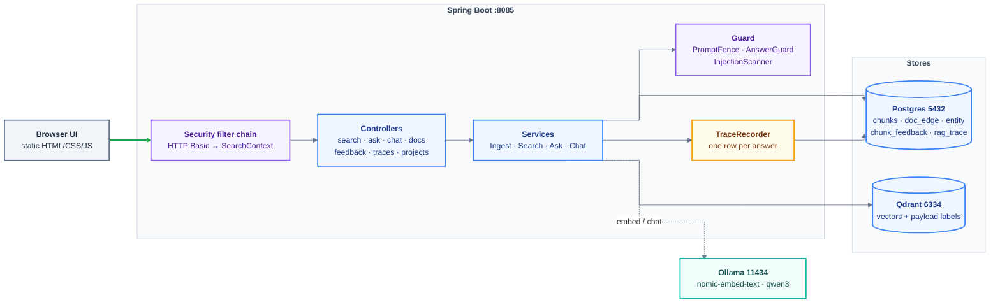
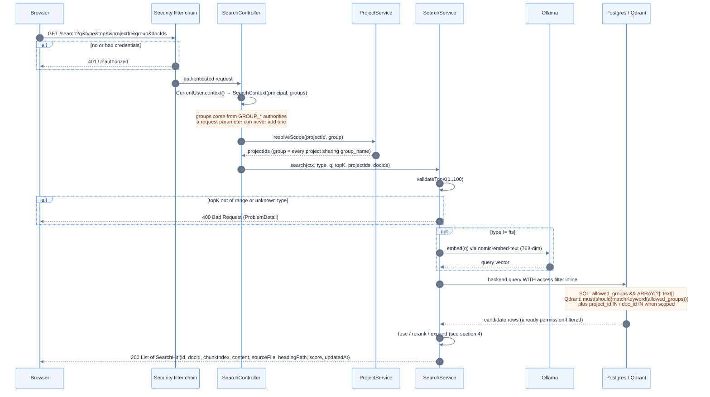
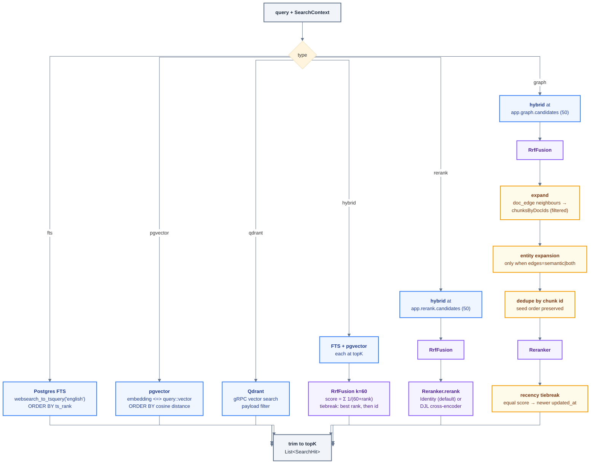
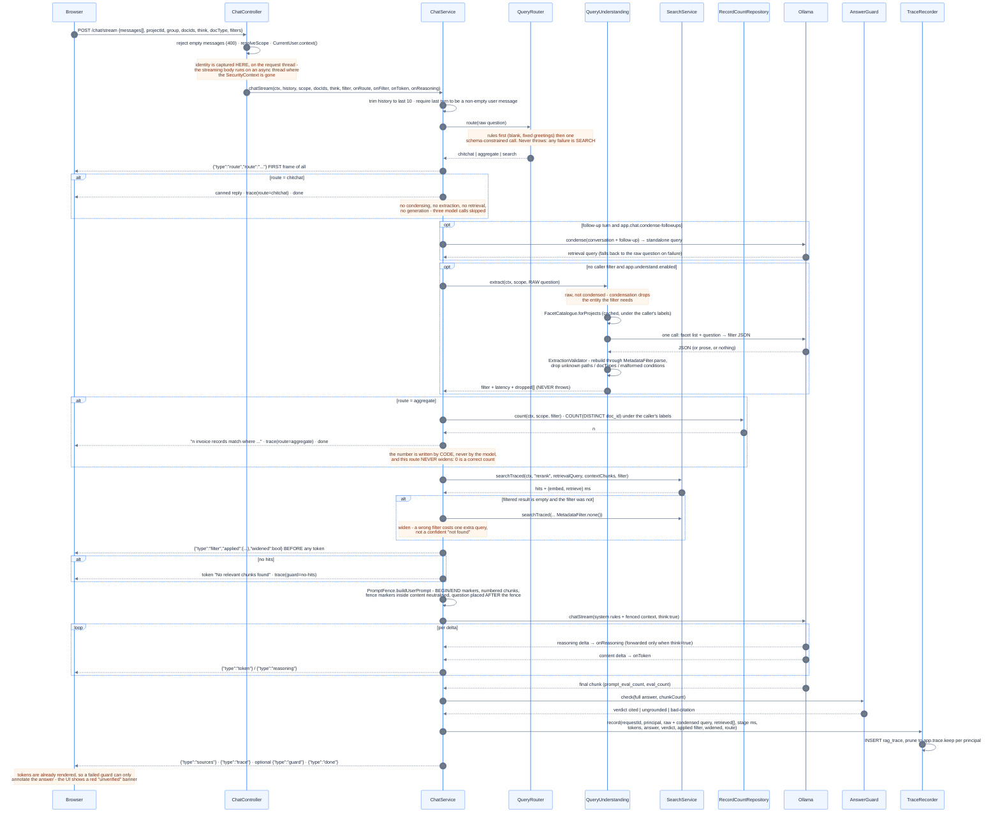
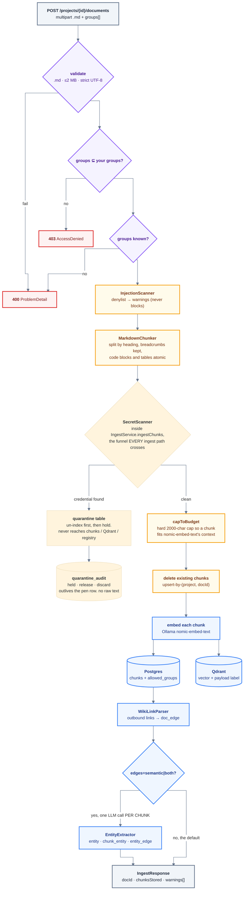
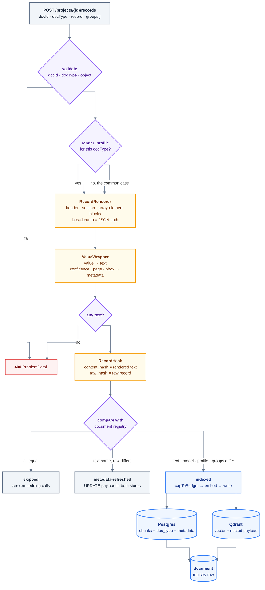

# Architecture - what actually happens on a request

This is the "read the machine" document. `README.md` tells you how to run it, `LEARNINGS.md`
explains why each piece exists, `RAG-MASTERY.md` lists what is still missing. This file shows the
**exact path a request takes**, so a developer landing on the repo can see what it can do without
reading the source first.

Nothing here is aspirational - every box maps to a class in `src/main/java`.

Contents:
1. Capability summary
2. Topology
3. `GET /search` - the detailed retrieval path
4. What each backend really does
5. `POST /chat/stream` - full RAG with guard and trace
6. Ingest - what happens to an uploaded document
7. Failure map (what returns which status, and why)
8. Where measurement happens (recall@5, MRR, precision) - and why it is NOT in the request path
9. File map

---

## 1. Capability summary

| Capability | Status | Entry point |
|---|---|---|
| Keyword search (Postgres FTS, `websearch_to_tsquery`) | done | `PgFtsRepository` |
| Vector search (pgvector, cosine HNSW) | done | `PgVectorRepository` |
| Vector search (Qdrant, gRPC) | done | `QdrantRepository` |
| Hybrid fusion (RRF, k=60) | done | `RrfFusion` |
| Cross-encoder rerank (DJL, opt-in) | done, measured | `DjlReranker` |
| Graph expansion (structural + optional entity) | done | `SearchService.graph`, `doc_edge`, `entity` |
| Full RAG answer with citations | done | `AskService` |
| Streaming multi-turn chat + condense-question | done | `ChatService`, `POST /chat/stream` |
| Permission-aware retrieval (access labels) | done | `SearchContext`, `chunks.allowed_groups` |
| Prompt-injection defence (fence + cite-or-refuse) | done | `PromptFence`, `AnswerGuard` |
| Per-request trace + debug view | done | `rag_trace`, `TraceRecorder` |
| Human relevance labels (eval only) | done | `chunk_feedback`, `POST /feedback` |
| Retrieval eval + regression gate (private wiki corpus) | done | `WikiRetrievalEvalTest`, `baseline-wiki.yaml` |
| Query understanding (question -> metadata filter) | done, measured | `QueryUnderstanding`, `FacetCatalogue` |
| Query-understanding eval + gate (runs on a fresh clone) | done | `RecordFilterEvalTest`, `baseline-records.yaml` |
| Incremental re-sync / delete propagation | **missing** | see `RAG-MASTERY.md` section 7 |
| Metrics, alerting, aggregate latency view | **missing** | see `RAG-MASTERY.md` section 6 |

---

### Routing, in one line

`QueryRouter` runs before everything on `/ask` and `/chat/stream`: chit-chat is answered from a
fixed string, "how many X" is answered by one SQL count, and everything else takes the unchanged
RAG path. A router failure resolves to the RAG path, so the worst case is exactly the old
behaviour. `app.route.enabled=false` restores it outright.

## 2. Topology

---

## 3. `GET /search` - the detailed retrieval path

Every numbered step below is code that runs on every query. The two that people usually forget
are **4** (identity is resolved on the server, never from a parameter) and **7** (the access filter
is inside the SQL, not applied to the result list).

**Not traced.** `/search` and `/compare` do not write a `rag_trace` row - tracing covers the two
paths that produce an *answer* (`/ask`, `/chat/stream`), because the fields that make a trace worth
reading (prompt tokens, guard verdict, generated text) only exist there. Search latency is visible
in `/compare` per backend instead.

---

## 4. What each backend really does

`type` selects one of six paths. All six receive the same access filter; they differ in what they
ask the stores for and what they do with the answers.

Two details that surprise people:

- **`rerank` over-fetches 50 candidates before trimming to `topK`.** The access filter therefore
  has to be *inside* the retrieval query - if it were applied afterwards, the cross-encoder would
  score chunks the caller may not read (`LEARNINGS.md` section 16).
- **Graph expansion walks `doc_edge`, which has no access label.** Content is protected because the
  neighbour's *chunks* are loaded through the filtered query. The edges themselves are readable, so
  graph topology leaks even though content does not.

---

## 5. `POST /chat/stream` - full RAG with guard and trace

This is the path the UI's Ask screen uses. It is the same retrieval as above, wrapped in
condense-question, prompt fencing, a grounding check, and a trace row.

`GET /ask` is the same pipeline without streaming, and there the guard **replaces** a failed answer
with `Not found in knowledge base.` - it can, because nothing has been sent yet.

---

## 6. Ingest - what happens to an uploaded document

**Known gap:** *markdown* ingest is one-shot. Nothing detects that an uploaded page changed, and
deleting a page upstream leaves it in the index (`RAG-MASTERY.md` section 7). Record ingest, below,
does not have this gap.

---

## 6b. Record ingest - extracted JSON instead of markdown

`POST /projects/{id}/records` is the path for an upstream pipeline that already did
upload -> parse -> extraction. The input is arbitrary nested JSON whose schema differs per document
type and per tenant, so nothing here requires a schema up front.

**Chunk metadata** is three nested trees per chunk, stored in `chunks.metadata` (JSONB) and mirrored
into the Qdrant payload:

| Tree | Holds | Example filter path |
|---|---|---|
| `values` | the extracted data, nested by its path in the record | `values.customer.name` |
| `prov` | what the extractor said about it: `confidence`, `page`, `bbox`, `span` | `prov.customer.confidence` |
| `conf` | per-chunk aggregate over numeric confidences | `conf.min` |

Nested rather than flat dotted keys because Qdrant parses a dot inside a payload key as a path
separator - a flat `"customer.name"` key would match in Postgres and never in Qdrant.

**Delete** (`DELETE /projects/{id}/records/{docId}`, and `IngestService.delete` generally) removes:
Qdrant points **first** (the fallible store, so a failure is retryable), then Postgres chunks,
`doc_edge` rows in **both** directions, the `document` registry row, and orphaned entities.
`chunk_feedback` and `rag_trace` rows are kept on purpose - labels are eval evidence and traces are
a record of what was actually answered.

### Where a metadata filter is enforced

| Backend | Enforcement point |
|---|---|
| `fts`, `pgvector` | `FilterSql` fragment appended to the WHERE clause of the retrieval query |
| `qdrant` | `FilterQdrant` conditions added to the search request's `must` / `must_not` |
| `hybrid` | both arms filtered before RRF fusion |
| `rerank` | the **over-fetch** is filtered, before the trim to topK |
| `graph` | seed filtered, and the neighbour chunk load filtered too, so expansion cannot bypass it |

A filter narrows only. `allowed_groups` stays a separate AND term in every one of those queries: a
filter is a caller preference, a label is a boundary.

---

## 7. Failure map

| Situation | Response | Where |
|---|---|---|
| No / wrong credentials | `401` | Spring Security filter chain |
| Authenticated but no groups, or anonymous principal | `403` | `CurrentUser.context()` |
| Labelling a document with a group you are not in | `403` | `CurrentUser.requireOwnGroups` |
| Unknown `type`, `topK` outside 1..100, blank docId, unknown group, bad rating, oversized query | `400` ProblemDetail | `GlobalExceptionHandler` |
| Upload not `.md`, over 2 MB, or invalid UTF-8 | `400` | `DocumentController.parseUpload` |
| Record with no docType, non-object record, or one that renders to no text | `400` | `RecordIngestService.ingest` |
| Document carries credential-shaped text | `200` with `quarantined: true`, nothing indexed | `IngestService.ingestChunks` throws `QuarantineRequiredException`; the caller holds it via `QuarantineService` |
| Release requested for a document you cannot read | `400` | `QuarantineController.require` - the lookup goes through your groups |
| Release or discard by a caller without the role | `403` | `@PreAuthorize("hasRole('quarantine-release')")`; the group lookup above still applies on top |
| Streamed answer never cites a supplied chunk | nothing streamed; `AnswerGuard.REFUSAL` sent instead | `GuardedEmitter` (HOLDING state at end of stream) |
| Streamed answer cites out of range mid-answer | stream stops after the good prefix, `guard` frame | `GuardedEmitter` (PASSING state) |
| Groundedness judge unreachable or unparseable | answer allowed | `GroundednessJudge.judge` - a judge outage must not refuse everything |
| Malformed filter JSON, unknown op, `range` with no bound, `in` with an empty list, illegal path segment | `400` | `MetadataFilter.parse` / `FilterSql.segments` |
| Filter path that does not exist in any record | matches nothing (not an error - schemas differ per tenant) | `FilterSql` |
| `date` range filter on the `qdrant` backend | `400` - Qdrant `Range` is numeric only | `FilterQdrant.numericRange` |
| Feedback on a chunk you cannot read | `400` (deliberately identical to "not found") | `FeedbackController.requireVisible` |
| Ollama down / model missing | `503` | `ChatUnavailableException` |
| Qdrant down at startup | app still boots, Qdrant backends fail per call | `QdrantRepository.ensureCollection` |
| Qdrant down during search | `500` | `SearchService.qdrantSearch` |
| Answer with no citation or a fabricated one | `/ask`: replaced by refusal. `/chat/stream`: `guard` frame + UI banner | `AnswerGuard` |
| Trace insert fails | logged, request unaffected | `TraceRecorder` |
| Query understanding: model down, timeout, or garbage output | answer proceeds UNFILTERED, reason recorded in `dropped[]` | `QueryUnderstanding.extract` |
| Query understanding: model invents a path or docType | that condition is dropped, the rest survive | `ExtractionValidator` |
| Facet catalogue query fails | empty catalogue → no extraction → unfiltered answer | `FacetCatalogue.forProjects` |
| Extracted filter matches nothing | retrieval retried unfiltered, `widened: true` reported | `AskService` / `ChatService` |

---

## 8. Where measurement happens

A point of confusion worth stating plainly: **recall@5, MRR and hit@1 are not computed at query
time.** No request calculates them - they need a golden set of known-correct answers, so they live
in tests that replay questions against the corpus.

| Metric | Computed in | Against | Gate? |
|---|---|---|---|
| recall@5, MRR, hit@1 (self corpus) | `RetrievalEvalTest` (`-Dgroups=eval`) | this repo's `docs/` | report |
| recall@5, MRR, hit@1 (real corpus) | `WikiRetrievalEvalTest` (`-Dgroups=eval-wiki`) | live `docmaster` project, `golden-wiki.yaml` | **yes** - fails on a >0.02 drop vs `baseline-wiki.yaml` |
| Faithfulness (LLM judge) | `FaithfulnessEvalTest` (`-Dgroups=eval-judge`) | generated answers | report |
| precision@5/@10, MRR of first 👍 | `FeedbackPrecisionEvalTest` (`-Dgroups=eval-feedback`) | human labels in `chunk_feedback` | report |
| Extraction precision/recall, docType accuracy, widen rate, recall@5/MRR with vs without | `RecordFilterEvalTest` (`-Dgroups=eval-records`) | committed synthetic corpus (`RecordCorpus.generate(42)`) + `records-golden.yaml` | **yes** - fails on a >0.05 drop vs `baseline-records.yaml`, or on a lost filter / new over-extraction |
| Per-request latency and tokens | `rag_trace`, written live | every answer | none (no alerting) |

The metrics that DO exist per request are latency per stage and token counts, in the trace.

---

## 9. File map

| Concern | Class |
|---|---|
| Identity → access labels | `security/CurrentUser`, `security/SearchContext`, `security/SecurityConfig` |
| ACL migration for old data | `schema.sql` backfill, `security/QdrantAclBackfill` |
| Retrieval orchestration | `service/SearchService` (`search`, `searchTraced`, `compare`) |
| Backends | `repository/PgFtsRepository`, `PgVectorRepository`, `QdrantRepository` |
| Fusion / rerank | `fusion/RrfFusion`, `rerank/IdentityReranker`, `rerank/DjlReranker` |
| Graph | `repository/DocEdgeRepository`, `repository/EntityRepository`, `graph/*` |
| RAG answers | `service/AskService`, `service/ChatService` |
| Query understanding | `understand/FacetCatalogue`, `understand/ExtractionValidator`, `understand/QueryUnderstanding`, `understand/FilterJson`, `repository/FacetRepository`, `web/FacetController` |
| Injection defence | `guard/PromptFence`, `guard/AnswerGuard`, `guard/InjectionScanner` |
| Tracing | `trace/RagTrace`, `trace/TraceRecorder`, `trace/TraceRepository`, `web/TraceController` |
| Human labels | `repository/FeedbackRepository`, `web/FeedbackController` |
| Ingest | `service/IngestService`, `chunk/MarkdownChunker`, `tool/WikiImporter` |
| Schema | `src/main/resources/schema.sql` (idempotent, runs at startup) |
| Frontend | `src/main/resources/static/{index.html,app.js,style.css}` - no framework |

> Rendering note: the `%%{init: ...}%%` blocks above render correctly on GitHub and with
> `mermaid-cli`, but the bundled VS Code "Markdown Preview Mermaid Support" extension shows a blank
> box for any diagram carrying a config directive. Diagrams look right on GitHub; locally the
> arrows will curve.
